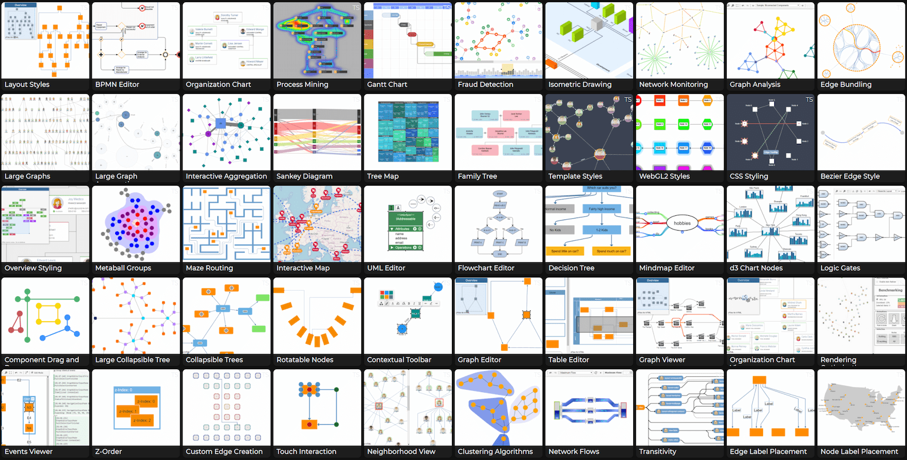

# yFiles for HTML Demo Sources

This repository contains source code demos that use the commercial [yFiles for HTML](https://www.yfiles.com/) software programming library for the visualization of graphs, diagrams, and networks. The library itself is __*not*__ part of this repository.

# Running the Demos

Most of the demos are hosted [online here](https://yfiles.com/demos) for everyone to play with. Developers *need* to [evaluate the library](https://www.yworks.com/products/yfiles-for-html/evaluate), instead, since it is __*not*__ part of this repository. 
The evaluation version also contains these demos and the necessary library to execute the code, so *cloning this repository is neither necessary nor will it suffice*. 

# Live Online Playground

If you want to play with the library withough downloading or signing up to anything, you can play with the API on our [public online playground](https://yfiles.com/play).

# License

Use of the software hosted in this repository is subject to the license terms of the corresponding yFiles for HTML license. 
Owners of a valid software license for a yFiles for HTML version that these
demos are shipped with are allowed to use the demo source code as basis
for their own yFiles for HTML powered applications. Use of such programs is
governed by the rights and conditions as set out in the yFiles for HTML
license agreement. More details [here](./LICENSE). If in doubt, feel free to [contact](https://www.yworks.com/contact) the yFiles for HTML support team.
