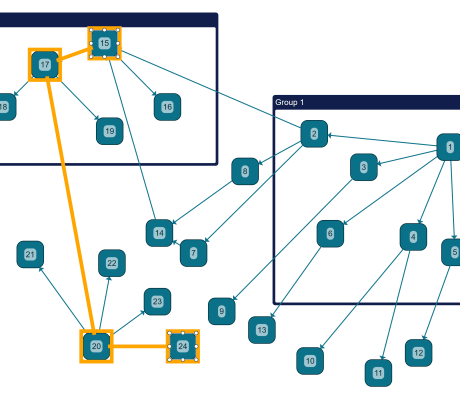

# Running Graph Analysis Algorithms - Getting Started Tutorial

[You can also run this demo online](https://live.yworks.com/demos/01-tutorial-getting-started/12-graph-analysis/index.html).

## Tutorial Demo 12

This step shows how to use the [graph algorithms](https://docs.yworks.com/yfileshtml/#/dguide/analysis) in yFiles for HTML.

Graph Analysis Algorithms in yFiles can be used for all kinds of purposes. The result of an analysis run can be shown directly to the user or the results can be used to drive third party systems. They can also be used as input to layout algorithms configurations. The purpose of this sample is to demonstrate how to build, configure, and execute graph analysis algorithms. We also show how the results may be interpreted. For a more interactive and complete showcase of many of the available algorithms, please see the [Graph Analysis Demo](../../analysis/graphanalysis/index.html), the [Clustering Demo](../../analysis/clustering/index.html), the [Network Flows Demo](../../analysis/networkflows/index.html), and the [Transitivity Demo](../../analysis/transitivity/index.html).

- Click the two 'Run' buttons in the toolbar to run two different algorithms.
- 'Run Reachability' will use the currently selected nodes to run a reachability test. All nodes that can be reached from the set of currently selected ones will be highlighted.
- 'Run Shortest Path' will use the most recently selected node (the 'current item') to calculate a shortest path to the last created node (node 19 by default). If a path is found, the nodes on the path and the edges will be highlighted. The distance to the target node will be shown as a tooltip on the target node.

See the sources for details.
