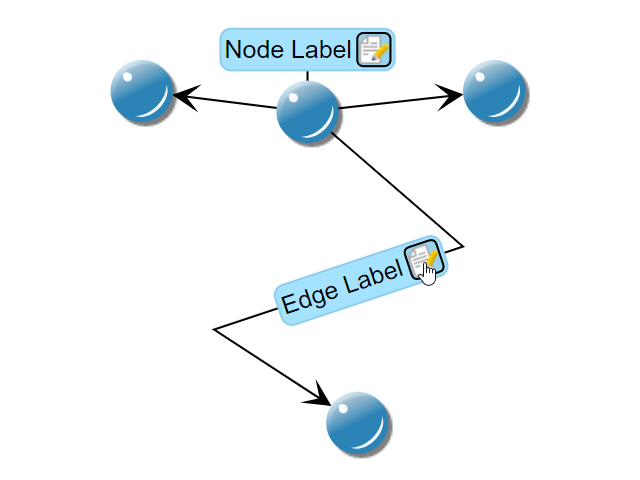

# Button Visibility - Custom Styles Tutorial

[You can also run this demo online](https://live.yworks.com/demos/02-tutorial-custom-styles/14-button-visibility/index.html).

Custom Styles Tutorial

# Button Visibility

This step shows how to hide the 'Label Edit' button based on the zoom level. If the zoom level gets too small, the button won't get drawn.

## Things to Try

- Zoom in and out to watch the edit button appear and disappear.
- Take a look at methods `render()` and `createRenderDataCache()` of class `MySimpleLabelStyle`.

## Left to Do

- Allow to change the background color of labels.
- Create a custom edge style.
- Create a custom port style for nodes.
- Use the decorator pattern to add label edges to the nodes.
- Create a custom group node style.
