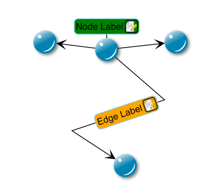

# Using Data in Label Tag - Custom Styles Tutorial

[You can also run this demo online](https://live.yworks.com/demos/02-tutorial-custom-styles/15-using-data-in-label-tag/index.html).

This step shows how to use data from a business object, which is stored in the label's tag, for rendering. This mechanism also applies to nodes, edges and ports. In this example, a dummy business object, which only defines a color, is stored. This color is used to set the background of the label. You can store any object you like in the tag in order to use its data in the style.

Note that, in contrast to `MySimpleNodeStyle`, you can change the color of each label separately without affecting other labels that use the same style instance.

## Things to Try

- Change the label tags in method `SampleApplication.createLabelTags()` and see what happens.
- Take a look at class `MySimpleLabelStyle`, especially method `createRenderDataCache()`.

## Left to Do

- Create a custom edge style.
- Create a custom port style for nodes.
- Use the decorator pattern to add label edges to the nodes.
- Create a custom group node style.
