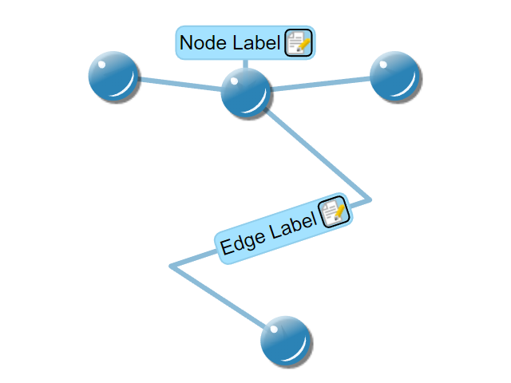

# Custom Edge Style - Custom Styles Tutorial

[You can also run this demo online](https://live.yworks.com/demos/02-tutorial-custom-styles/16-custom-edge-style/index.html).

Custom Styles Tutorial

# Custom Edge Style

This step shows how to create a custom edge style which allows to specify the edge thickness by setting a property on the style. The [EdgeStyleBase#createVisual](https://docs.yworks.com/yfileshtml/#/api/EdgeStyleBase#createVisual) and [EdgeStyleBase#updateVisual](https://docs.yworks.com/yfileshtml/#/api/EdgeStyleBase#updateVisual) methods are implemented like in `MySimpleNodeStyle` and `MySimpleLabelStyle`.

## Things to Try

- Zoom in on an edge and try selecting it by clicking near its borders.

## Left to Do

- Adapt the hit test which checks if an edge was clicked to take the edge's thickness into account.
- Crop the edges so that they don't extend into the nodes.
- Change the style of an edge when selected.
- Create a custom arrow which fits the style of the demo.
- Create a custom port style for nodes.
- Use the decorator pattern to add label edges to the nodes.
- Create a custom group node style.
