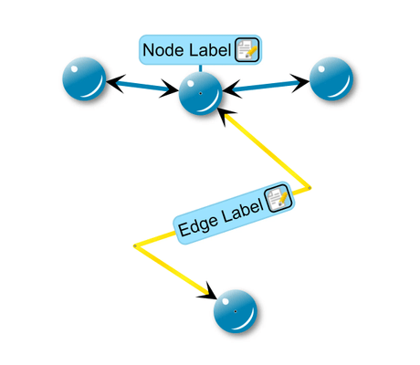

# Animated Edge Selection - Custom Styles Tutorial

[You can also run this demo online](https://live.yworks.com/demos/02-tutorial-custom-styles/19-animated-edge-selection/index.html).

Custom Styles Tutorial

# Animated Edge Selection

This step shows how to change the style of an edge if the edge is selected.

Also, this steps demonstrates how to create an animated linear gradient fill.

## Things to Try

- Select an edge and see what happens.
- Take a look at methods `render()` and `createRenderDataCache()` of class `MySimpleEdgeStyle`.
- Take a look at class `AnimatedLinearGradientFill`.

## Left to Do

- Create a custom arrow which fits the style of the demo.
- Create a custom port style for nodes.
- Use the decorator pattern to add label edges to the nodes.
- Create a custom group node style.
