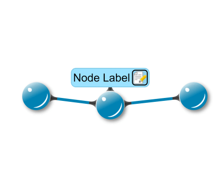

# Edge Performance - Custom Styles Tutorial

[You can also run this demo online](https://live.yworks.com/demos/02-tutorial-custom-styles/21-edge-performance/index.html).

Custom Styles Tutorial

# Edge Performance

This step shows how to optimize rendering performance for edges and arrows. Instead of re-creating all elements if only the edge path changes, only the 'd' attribute of the path and the arrows visualizations are updated.

## Things to Try

- Take a look at `MySimpleEdgeStyle.updateVisual()` and `MySimpleArrow.updateVisual()`.

## Left to Do

- If you change the edge thickness in the edge style, the arrow thickness stays the same. Make the arrow thickness match the edge thickness.
- Create a custom port style for nodes.
- Use the decorator pattern to add label edges to the nodes.
- Create a custom group node style.
