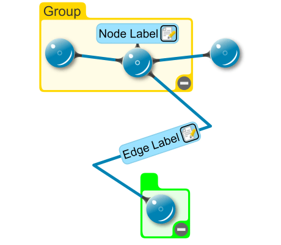

# Custom Group Bounds - Custom Styles Tutorial

[You can also run this demo online](https://live.yworks.com/demos/02-tutorial-custom-styles/26-custom-group-bounds/index.html).

## Description

This step shows how to customize the way that the group insets are calculated by implementing an [ILayoutGroupBoundsCalculator](https://docs.yworks.com/yfileshtml/#/api/ILayoutGroupBoundsCalculator). This implementation takes the labels of the child nodes into account and also considers the insets as specified by the [INodeInsetsProvider](https://docs.yworks.com/yfileshtml/#/api/INodeInsetsProvider) of the group node.

Please note that [ILayoutGroupBoundsCalculator](https://docs.yworks.com/yfileshtml/#/api/ILayoutGroupBoundsCalculator) replaces [INodeInsetsProvider](https://docs.yworks.com/yfileshtml/#/api/INodeInsetsProvider). If the [INodeInsetsProvider](https://docs.yworks.com/yfileshtml/#/api/INodeInsetsProvider) should also be respected, this has to be done explicitly by the [ILayoutGroupBoundsCalculator](https://docs.yworks.com/yfileshtml/#/api/ILayoutGroupBoundsCalculator) like demonstrated in this sample.

If a label is moved to another position of a node, the group bounds are not adjusted automatically. This sample contains code that adjusts the group size when a label is moved.

This sample also shows how to draw the group differently in the collapsed state and how to customize the position of the collapse and expand buttons using an [ILabelModelParameter](https://docs.yworks.com/yfileshtml/#/api/ILabelModelParameter).

## Things to Try

- Move the node with the label and see how the group size is adjusted.
- Move the node label to another position on the node. Select it using "Shift-Click" and drag it with the mouse.
- Take a look at `MyGroupNodeStyle.lookup()`.
- Take a look at `SampleApplication.createEditorMode()`.

## Left to Do

- Render nodes with HTML5 canvas instead of SVG for improved performance, especially for large graphs.
- Add [bridge support](https://docs.yworks.com/yfileshtml/#/dguide/bridges-customizations) to the edge style.
