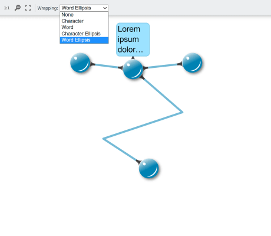

# Label Line Wrapping - Custom Styles Tutorial

[You can also run this demo online](https://live.yworks.com/demos/02-tutorial-custom-styles/29-label-line-wrapping/index.html).

This step shows how to enhance a custom label style to support different line wrapping (trimming) styles as well as text clipping at the label bounds.

## Description

`MySimpleLabelStyle` provides a property `wrapping`, which offers the option to switch between different [TextWrapping](https://docs.yworks.com/yfileshtml/#/api/TextWrapping) styles. The value of the property is passed to [TextRenderSupport#addText](https://docs.yworks.com/yfileshtml/#/api/TextRenderSupport#addText), which automatically takes care of the line wrapping.

Method `clipText()` adds a `clip-path` element to the label's DOM element, which clips the label text at the label bounds. This is only done if the text exceeds the bounds, i.e. when trimming is set to _None_ and the text is long enough.

The label style is configured to use a fixed desired size to showcase the trimming feature.

## Things to Try

- Use the _Wrapping_ box to switch between the different wrapping styles.
- Edit the label text or create new labels to see the outcome.
- Take a look at `MySimpleLabelStyle`.
