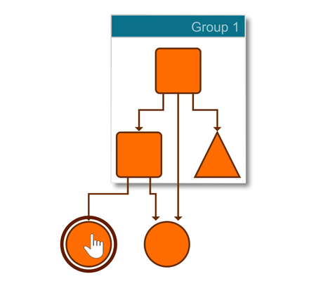

# Complex Highlight Decorator - Application Features Tutorial

[You can also run this demo online](https://live.yworks.com/demos/03-tutorial-application-features/complex-highlight-decorator/index.html).

Application Features Tutorial

# Complex Highlight Decorator

Shows how to highlight a node when the mouse hovers over it. The shape of the highlight effect differs depending on the data stored in the node's tag.

## Things to Try

- Hover over a node to see a highlight effect.
- Hover over nodes of different shapes to see the shape of the highlight effect change as well.
