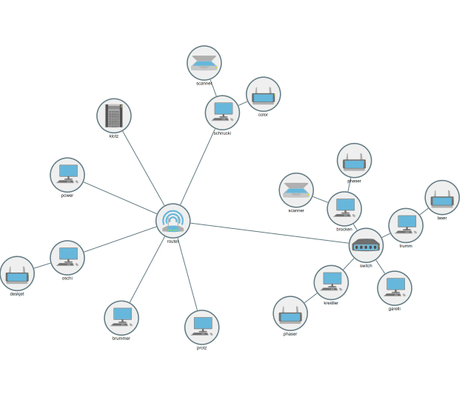

# Composite Node Style Demo - Application Features Tutorial

[You can also run this demo online](https://live.yworks.com/demos/03-tutorial-application-features/composite-node-style/index.html).

This demo shows how to combine node visualizations from several styles into one.

This is achieved with a composite node style, i.e., a custom node style implementation that combines the visualizations from several other node style instances into a composite visual.

See the sources for details.
