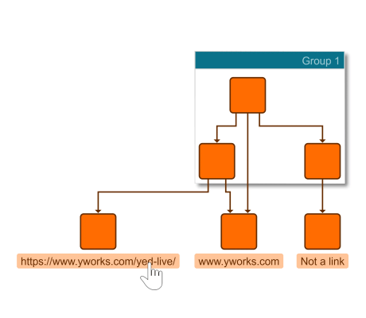

# External Links - Application Features Tutorial

[You can also run this demo online](https://live.yworks.com/demos/03-tutorial-application-features/external-links/index.html).

## External Links

This demo shows how to add labels that act like external links and open in a new window.

It is configured to only follow the external link on a `CTRL` click.

This demo works directly on the [ILabel](https://docs.yworks.com/yfileshtml/#/api/ILabel) text, therefore you can also add new labels the represent links.

See the sources for details.
