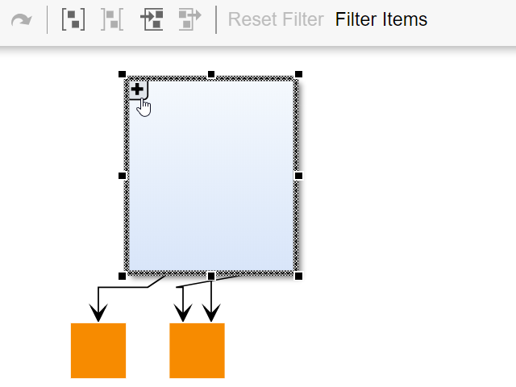

# Filtering with Folding - Application Features Tutorial

[You can also run this demo online](https://live.yworks.com/demos/03-tutorial-application-features/filtering-with-folding/index.html).

Application Features Tutorial

# Filtering with Folding

This sample shows how to configure [filtering](https://docs.yworks.com/yfileshtml/#/dguide/filtering) and [folding](https://docs.yworks.com/yfileshtml/#/dguide/folding) in the same application. While both features can be used in the same graph, the order of initialization is important.

Filtering and Folding are both features to reduce the complexity of a graph and to hide graph items from the viewer. With Folding, group nodes can be collapsed into folders, which hides their content. Filtering temporarily removes nodes or edges from the graph. Both features have their field of application, and sometimes the need arises to use both together.

The general approach is also described in the article [Using Filtering and Folding Together](https://docs.yworks.com/yfileshtml/#/kb/article/693/Using_Filtering_and_Folding_Together).

## Things to Try

- Select graph items and press the **Filter Items** button to filter those items from the graph.
- Press the **Reset Filter** button to un-hide any filtered items in the graph.
- Collapse (expand) group nodes by pressing their -/+ button.

See the sources for details.
