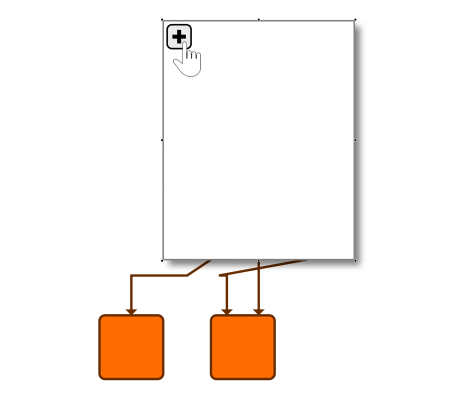

# Folding - Application Features Tutorial

[You can also run this demo online](https://live.yworks.com/demos/03-tutorial-application-features/folding/index.html).

## Folding

This step shows how to enable [collapsing and expanding of group nodes](https://docs.yworks.com/yfileshtml/#/dguide/folding). This is provided through class [FoldingManager](https://docs.yworks.com/yfileshtml/#/api/FoldingManager) and its support classes.

[GraphEditorInputMode](https://docs.yworks.com/yfileshtml/#/api/GraphEditorInputMode) provides the following default gestures for collapse/expand:

- Press CTRL+Numpad + or click the expand-button on the node's top left corner to open (expand) a closed group node.
- Press CTRL+Numpad - or click the collapse-button on the node's top left corner to close (collapse) an open group node.
- Press CTRL+Return to enter (navigate into) a group node.
- Press CTRL+Backspace to exit (navigate out of) a group node.

See the sources for details.
