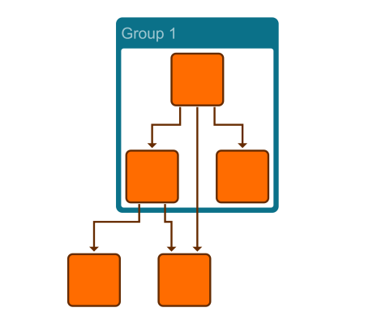

# Input / Output - Application Features Tutorial

[You can also run this demo online](https://live.yworks.com/demos/03-tutorial-application-features/input-output/index.html).

## Input / Output

This demo shows how to use [GraphML input and output](https://docs.yworks.com/yfileshtml/#/dguide/io-loading_saving).

GraphML is the standard file format for yFiles for HTML. It is an XML format that provides great flexibility when storing custom data. However, note that these attributes (such as styles or even node locations) are not standardized, so you probably won't be able to exchange all of them between different graph libraries, for example.

Built-in types, in particular styles, can be de-/serialized out of the box which is illustrated in this application. Custom types can be de-/serialized automatically if they meet specific rules that are described in [Automatically Serialized Types.](https://docs.yworks.com/yfileshtml/#/dguide/customizing_io_automatic-serialization)

How to de-/serialize complex types is described in [Serializing Complex Types.](https://docs.yworks.com/yfileshtml/#/dguide/customizing_io_serialization_complex-types)

See the sources for details.
