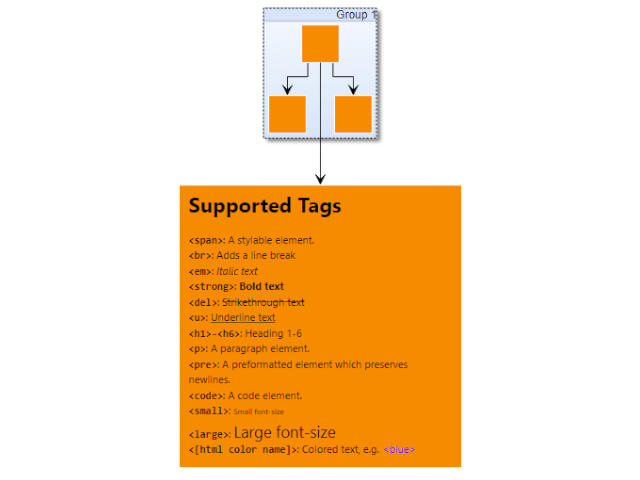

# Markup Labels - Application Features Tutorial

[You can also run this demo online](https://live.yworks.com/demos/03-tutorial-application-features/markup-labels/index.html).

Application Features Tutorial

# Markup Labels

This demo shows how to create labels with rich text features using [MarkupLabelStyle](https://docs.yworks.com/yfileshtml/#/api/MarkupLabelStyle).

Since the [MarkupLabelStyle](https://docs.yworks.com/yfileshtml/#/api/MarkupLabelStyle) supports basic HTML markup, it can be easily hooked up with a WYSIWYG text editor that completely hides the markup from the user, as demonstrated in the [Rich Text Label](../../style/richtextlabel/index.html) demo.

#### Creating and Editing Labels

- Press the F2 key while an element or connection is selected.
- Insert HTML-style markup text into the editor, i.e. `<strong>Hello World</strong>`

#### Supported Markup

The tags supported by rich text labels are

- ``: A stylable element.
- ` `: Adds a line break
- `<em>`: Italic text
- `<strong>`: Bold text
- `<del>`: Strikethrough text
- `<u>`: Underline text
- `<h1>-<h6>`: Heading 1-6
- `
`: A paragraph element.
- `<pre>`: A preformatted element which preserves newlines.
- `<code>`: A code element.
- `<small>`: Small font-size
- `<large>`: Large font-size
- `<[html color name]>`: Colored text, e.g. <blue>

#### Styling Labels with CSS

Tags can be styled with inline CSS. Also tags can be given CSS classes to use external CSS.

For example, the default <h2> is styled as dark gray with small-caps in this demo.

#### Text Wrapping

Markup labels can use line wrapping. In this demo application, the labels use word wrapping with ellipsis. Select and resize a node to observe the interactive text wrapping. Rich text labels can also be wrapped at character boundaries.

See the sources for details.
