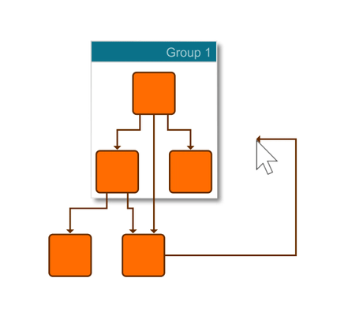

# Orthogonal Edges - Application Features Tutorial

[You can also run this demo online](https://live.yworks.com/demos/03-tutorial-application-features/orthogonal-edges/index.html).

Application Features Tutorial

# Orthogonal Edges

This demo shows how to enable interactive orthogonal edge editing. This is provided through class [OrthogonalEdgeEditingContext](https://docs.yworks.com/yfileshtml/#/api/OrthogonalEdgeEditingContext).

- Drag the mouse starting on an unselected node to start the creation of an edge. The edge stays orthogonal.
- Drag an edge segment of an existing orthogonal edge to move or break the segment while the edge stays orthogonal.
- Drag a bend of an orthogonal edge.
- Move a node that is connected to an orthogonal edge.

See the sources for details.
