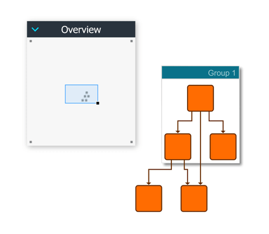

# Overview - Application Features Tutorial

[You can also run this demo online](https://live.yworks.com/demos/03-tutorial-application-features/overview/index.html).

Application Features Tutorial

# Overview

This demo shows how to add an overview component to the application.

## Things to Try

- Drag the blue rectangle in the overview to move the viewport of the canvas.
- Drag the handle at the lower right corner of the blue rectangle to change the zoom level of the canvas.
- Use the mouse wheel over both the overview and the canvas to see the effect of zooming in both views.

See the sources for details.
