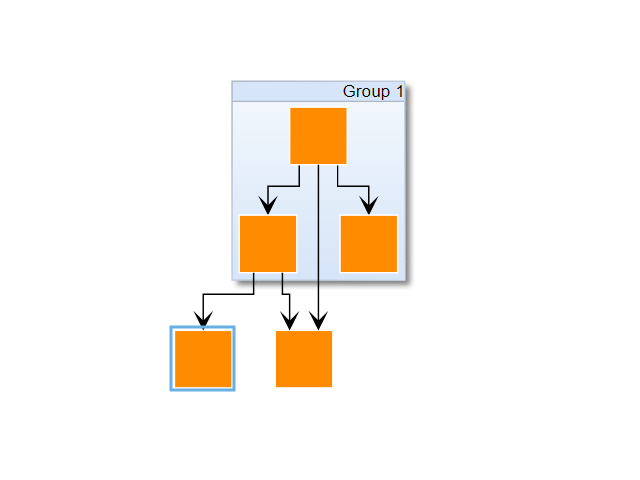

# Simple Highlight Decorator - Application Features Tutorial

[You can also run this demo online](https://live.yworks.com/demos/03-tutorial-application-features/simple-highlight-decorator/index.html).

## Simple Highlight Decorator

Shows how to highlight a node or an edge when the mouse hovers over said node or edge.

## Things to Try

- Hover over a node or an edge to see a highlight effect.
