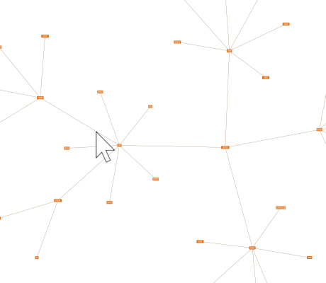

# Smart Click Navigation - Application Features Tutorial

[You can also run this demo online](https://live.yworks.com/demos/03-tutorial-application-features/smart-click-navigation/index.html).

Application Features Tutorial

# Smart Click Navigation

This demos shows how to navigate in a large graph, especially when only a part of the graph is visible in the viewport.

### Things To Try

- Click on an **edge** whose target node or source node is not visible. Then you will notice that the focus will be moved to this source or target node.
- Click on an **edge** where both target and source node are visible. Then you will notice that the focus will be moved to the middle point of the edge.
- Click on a **node** and you will notice that the focus will be moved to the center of the clicked node.
- Choose between two modes in the combo box:
  - _Zoom to Viewport Center._ The focused item is in the center of the viewport.
  - _Zoom to Mouse Location._ The focused item is centered at the mouse location.
