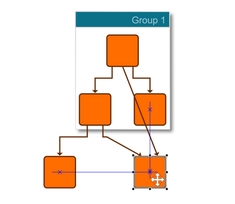

# Snapping - Application Features Tutorial

[You can also run this demo online](https://live.yworks.com/demos/03-tutorial-application-features/snapping/index.html).

## Snapping

This demo shows how to enable [snapping](https://docs.yworks.com/yfileshtml/#/dguide/interaction-snapping) (guide lines) for graph elements. This is provided through class [GraphSnapContext](https://docs.yworks.com/yfileshtml/#/api/GraphSnapContext).

Snapping helps you to arrange graph items interactively without running an automatic layout by providing useful lines and position hints that elements snap to.

In addition to this, labels with certain label models can snap to particular positions relative to their owner, for example to the corners of a node or along the edge path. This can be enabled with class [LabelSnapContext](https://docs.yworks.com/yfileshtml/#/api/LabelSnapContext).

See the sources for details.
