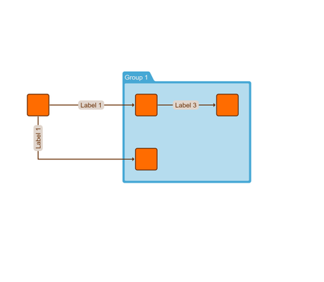

# Subdivide Edges - Application Features Tutorial

[You can also run this demo online](https://live.yworks.com/demos/03-tutorial-application-features/subdivide-edges/index.html).

Application Features Tutorial

# Subdivide Edges

This demo shows how to use a custom [NodeDropInputMode](https://docs.yworks.com/yfileshtml/#/api/NodeDropInputMode) for dragging nodes from a separate panel onto an edge.

More precisely, when a node is dropped onto an edge, a new node is created and the edge is split in two edges such that:

- The source of the first edge is the original source of the split edge and the target is the newly created node.
- The source of second edge is the newly created node and the target is the original target of the split edge.

## Things to try

- Drag a node onto an edge and see how the edge is being split.

See the sources for details.

## Related Demos

- [Tutorial Drag and Drop](../drag-and-drop)
- [Drag and Drop](../../input/draganddrop)
- [Graph Drag and Drop](../../input/graph-drag-and-drop)
- [Custom Drag and Drop](../../input/custom-drag-and-drop)
- [Drag From Component](../../input/drag-from-component)
