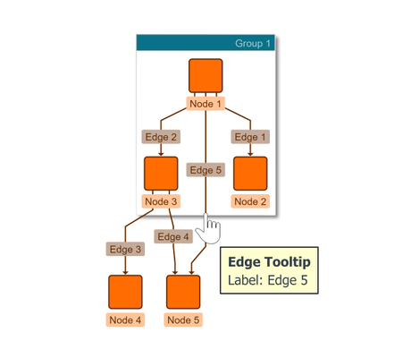

# Tooltips - Application Features Tutorial

[You can also run this demo online](https://live.yworks.com/demos/03-tutorial-application-features/tooltips/index.html).

Application Features Tutorial

# Tooltips

This demo shows how to enable tooltips for graph items.

See the sources for details.
