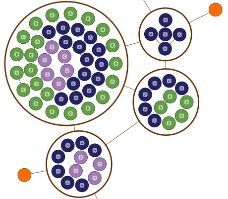

# Compact Disk Groups - Layout Features Tutorial

[You can also run this demo online](https://live.yworks.com/demos/04-tutorial-layout-features/compact-disk-groups/index.html).

Layout Features Tutorial

# Compact Disk Layout for Group Content

This demo shows how to use the [CompactDiskLayout](https://docs.yworks.com/yfileshtml/#/api/CompactDiskLayout) to arrange the content of (circular) group nodes.

This arrangement is suitable if the group content should be placed in a compact way and if there are no or only few edges between child nodes.

The content of each group is arranged in a compact, circular way by [CompactDiskLayout](https://docs.yworks.com/yfileshtml/#/api/CompactDiskLayout). The children are furthermore ordered by [node type](https://docs.yworks.com/yfileshtml/#/api/CompactDiskLayoutData#nodeTypes) (reflected by label text and color in this example).

[RecursiveGroupLayout](https://docs.yworks.com/yfileshtml/#/api/RecursiveGroupLayout) handles the group nodes recursively. An [OrganicLayout](https://docs.yworks.com/yfileshtml/#/api/OrganicLayout) is applied to the nodes of the top-level hierarchy.

### Code Snippet

You can copy the code snippet to configure the layout from [GitHub](https://github.com/yWorks/yfiles-for-html-demos/blob/master/demos/04-tutorial-layout-features/compact-disk-groups/CompactDiskGroups.ts).

### Documentation

The Developer's Guide provides in-depth information about the [Compact Disk Layout](https://docs.yworks.com/yfileshtml/#/dguide/compact_disk_layout).
