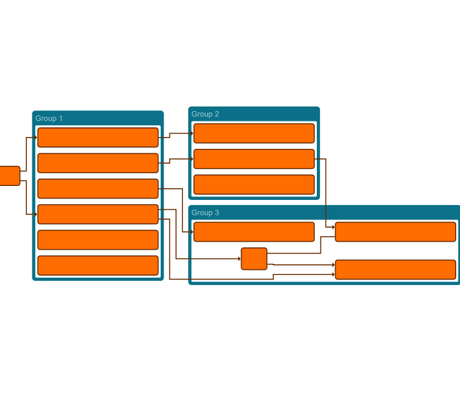

# Compact Group Nodes with HierarchicLayout - Layout Features Tutorial

[You can also run this demo online](https://live.yworks.com/demos/04-tutorial-layout-features/hierarchic-compact-groups/index.html).

## Compact Group Nodes in HierarchicLayout

This demo shows how to configure the [Hierarchic Layout](https://docs.yworks.com/yfileshtml/#/api/HierarchicLayout) and the related [SimplexNodePlacer](https://docs.yworks.com/yfileshtml/#/api/SimplexNodePlacer) such that group nodes are drawn in a more compact way compared to the algorithm's default settings.

It is a common requirement that the dimension of group nodes should be kept as compact as possible. With default settings, the hierarchic layout algorithm does not focus on that, but, for example, rather tries to avoid bends and to align nodes, which produces less compact arrangements.

### Compaction of the layers

Recursive group layering has an optional _compaction_ feature which tries to keep the layer span of group nodes low. It is accessed via the [compactGroups](https://docs.yworks.com/yfileshtml/#/api/HierarchicLayout#compactGroups) property. In this example, layers are from left to right, thus this property affects group width. In the sample, the effect of compaction can be seen with 'Group 3'. That group shares its first layer with 'Group 2', whereas without compaction the layers would be disjoint.

### Compaction orthogonal to the flow

To keep group nodes compact with respect to the dimension which is orthogonal to the main direction, there are two properties which can be configured. In this example with left-to-right layout direction those properties affect the group height (group width in default top-to-bottom layout).

- [groupCompactionStrategy](https://docs.yworks.com/yfileshtml/#/api/SimplexNodePlacer#groupCompactionStrategy) must be set to [MAXIMAL](https://docs.yworks.com/yfileshtml/#/api/GroupCompactionPolicy#MAXIMAL).
- [bendReduction](https://docs.yworks.com/yfileshtml/#/api/SimplexNodePlacer#bendReduction) should be disabled to prioritize compaction over the reduction of bends.

### See the difference

Use the toggle-button in the toolbar to see the effect the settings have on the layout result.

### Code Snippet

You can copy the code snippet to configure the layout from [GitHub](https://github.com/yWorks/yfiles-for-html-demos/blob/master/demos/04-tutorial-layout-features/hierarchic-compact-groups/HierarchicCompactGroups.ts).
