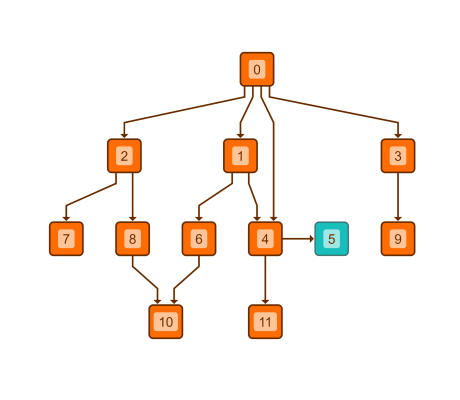

# Hierarchic Layout with Constraints - Layout Features Tutorial

[You can also run this demo online](https://live.yworks.com/demos/04-tutorial-layout-features/hierarchic-constraints/index.html).

## Hierarchic Layout with Constraints

This demo shows how to customize the assignment of the nodes to the layers (layering) and the order of the nodes in a layer (sequencing) when using the [Hierarchic Layout](https://docs.yworks.com/yfileshtml/#/api/HierarchicLayout).

### Layer constraints

The layout is configured such that node 5 follows node 4 on the same layer. When using the default [Hierarchic Layout](https://docs.yworks.com/yfileshtml/#/api/HierarchicLayout), node 5 is placed on the next layer.

### Sequence constraints

The only configured sequence constraint is that node 5 follows after node 4.

Click the button in the toolbar to toggle between [Hierarchic Layout](https://docs.yworks.com/yfileshtml/#/api/HierarchicLayout) with and without configured constraints.

### Code Snippet

You can copy the code snippet to configure the layout from [GitHub](https://github.com/yWorks/yfiles-for-html-demos/blob/master/demos/04-tutorial-layout-features/hierarchic-constraints/HierarchicConstraints.ts).

### Demos

See the [Layer Constraints](../../layout/layerconstraints/index.html) and [Sequence Constraints](../../layout/sequenceconstraints/index.html) demos for more elaborate examples of the constraints functionality.

### Documentation

See the [Constrained Layer Assignment](https://docs.yworks.com/yfileshtml/#/dguide/hierarchical_layout-constrained_layer_assignment) and [Constrained Node Sequencing](https://docs.yworks.com/yfileshtml/#/dguide/hierarchical_layout-constrained_node_sequencing) sections in the Developer's Guide for an in-depth discussion of the relevant concepts.
