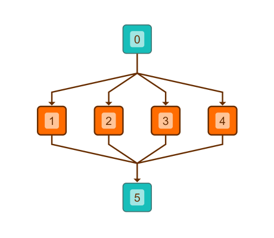

# Hierarchic Layout with Edge Grouping - Layout Features Tutorial

[You can also run this demo online](https://live.yworks.com/demos/04-tutorial-layout-features/hierarchic-edge-grouping/index.html).

## Hierarchic Layout with Edge Grouping

This demo shows how to configure edge grouping for the [Hierarchic Layout](https://docs.yworks.com/yfileshtml/#/api/HierarchicLayout).

For edges connecting to nodes `0` and `5`, source and target group IDs are configured, which causes the [HierarchicLayout](https://docs.yworks.com/yfileshtml/#/api/HierarchicLayout) to group them. The IDs are defined via properties [sourceGroupIds](https://docs.yworks.com/yfileshtml/#/api/HierarchicLayoutData#sourceGroupIds) and [targetGroupIds](https://docs.yworks.com/yfileshtml/#/api/HierarchicLayoutData#targetGroupIds).

Click the button in the toolbar to toggle between [HierarchicLayout](https://docs.yworks.com/yfileshtml/#/api/HierarchicLayout) with and without configured edge routing.

### Code Snippet

You can copy the code snippet to configure the layout from [GitHub](https://github.com/yWorks/yfiles-for-html-demos/blob/master/demos/04-tutorial-layout-features/hierarchic-edge-grouping/HierarchicEdgeGrouping.ts).

### Edge grouping for other layouts

The edge grouping setup for other algorithms that support the feature is basically identical. The respective [LayoutData](https://docs.yworks.com/yfileshtml/#/api/LayoutData) implementations offer the same properties, so that the snippet provided by this demo can easily be adjusted.

### Demos

You can also take a look at the [Edge Grouping](../../layout/edgegrouping/index.html) and [Edge Router Grouping](../../layout/edgeroutergrouping/index.html) demos for more elaborate applications of edge grouping.

### Documentation

The Developer's Guide provides more information about [Layout with Edge Grouping](https://docs.yworks.com/yfileshtml/#/dguide/layout-edge_grouping).
