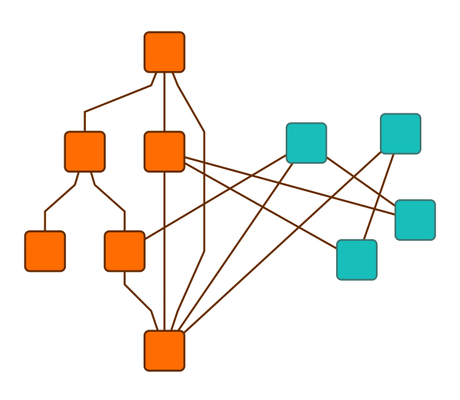

# Incremental Hierarchic Layout - Layout Features Tutorial

[You can also run this demo online](https://live.yworks.com/demos/04-tutorial-layout-features/hierarchic-incremental/index.html).

## Incremental Hierarchic Layout

This demo shows how to run the hierarchic layout algorithm on a predefined subset of nodes (and edges) in a graph.

To achieve this, two setup steps are necessary:

First, the algorithm has to be told to work on a subset only. To do so, [HierarchicLayout](https://docs.yworks.com/yfileshtml/#/api/HierarchicLayout)'s [layout mode](https://docs.yworks.com/yfileshtml/#/api/Hierarchic#layoutMode) property has to be set to [incremental](https://docs.yworks.com/yfileshtml/#/api/LayoutMode#INCREMENTAL).

Second, the algorithm has to be told which set of nodes (and edges) to rearrange. The class [HierarchicLayoutData](https://docs.yworks.com/yfileshtml/#/api/HierarchicLayoutData) offers the property [incrementalHints](https://docs.yworks.com/yfileshtml/#/api/HierarchicLayoutData#incrementalHints) for this purpose.

In this demo, the algorithm works on the subset of turquoise nodes only.

Click the button in the toolbar to run the layout and see the effect.

### Code Snippet

You can copy the code snippet to configure the layout from [GitHub](https://github.com/yWorks/yfiles-for-html-demos/blob/master/demos/04-tutorial-layout-features/hierarchic-incremental/HierarchicIncremental.ts).

### Demos

You can also take a look at more extensive demos that take advantage of this feature:

- [Incremental Hierarchic Demo](../../layout/incrementalhierarchic/index.html)
- [Decision Tree Demo](../../complete/decisiontree/index.html)
- [Collapse Demo](../../complete/collapse/index.html)
- [Network Flows Demo](../../analysis/networkflows/index.html)

### Documentation

The Developer's Guide has detailed information about the [hierarchic layout algorithm](https://docs.yworks.com/yfileshtml/#/dguide/hierarchical_layout) in general and about [how to run the algorithm on a subset of nodes](https://docs.yworks.com/yfileshtml/#/dguide/hierarchical_layout-incremental_layout) specifically.
