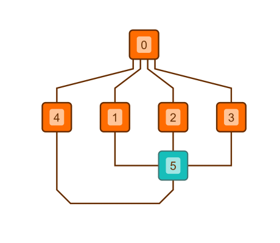

#

      Hierarchic Layout with PortCandidateSet - Layout Features Tutorial

[You can also run this demo online](https://live.yworks.com/demos/04-tutorial-layout-features/hierarchic-portcandidate-set/index.html).

Layout Features Tutorial

# Hierarchic Layout with PortCandidateSet

This demo shows how to use a [PortCandidateSet](https://docs.yworks.com/yfileshtml/#/api/PortCandidateSet) for the [Hierarchic Layout](https://docs.yworks.com/yfileshtml/#/api/HierarchicLayout) to define the port locations for a node as well as control how many edges can be connected to each port.

For the turquoise node, a [PortCandidateSet](https://docs.yworks.com/yfileshtml/#/api/PortCandidateSet) is used that contains four port candidates, one for each side of the node.

Each [PortCandidate](https://docs.yworks.com/yfileshtml/#/api/PortCandidate) only allows for one connecting edge, hence the four incoming edges are distributed to the four port candidates.

Click the button in the toolbar to toggle between [Hierarchic Layout](https://docs.yworks.com/yfileshtml/#/api/HierarchicLayout) with and without a configured port candidate set.

### Code Snippet

You can copy the code snippet to configure the layout from [GitHub](https://github.com/yWorks/yfiles-for-html-demos/blob/master/demos/04-tutorial-layout-features/hierarchic-portcandidate-set/HierarchicPortcandidateSet.ts).

### Documentation

See the [Restricting Port Locations](https://docs.yworks.com/yfileshtml/#/dguide/layout-port_locations) section in the Developer's Guide for an in-depth discussion of the relevant concepts.
