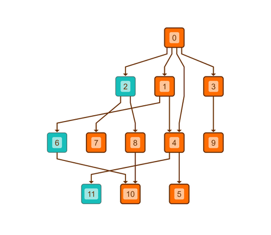

# Hierarchic Layout with Sequence Constraints - Layout Features Tutorial

[You can also run this demo online](https://live.yworks.com/demos/04-tutorial-layout-features/hierarchic-sequence-constraints/index.html).

## Hierarchic Layout with Sequence Constraints

This demo shows how to customize the order of the nodes in a layer (sequencing) when using [Hierarchic Layout](https://docs.yworks.com/yfileshtml/#/api/HierarchicLayout).

### Sequence constraints

Nodes 2, 6 and 11 are configured to be placed at the beginning (or head) of the sequence with the [placeAtHead](https://docs.yworks.com/yfileshtml/#/api/SequenceConstraintData#placeAtHead) method.

Click the button in the toolbar to toggle between [Hierarchic Layout](https://docs.yworks.com/yfileshtml/#/api/HierarchicLayout) with and without configured constraints.

### Code Snippet

You can copy the code snippet to configure the layout from [GitHub](https://github.com/yWorks/yfiles-for-html-demos/blob/master/demos/04-tutorial-layout-features/hierarchic-sequence-constraints/HierarchicSequenceConstraints.ts).

### Demos

See the [Sequence Constraints](../../layout/sequenceconstraints/index.html) demo for more elaborate examples of the constraints functionality.

### Documentation

See the [Constrained Node Sequencing](https://docs.yworks.com/yfileshtml/#/dguide/hierarchical_layout-constrained_node_sequencing) section in the Developer's Guide for an in-depth discussion of the relevant concepts.

See the [SequenceConstraintData](https://docs.yworks.com/yfileshtml/#/api/SequenceConstraintData) API documentation for detailed information on all available constraints.
