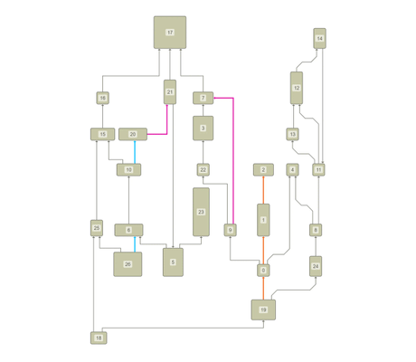

# Hierarchic Layout - Layout Features Tutorial

[You can also run this demo online](https://live.yworks.com/demos/04-tutorial-layout-features/hierarchic/index.html).

## Hierarchic Layout

This demo shows common configuration options for [HierarchicLayout](https://docs.yworks.com/yfileshtml/#/api/HierarchicLayout).

For example, the demo code sets [layout orientation](https://docs.yworks.com/yfileshtml/#/api/HierarchicLayout#layoutOrientation), [default (orthogonal)](https://docs.yworks.com/yfileshtml/#/api/HierarchicLayout#edgeLayoutDescriptor) and [individual (octilinear) edge routing styles](https://docs.yworks.com/yfileshtml/#/api/HierarchicLayoutData#edgeLayoutDescriptors), [source](https://docs.yworks.com/yfileshtml/#/api/HierarchicLayoutData#sourcePortConstraints) and [target port constraints](https://docs.yworks.com/yfileshtml/#/api/HierarchicLayoutData#targetPortConstraints) (pink edges), [critical paths](https://docs.yworks.com/yfileshtml/#/api/HierarchicLayoutData#criticalEdgePriorities) (orange edges), [straightened edges (blue edges)](https://docs.yworks.com/yfileshtml/#/api/SimplexNodePlacer#straightenEdges) and various distances between graph items.

### Code Snippet

You can copy the code snippet to configure the layout from [GitHub](https://github.com/yWorks/yfiles-for-html-demos/blob/master/demos/04-tutorial-layout-features/hierarchic/Hierarchic.ts).

### Demos

The [Layout Styles](../../layout/layoutstyles/index.html) demo showcases more configuration options for the [hierarchic layout algorithm](https://docs.yworks.com/yfileshtml/#/api/HierarchicLayout).

### Documentation

The Developer's Guide provides in-depth information about [Hierarchic Layout](https://docs.yworks.com/yfileshtml/#/dguide/hierarchical_layout) and its features.
