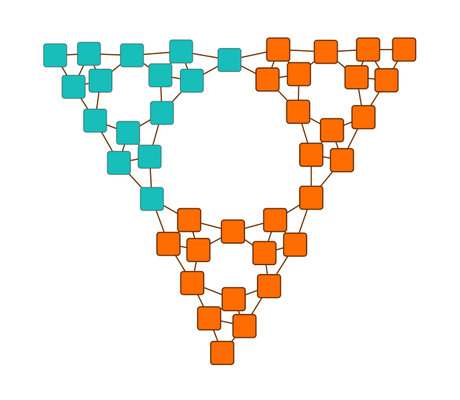

# Incremental Organic Layout - Layout Features Tutorial

[You can also run this demo online](https://live.yworks.com/demos/04-tutorial-layout-features/organic-incremental/index.html).

Layout Features Tutorial

# Incremental Organic Layout

This demo shows how to run the [Organic Layout](https://docs.yworks.com/yfileshtml/#/api/OrganicLayout) algorithm on a predefined subset of nodes in a graph.

To achieve this, two setup steps are necessary:

First, the algorithm has to be told to work on a subset only. To do so, [OrganicLayout](https://docs.yworks.com/yfileshtml/#/api/OrganicLayout)'s [scope](https://docs.yworks.com/yfileshtml/#/api/OrganicLayout#scope) property has to be set to one of the subset scopes [MAINLY_SUBSET](https://docs.yworks.com/yfileshtml/#/api/OrganicLayoutScope#MAINLY_SUBSET), [MAINLY_SUBSET_GEOMETRIC](https://docs.yworks.com/yfileshtml/#/api/OrganicLayoutScope#MAINLY_SUBSET_GEOMETRIC), or [SUBSET](https://docs.yworks.com/yfileshtml/#/api/OrganicLayoutScope#SUBSET).

And second, the algorithm has to be told which set of nodes to rearrange. Class [OrganicLayoutData](https://docs.yworks.com/yfileshtml/#/api/OrganicLayoutData) offers the property [affectedNodes](https://docs.yworks.com/yfileshtml/#/api/OrganicLayoutData#affectedNodes) for this purpose.

In this demo, the algorithm works on the [SUBSET](https://docs.yworks.com/yfileshtml/#/api/OrganicLayoutScope#SUBSET) of turquoise nodes only.

### Code Snippet

You can copy the code snippet to configure the layout from [GitHub](https://github.com/yWorks/yfiles-for-html-demos/blob/master/demos/04-tutorial-layout-features/organic-incremental/OrganicIncremental.ts).

### Documentation

The Developer's Guide has detailed information about the [organic layout algorithm](https://docs.yworks.com/yfileshtml/#/dguide/organic_layout) in general and about [how to run the algorithm on a subset of nodes](https://docs.yworks.com/yfileshtml/#/dguide/organic_layout#organic_layout-incremental) specifically.
