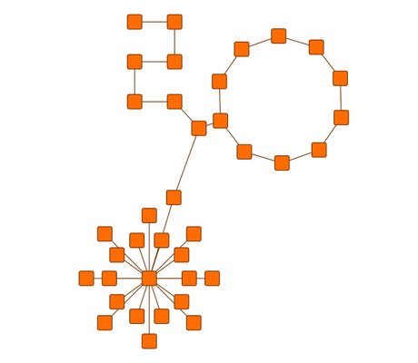

# Organic Layout with Substructures - Layout Features Tutorial

[You can also run this demo online](https://live.yworks.com/demos/04-tutorial-layout-features/organic-substructures/index.html).

Layout Features Tutorial

# Organic Layout with Substructures

This demo shows the ability of [Organic Layout](https://docs.yworks.com/yfileshtml/#/api/OrganicLayout) to consider substructures in the graph.

The graph contains three substructures: a circle, a star and a chain. For each substructure type a special layout configuration is used:

- The circle is configured with the [RADIAL](https://docs.yworks.com/yfileshtml/#/api/StarSubstructureStyle#RADIAL) style.
- The star is configured with the [CIRCULAR](https://docs.yworks.com/yfileshtml/#/api/CycleSubstructureStyle#CIRCULAR) style.
- The chain is configured with [RECTANGULAR](https://docs.yworks.com/yfileshtml/#/api/ChainSubstructureStyle.RECTANGULAR) style.

### Code Snippet

You can copy the code snippet to configure the layout from [GitHub](https://github.com/yWorks/yfiles-for-html-demos/blob/master/demos/04-tutorial-layout-features/organic-substructures/OraganicSubstructures.ts).

### Demos

See the [Organic Substructures Demo](../../layout/organicsubstructures/index.html) for an extensive presentation of the substructures functionality.

### Documentation

See the [Layout of Regular Substructures](https://docs.yworks.com/yfileshtml/#/dguide/organic_layout-substructures) section in the Developer's Guide for an in-depth discussion of the relevant concepts.
