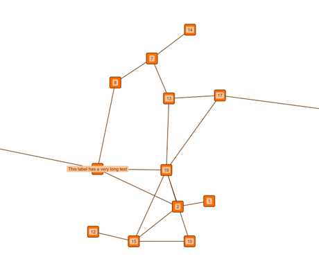

# Organic Layout - Layout Features Tutorial

[You can also run this demo online](https://live.yworks.com/demos/04-tutorial-layout-features/organic/index.html).

Layout Features Tutorial

# Organic Layout

This demo shows basic configuration options for the [Organic Layout](https://docs.yworks.com/yfileshtml/#/api/OrganicLayout). The default behavior is modified in various ways, some of which are described below:

- The layout is [configured to be deterministic](https://docs.yworks.com/yfileshtml/#/api/OrganicLayoutData#deterministic), which causes the layout algorithm to produce identical results for identical input graphs and identical settings.
- The [preferred edge length](https://docs.yworks.com/yfileshtml/#/api/OrganicLayout#preferredEdgeLength) is increased.
- The [compactness factor](https://docs.yworks.com/yfileshtml/#/api/OrganicLayoutData#compactnessFactor) has been increased to yield a more compact layout. For small values, the resulting layout will use a lot of space and nodes tend to be far away from each other. Whereas values near 1.0 produce highly compact layouts.
- To prevent labels from overlapping, the [node label awareness](https://docs.yworks.com/yfileshtml/#/api/OrganicLayoutData#considerNodeLabels) is enabled.
- The [automatic overlap avoidance](https://docs.yworks.com/yfileshtml/#/api/OrganicLayoutData#nodeOverlapsAllowed) is disabled, so a manually chosen [minimum distances between nodes](https://docs.yworks.com/yfileshtml/#/api/OrganicLayoutData#minimumNodeDistance) is applied.
- An [output restriction](https://docs.yworks.com/yfileshtml/#/api/OrganicLayoutData#outPutRestriction) is applied to create a result that is wider than tall.

### Code Snippet

A quick glance at the source for the configuration can be taken at [GitHub](https://github.com/yWorks/yfiles-for-html-demos/blob/master/demos/04-tutorial-layout-features/organic/Organic.ts).

### Demos

The [Layout Styles](../../layout/layoutstyles/index.html?layout=organic&sample=organic) demo showcases even more configuration options for the [organic layout algorithm](https://docs.yworks.com/yfileshtml/#/api/OrganicLayout).

### Documentation

The Developer's Guide provides in-depth information about [Organic Layout](https://docs.yworks.com/yfileshtml/#/dguide/organic_layout) and its features.
