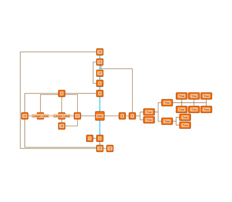

# Orthogonal Layout - Layout Features Tutorial

[You can also run this demo online](https://live.yworks.com/demos/04-tutorial-layout-features/orthogonal/index.html).

## Orthogonal Layout

This demo shows basic configuration options for the [Orthogonal Layout](https://docs.yworks.com/yfileshtml/#/api/OrthogonalLayout).

See the [sources](https://github.com/yWorks/yfiles-for-html-demos/blob/master/demos/04-tutorial-layout-features/orthogonal/Orthogonal.ts) on how the layout is configured.

- The [grid spacing](https://docs.yworks.com/yfileshtml/#/api/OrthogonalLayout#gridSpacing) is decreased, which leads to an overall more compact graph.
- The sources also show how to use the [LayoutData](https://docs.yworks.com/yfileshtml/#/api/LayoutData) to set options for specific edges and nodes in the graph, for example, reserving space around a node (node with 'Halo' text in the sample).
- [Directed edges](https://docs.yworks.com/yfileshtml/#/api/OrthogonalLayoutData#directedEdges) are defined with a flow in a top-to-bottom orientation (blue edges)
- For [tree substructures](https://docs.yworks.com/yfileshtml/#/api/OrthogonalLayout#treeStyle), a compact arrangement style with left-to-right orientation is specified. In this example, nodes with text 'Tree' form a subtree. Other supported substructures, not shown in this example, are [chains](https://docs.yworks.com/yfileshtml/#/api/OrthogonalLayout#chainStyle) and [cycles](https://docs.yworks.com/yfileshtml/#/api/OrthogonalLayout#cycleStyle).

### Code Snippet

You can copy the code snippet to configure the layout from [GitHub](https://github.com/yWorks/yfiles-for-html-demos/blob/master/demos/04-tutorial-layout-features/orthogonal/Orthogonal.ts).

### Documentation

See the [Orthogonal Layout](https://docs.yworks.com/yfileshtml/#/dguide/orthogonal_layout) section in the Developer's Guide for an in-depth discussion of the relevant concepts.
