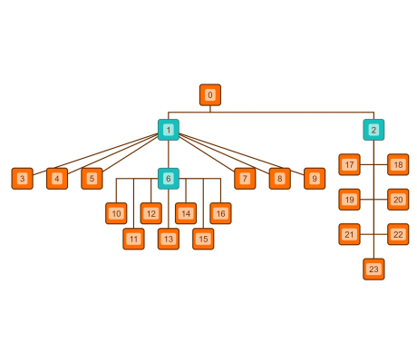

# Tree Layout with Node Placers - Layout Features Tutorial

[You can also run this demo online](https://live.yworks.com/demos/04-tutorial-layout-features/tree-node-placers/index.html).

Layout Features Tutorial

# Tree Layout with Node Placers

This demo shows how to use [node placers](https://docs.yworks.com/yfileshtml/#/api/ITreeLayoutNodePlacer) with the [Tree Layout](https://docs.yworks.com/yfileshtml/#/api/TreeLayout). A node placer is responsible for the arrangement of a local root node and all of its subtrees.

yFiles comes with predefined node placers that provide a variety of subtree arrangement schemes. This example uses three of them:

- Node 1 uses a [LayeredNodePlacer](https://docs.yworks.com/yfileshtml/#/api/LayeredNodePlacer), that places child nodes with the same depth in the tree in the same horizontal layer.
- Node 2 uses a [LeftRightNodePlacer](https://docs.yworks.com/yfileshtml/#/api/LeftRightNodePlacer), that places child nodes left and right of of a single vertical bus.
- Node 6 uses a [DoubleLineNodePlacer](https://docs.yworks.com/yfileshtml/#/api/DoubleLineNodePlacer), that places child nodes in two horizontal lines.

### Code Snippet

You can copy the code snippet to configure the layout from [GitHub](https://github.com/yWorks/yfiles-for-html-demos/blob/master/demos/04-tutorial-layout-features/tree-node-placers/TreeNodePlacers.ts).

### Demos

See the [Tree Layout Demo](../../layout/tree/index.html) for mode extensive examples of node placers.

### Documentation

See the [Tree Layout](https://docs.yworks.com/yfileshtml/#/dguide/tree_layout) section in the Developer's Guide for an in-depth discussion of the relevant concepts.
