<!--
 //////////////////////////////////////////////////////////////////////////////
 // @license
 // This file is part of yFiles for HTML.
 // Use is subject to license terms.
 //
 // Copyright (c) by yWorks GmbH, Vor dem Kreuzberg 28,
 // 72070 Tuebingen, Germany. All rights reserved.
 //
 //////////////////////////////////////////////////////////////////////////////
-->
# yFiles for HTML Demo Applications

The [yFiles for HTML 3.0](https://www.yworks.com/products/yfiles-for-html) demos and tutorials are extensive sample applications that present the features of the yFiles for HTML diagramming library.

The complete source code of all of these samples is part of the yFiles for HTML package and available at [Github](https://github.com/yWorks/yfiles-for-html-demos)

To execute a specific sample, click on its card below. All of these demos are also hosted at the [yWorks homepage](https://www.yworks.com/demos/).

# [Analysis](analysis)

This folder and its subfolders contain demo applications which make use of the different features of the viewer component of yFiles for HTML.

&nbsp;&nbsp;&nbsp;&nbsp;&nbsp;&nbsp;&nbsp;&nbsp;&nbsp;&nbsp;&nbsp;&nbsp;&nbsp;&nbsp;&nbsp;&nbsp;&nbsp;&nbsp;&nbsp;&nbsp;&nbsp;&nbsp;&nbsp;&nbsp;&nbsp;&nbsp;&nbsp;&nbsp;&nbsp;&nbsp; | Demo | Description
--- | --- | ---
 | [Critical Path Analysis (CPA)](analysis/criticalpathanalysis/) | Shows how to perform critical path analysis in project management.
 | [Clustering Algorithms](analysis/clustering/) | Showcases a selection of clustering algorithms such as edge betweenness, k-means, hierarchical and biconnected components clustering.
 | [Intersection Detection](analysis/intersection-detection/) | Shows how to compute and highlight intersections between graph items.
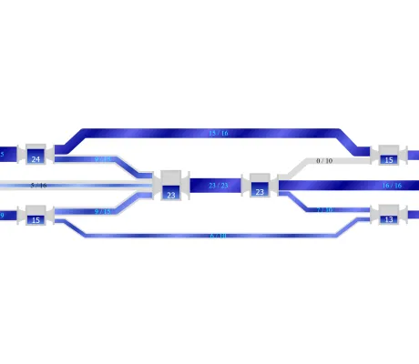 | [Network Flows](analysis/networkflows/) | Presents three network flow graph analysis algorithms that are applied on a network of water pipes.
 | [Transitivity](analysis/transitivity/) | Shows how transitivity graph analysis algorithms can be applied to solve reachability problems.
# [Application Features](application-features)

This folder and its subfolders contain demo applications which illustrate features of the yFiles for HTML diagramming library for building an application. It covers a broad range of topics including building graphs from JSON data, drag and drop, tooltips, snapping (guide lines), etc.

&nbsp;&nbsp;&nbsp;&nbsp;&nbsp;&nbsp;&nbsp;&nbsp;&nbsp;&nbsp;&nbsp;&nbsp;&nbsp;&nbsp;&nbsp;&nbsp;&nbsp;&nbsp;&nbsp;&nbsp;&nbsp;&nbsp;&nbsp;&nbsp;&nbsp;&nbsp;&nbsp;&nbsp;&nbsp;&nbsp; | Demo | Description
--- | --- | ---
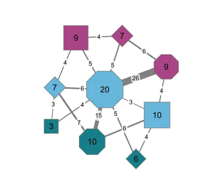 | [Interactive Aggregation](application-features/interactiveaggregation/) | Shows how to analyze a graph by interactively aggregating nodes with common properties.
 | [Table Editor](application-features/tableeditor/) | Shows the support for diagrams that are organized in a tabular way, for example in a grid or a swimlane layout.
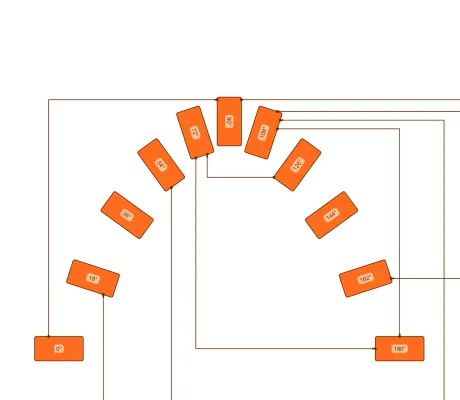 | [Rotatable Nodes](application-features/rotatablenodes/) | Shows nodes that can be rotated with the mouse or touch.
 | [Simple Drag And Drop](application-features/drag-and-drop/) | Shows how to enable dragging nodes from a panel and drop them into the graph component.
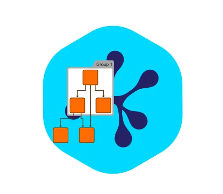 | [Background Image](application-features/background-image/) | Shows how to add a background visualizations to a graph component.
 | [Building Graphs From Data](application-features/building-graph-from-data/) | Shows how to build a graph from data in JSON format.
 | [Building Swimlanes From Data](application-features/building-swimlanes-from-data/) | Shows how to build a graph with swimlanes from data in JSON format.
 | [External Links](application-features/external-links/) | Shows how to add labels that act like external links and open in a new window.
 | [Filtering](application-features/filtering/) | Shows how to configure graph filtering.
 | [Filtering With Folding](application-features/filtering-with-folding/) | Shows how to configure filtering and folding in the same application.
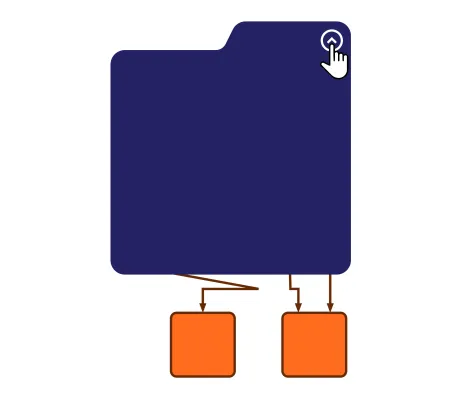 | [Folding](application-features/folding/) | Shows how to enable collapsing and expanding of group nodes.
 | [Folding With Merged Edges](application-features/folding-with-merged-edges/) | Shows how to enable the merging of edges when collapsing group nodes.
 | [Graph Copy](application-features/graph-copy/) | Shows how to copy a graph or parts of a graph.
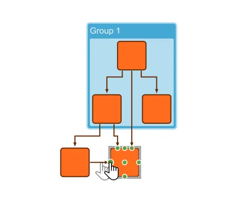 | [Graph Decorator](application-features/graph-decorator/) | Shows how to decorate graph items to change their behavior or visualization.
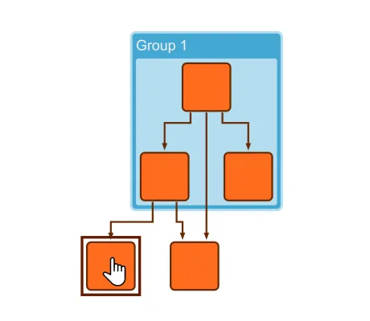 | [Simple Highlight Decorator](application-features/simple-highlight-decorator/) | Shows how to highlight nodes and edges when the mouse hovers over them.
 | [Complex Highlight Decorator](application-features/complex-highlight-decorator/) | Shows how to highlight nodes with different effects based on data stored in their tags.
 | [Graph Search](application-features/graph-search/) | Shows how to search for specific nodes in a graph.
 | [Grid Snapping](application-features/grid-snapping/) | Shows how to enable grid snapping during interactive changes.
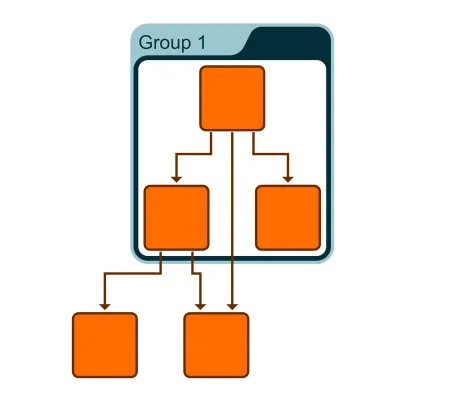 | [Save and Load GraphML](application-features/input-output/) | Shows how to use GraphML input and output.
 | [Custom Data in GraphML](application-features/custom-graphml/) | Shows how to read and write additional data from and to GraphML.
 | [Label Text Wrapping](application-features/label-text-wrapping/) | Shows how to enable label text wrapping and trimming.
 | [Native Listeners](application-features/native-listeners/) | Illustrates how to register native event listeners to a SVG elements of a style.
 | [Orthogonal Edge Editing](application-features/orthogonal-edges/) | Shows how to enable interactive orthogonal edge editing.
 | [Rectangular Indicator](application-features/rectangular-indicator/) | Shows how to add an interactive rectangular indicator to the graph component.
 | [Smart Click Navigation](application-features/smart-click-navigation/) | Shows the how to scroll and zoom to the area of interest by single edge-clicks.
 | [Snapping](application-features/snapping/) | Shows how to enable snapping (guide lines) for interactive changes.
 | [Subdivide Edges](application-features/subdivide-edges/) | Shows how to subdivide an edge when a node is dragged on it.
 | [Theming](application-features/theming/) | Shows how to use a theme to change the look-and-feel of an application.
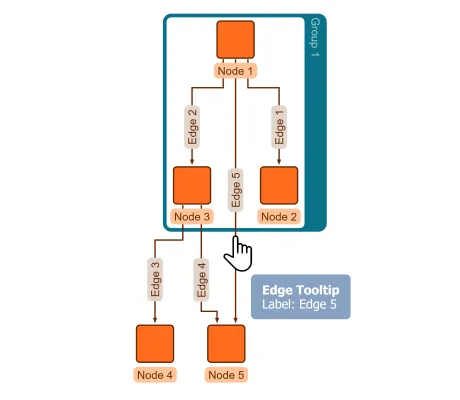 | [Tooltips](application-features/tooltips/) | Shows how to enable tooltips for graph items.
 | [Accessibility](application-features/accessibility/) | Shows how to use the aria-live region to update screen readers.
 | [WebGL Rendering](application-features/webgl-rendering/) | Shows how to enable the WebGL rendering mode.
 | [Overview Component](application-features/overview/) | Shows how to add an overview component to the application.
 | [Timeline](application-features/timeline/) | Shows how to add a timeline component to the graph.
 | [Viewport Limiter](application-features/viewportlimiter/) | Shows how to use the viewport limiter to constrain the graph navigation.
# [Data Binding](data-binding)

This folder and its subfolders contain demo applications which make use of the different features of the viewer component of yFiles for HTML.

&nbsp;&nbsp;&nbsp;&nbsp;&nbsp;&nbsp;&nbsp;&nbsp;&nbsp;&nbsp;&nbsp;&nbsp;&nbsp;&nbsp;&nbsp;&nbsp;&nbsp;&nbsp;&nbsp;&nbsp;&nbsp;&nbsp;&nbsp;&nbsp;&nbsp;&nbsp;&nbsp;&nbsp;&nbsp;&nbsp; | Demo | Description
--- | --- | ---
 | [Graph Builder](databinding/graphbuilder/) | Interactively builds and modifies a graph from JSON business data using class <code>GraphBuilder</code>.
 | [Tree Builder](databinding/treebuilder/) | Interactively builds and modifies a graph from JSON business data using class <code>TreeBuilder</code>.
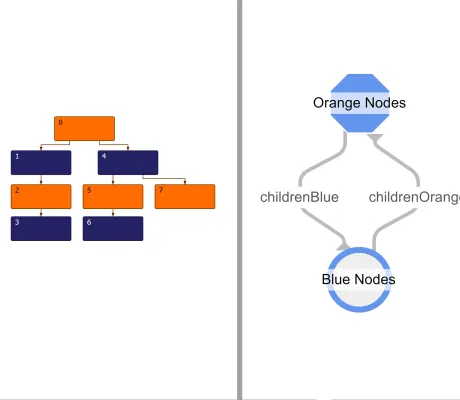 | [Adjacency Graph Builder](databinding/adjacencygraphbuilder/) | Interactively builds and modifies a graph from JSON business data using class <code>AdjacencyGraphBuilder</code>.
 | [Simple Graph Builder](databinding/simplegraphbuilder/) | Automatically builds a graph from JSON business data using <code>GraphBuilder</code>, <code>AdjacencyGraphBuilder</code> or <code>TreeBuilder</code>.
 | [Port-aware Graph Builder](databinding/port-aware-graph-builder/) | Builds a graph using <code>GraphBuilder</code> and connects the items to specific ports.
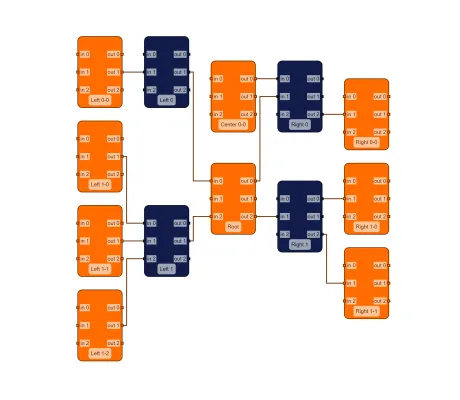 | [Port-aware Adjacency Graph Builder](databinding/port-aware-adjacency-graph-builder/) | Builds a graph using <code>AdjacencyGraphBuilder</code> and connects the items to specific ports.
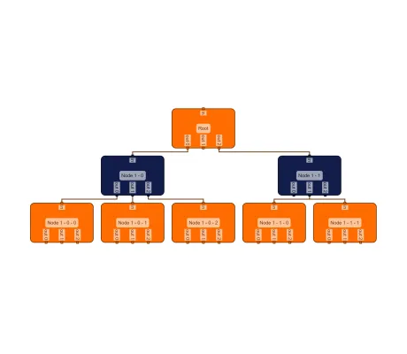 | [Port-aware Tree Builder](databinding/port-aware-tree-builder/) | Builds a graph using <code>TreeBuilder</code> and connects the items to specific ports.
# [Input](input)

This folder and its subfolders contain demo applications which demonstrate how to use and customize the graph editing features provided by yFiles for HTML.

&nbsp;&nbsp;&nbsp;&nbsp;&nbsp;&nbsp;&nbsp;&nbsp;&nbsp;&nbsp;&nbsp;&nbsp;&nbsp;&nbsp;&nbsp;&nbsp;&nbsp;&nbsp;&nbsp;&nbsp;&nbsp;&nbsp;&nbsp;&nbsp;&nbsp;&nbsp;&nbsp;&nbsp;&nbsp;&nbsp; | Demo | Description
--- | --- | ---
 | [Magnifying Glass](input/magnifying-glass/) | Shows a floating lens that magnifies the cursor's surroundings.
 | [Valid Begin Cursors](input/valid-begin-cursors/) | Shows how various cursors can be used to indicate valid gestures at the current location.
 | [Touch Interaction](input/touchcustomization/) | Shows how a graph editor application can be optimized for touch devices.
 | [Component Drag and Drop](input/componentdraganddrop/) | A demo that shows how to clear space for a dropped component in an existing layout.
 | [Interactive Graph Restructuring](input/interactivegraphrestructuring/) | Shows how to interactively relocate subtrees from one parent to another.
 | [Custom Edge Creation](input/customedgecreation/) | Shows how to provide directional ports and demonstrates interactive routing during edge creation.
 | [Node Selection Resizing](input/nodeselectionresizing/) | Shows how to reshape a selection of nodes as one unit.
 | [Custom Label Model](input/customlabelmodel/) | Shows how to implement and use a custom label model.
 | [Custom Port Location Model](input/customportmodel/) | Shows how to implement and use a custom port location model.
 | [Custom Snapping](input/customsnapping/) | Shows how the snapping feature can be customized.
 | [Drag From Component](input/drag-from-component/) | Shows how to drag graph items out of the graph component to another element.
 | [Context Menu](input/contextmenu/) | Shows how to add a context menu to the nodes of a graph and to the canvas background.
 | [Drag and Drop](input/draganddrop/) | Shows drag and drop of nodes, groups and labels.
 | [Graph Drag and Drop](input/graph-drag-and-drop/) | Shows drag and drop of graphs consisting of multiple items.
 | [Custom Drag and Drop](input/custom-drag-and-drop/) | Shows how to change the color of nodes and edges using drag and drop operations.
 | [Edge Reconnection](input/edgereconnection/) | Shows how the reconnection of edge ports can be customized and restricted.
 | [Label Editing](input/labelediting/) | Shows customizations of the interactive label editing.
 | [Custom Handle Provider](input/custom-handle-provider/) | Shows how to implement custom handles that allow to interactively change the shape of an ArrowNodeStyle.
 | [Label Handle Provider](input/labelhandleprovider/) | Shows how to implement custom handles that allow interactive resizing and rotation of labels.
 | [Move Unselected Nodes](input/moveunselectednodes/) | Shows a special input mode that allows you to move nodes without selecting them first.
 | [Orthogonal Edge Editing Customization](input/orthogonal-edge-editing-customization/) | Shows how to customize orthogonal edge editing.
 | [Port Candidate Provider](input/portcandidateprovider/) | Shows how edge creation can be customized.
 | [Position Handler](input/positionhandler/) | Shows how to customize and restrict the movement behavior of nodes.
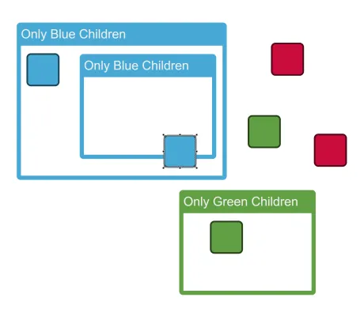 | [Reparent Handler](input/reparenthandler/) | Shows how reparenting of nodes can be customized.
 | [Reshape Handle Provider Configuration](input/reshapehandleconfiguration/) | Shows how resizing of nodes can be customized.
 | [Reshape Handle Provider](input/reshapehandleprovider/) | Shows how to add resize handles to ports.
 | [Restricted Editing](input/restricted-editing/) | Shows how to restrict interactive editing with GraphEditorInputMode.
 | [Lasso Selection](input/lassoselection/) | Shows how to configure a lasso tool for freeform selection.
 | [Marquee Node Creation](input/marquee-node-creation/) | Shows how to customize the MarqueeSelectionInputMode class to create new nodes.
 | [Mouse Wheel Customization](input/mousewheel-customization/) | Shows how to customize and enhance the default mouse wheel behavior.
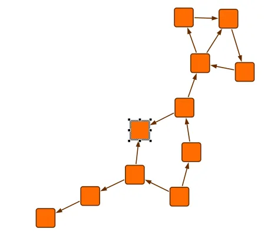 | [Single Selection](input/singleselection/) | Shows how to configure GraphEditorInputMode for single selection mode.
 | [Size Constraint Provider](input/sizeconstraintprovider/) | Shows how resizing of nodes can be restricted.
 | [Button Input Mode](input/button-input-mode/) | Shows how to use a custom input mode adding temporary buttons for model items.
 | [Circular Snapping](input/circle-snapping/) | Shows how to enable circular and angle snapping (guidelines) for interactive changes.
# [Integration](integration)

This folder and its subfolders contain demo applications which illustrate the integration of yFiles for HTML with different web frameworks.

&nbsp;&nbsp;&nbsp;&nbsp;&nbsp;&nbsp;&nbsp;&nbsp;&nbsp;&nbsp;&nbsp;&nbsp;&nbsp;&nbsp;&nbsp;&nbsp;&nbsp;&nbsp;&nbsp;&nbsp;&nbsp;&nbsp;&nbsp;&nbsp;&nbsp;&nbsp;&nbsp;&nbsp;&nbsp;&nbsp; | Demo | Description
--- | --- | ---
 | [Angular CLI](toolkit/angular/README.html) | Shows how to use yFiles for HTML in an Angular app (Angular 2 and newer) using Angular CLI.
 | [React](toolkit/react/README.html) | Shows how to use yFiles for HTML with the React library.
 | [React Class Components](toolkit/react-class-components/README.html) | Shows how to integrate yFiles in a basic React application with class components.
 | [Preact](toolkit/preact/) | Shows how to integrate yFiles in a basic Preact application with TypeScript.
 | [Vue](toolkit/vue/README.html) | Shows how to integrate yFiles in a Vue 3 app with TypeScript and Vite.
 | [Svelte](toolkit/svelte/README.html) | Shows how to integrate the yFiles library in a <a href="https://svelte.dev/" target="_blank">Svelte</a> project.
 | [GraphQL](toolkit/graphql/) | Shows how to load data from a GraphQL service and display it with yFiles for HTML.
 | [Neo4j](toolkit/neo4j/) | Shows how to load data from a Neo4j database and display it with yFiles for HTML.
 | [Next.js](toolkit/next/README.html) | Shows how to use yFiles for HTML with the Next.js library.
 | [SolidJS](toolkit/solid/README.html) | Shows how to integrate yFiles in a SolidJS app with TypeScript and Vite.
 | [Web Components](toolkit/webcomponents/) | Shows how to use yFiles for HTML with Web Components v1.
# [Layout](layout)

This folder and its subfolders contain demo applications which make use of the different layout algorithms of the layout component of yFiles for HTML.

&nbsp;&nbsp;&nbsp;&nbsp;&nbsp;&nbsp;&nbsp;&nbsp;&nbsp;&nbsp;&nbsp;&nbsp;&nbsp;&nbsp;&nbsp;&nbsp;&nbsp;&nbsp;&nbsp;&nbsp;&nbsp;&nbsp;&nbsp;&nbsp;&nbsp;&nbsp;&nbsp;&nbsp;&nbsp;&nbsp; | Demo | Description
--- | --- | ---
 | [Layout Styles: Hierarchical](showcase/layoutstyles?layout=hierarchical&sample=hierarchical) | Presents yFiles' hierarchical layout algorithm and its other layout styles.
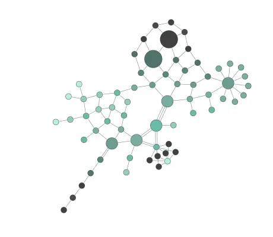 | [Layout Styles: Organic](showcase/layoutstyles?layout=organic&sample=organic) | Presents yFiles' organic layout algorithm and its other layout styles.
 | [Layout Styles: Edge Router](showcase/layoutstyles?layout=edge-router&sample=edge-router) | Presents yFiles' edge routing algorithm and its other layout styles.
 | [Layout Styles: Tree](showcase/layoutstyles?layout=tree&sample=tree) | Presents yFiles' tree layout algorithm and its other layout styles.
 | [Layout Styles: Radial Tree](showcase/layoutstyles?layout=radial-tree&sample=radial-tree) | Presents yFiles' radial tree layout algorithm and its other layout styles.
 | [Layout Styles: Orthogonal](showcase/layoutstyles?layout=orthogonal&sample=orthogonal) | Presents yFiles' orthogonal layout algorithm and its other layout styles.
 | [Layout Styles: Circular](showcase/layoutstyles?layout=circular&sample=circular) | Presents yFiles' circular layout algorithm and its other layout styles.
 | [Layout Styles: Radial](showcase/layoutstyles?layout=radial&sample=radial) | Presents yFiles' radial layout algorithm and its other layout styles.
 | [Layout Styles: Compact Disk](showcase/layoutstyles?layout=compact-disk&sample=compact-disk-with-edges) | Presents yFiles' compact disk layout algorithm and its other layout styles.
 | [Layout Styles: Series-Parallel](showcase/layoutstyles?layout=series-parallel&sample=series-parallel) | Presents yFiles' series-parallel layout algorithm and its other layout styles.
 | [Layout Styles: Components](showcase/layoutstyles?layout=components&sample=components) | Presents yFiles' component layout algorithm and its other layout styles.
 | [Layout Styles: Tabular](showcase/layoutstyles?layout=tabular&sample=tabular) | Presents yFiles' tabular layout algorithm and its other layout styles.
 | [Layout Styles: Labeling](showcase/layoutstyles?layout=labeling) | Presents yFiles' label placement algorithm and its other layout styles.
 | [Layout Styles: Partial](showcase/layoutstyles?layout=partial) | Presents yFiles' partial layout algorithm and its other layout styles.
 | [Sankey Diagram](layout/sankey/) | A diagram used for visualizing flow information in which the thickness of the edges is proportional to the flow quantity.
 | [Tree Map](layout/treemap/) | Shows disk usage of a directory tree with the Tree Map layout.
 | [Hierarchical Nesting](layout/hierarchical-nesting/) | The hierarchical layout nicely expands and collapses sub-graphs organized in groups.
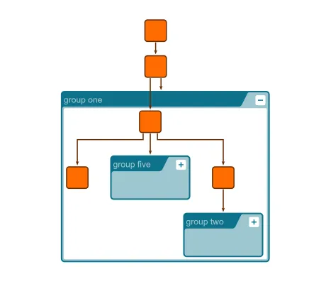 | [Hierarchical Nesting (Incremental)](layout/hierarchical-nesting-incremental/) | Shows how to nicely lay out newly loaded nodes when expanding folded groups.
 | [Folding With Layout](layout/foldingwithlayout/) | Shows how an automatic layout makes space for opening groups and reclaims the space of closing groups.
 | [Edge Bundling](layout/edgebundling/) | Shows how edge bundling can be applied for reducing visual cluttering in dense graphs.
 | [Arc Diagram](layout/arc-diagram/) | Shows how to visualize a graph as an arc diagram.
 | [Maze Routing](layout/mazerouting/) | Shows how the automatic edge routing finds routes through a maze.
 | [Edge Label Placement](layout/edgelabelplacement/) | Shows how to place edge labels at the preferred location with a labeling algorithm.
 | [Automatic Node Labeling](layout/node-labeling/) | Shows how to place node labels at the preferred location with a labeling algorithm.
 | [Node Types](layout/nodetypes/) | Shows how different layout algorithms handle nodes with types.
 | [Interactive Hierarchical Layout](layout/interactive-hierarchical/) | The from sketch mode of the hierarchical layout style can incrementally fit new nodes and edges into the existing drawing.
 | [Interactive Edge Routing](layout/interactiveedgerouting/) | After each edit the edge paths are re-routed if necessary.
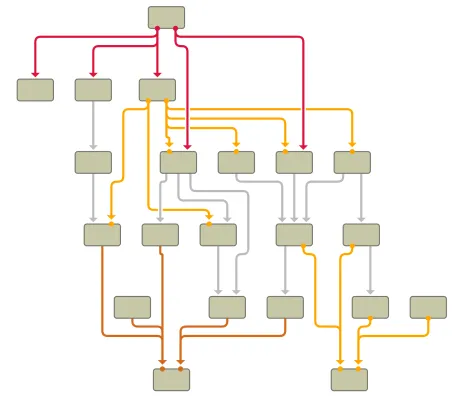 | [Edge Grouping](layout/edgegrouping/) | The hierarchical layout can group the paths or ports of edges.
 | [EdgeRouter Grouping](layout/edgeroutergrouping/) | The EdgeRouter can group the paths or ports of edges.
 | [Boundary Labeling](layout/boundary-labeling/) | Shows how to configure organic layout for annotating points on a diagram.
 | [Height Profile](layout/height-profile/) | Shows how to configure organic layout to create height profile visualization
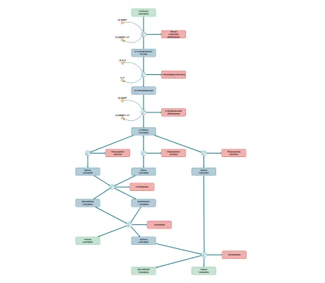 | [Metabolic Pathways](layout/metabolic-pathways/) | Shows how to configure organic layout for visualizing metabolic pathways.
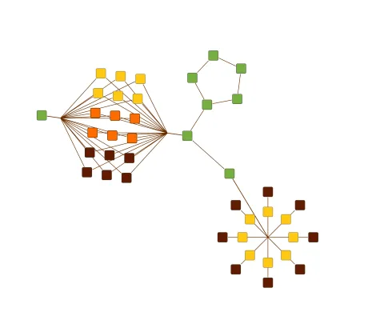 | [Organic Substructures](layout/organic-substructures/) | Shows organic layout, and its substructures and node types features.
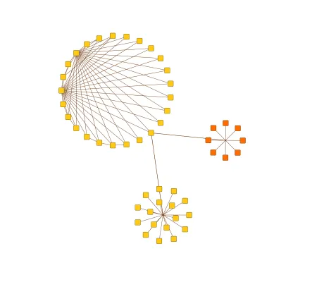 | [Circular Substructures](layout/circular-substructures/) | Shows circular layout, and its substructures and node types features.
 | [Bus Routing](layout/busrouting/) | Shows how to group edges in bus structures.
 | [Fill Area Layout](layout/fillarealayout/) | Shows how to fill free space after deleting nodes.
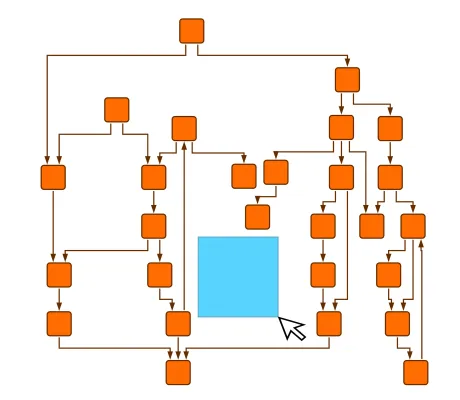 | [Clear Marquee Area](layout/clearmarqueearea/) | Shows how to automatically keep a marquee area clear of graph elements.
 | [Clear Rectangle Area](layout/clearrectanglearea/) | Shows how to automatically keep a user-defined rectangular area clear of graph elements.
 | [Node Overlap Avoiding](layout/nodeoverlapavoiding/) | Shows how an automatic layout can remove node overlaps while a user interactively edits a graph.
 | [Node Alignment](layout/node-alignment/) | Shows how to align nodes on horizontal and/or vertical lines.
 | [Hierarchical Grid Components](layout/hierarchical-grid-components/) | Grid components in the hierarchical layout result in more compact arrangements.
 | [Hierarchical Subcomponents](layout/subcomponents/) | The hierarchical layout can arrange subcomponents with different layout styles.
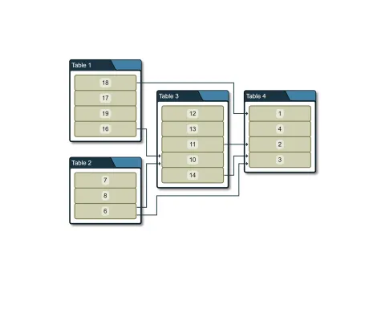 | [Tabular Groups](layout/tabular-groups/) | Shows how to configure the tabular groups feature of the hierarchical layout.
 | [Critical Paths](layout/criticalpaths/) | The hierarchical and tree layout styles can emphasize critical (important) paths by aligning their nodes.
 | [Custom Layout Stage](layout/custom-layout-stage/) | Custom layout stages can be used to solve unique layout problems that are not adequately covered by existing layout algorithms.
 | [Split Edges](layout/splitedges/) | Shows how to align edges at group nodes using RecursiveGroupLayout with HierarchicalLayout.
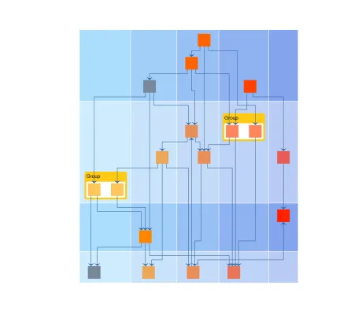 | [Layout Grid](layout/layoutgrid/) | Demonstrates the usage of a layout grid for hierarchical and organic layouts.
 | [Simple Layout Grid](layout/simplelayoutgrid/) | Shows how to create a simple layout grid.
 | [Layer Constraints](layout/layerconstraints/) | Shows how to use layer constraints to prescribe the node layering in hierarchical layouts.
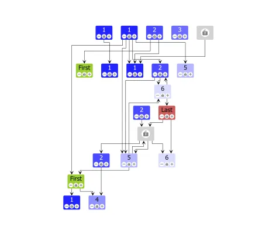 | [Sequence Constraints](layout/sequenceconstraints/) | Shows how to use sequence constraints to prescribe the node sequencing in hierarchical layouts.
 | [Interactive Organic Layout](layout/interactiveorganic/) | Shows the 'interactive organic' layout algorithm.
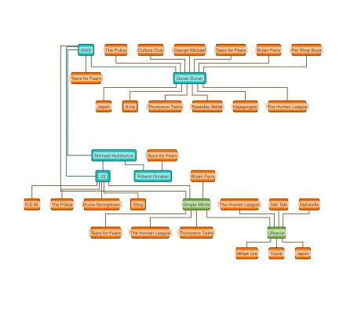 | [Multi-Page Layout](layout/multipage/) | Shows how to divide a large model graph into several smaller page graphs, for example to print to multiple pages.
 | [Tree Layout](layout/tree/) | Shows how to use different subtree placer in TreeLayout.
 | [Partial Layout](layout/partial/) | Shows how to integrate new graph elements into an existing graph layout.
 | [Layout Without View](layout/without-view/) | Shows how to use the graph analysis and layout algorithms without a view and without the IGraph API
 | [Port Alignment](layout/port-alignment/) | Shows how to implement port alignment in hierarchical layout to visualize paths.
# [Layout Features](layout-features)

This collection of demos shows for the main features of yFiles' layout algorithms how to configure the algorithm accordingly.

&nbsp;&nbsp;&nbsp;&nbsp;&nbsp;&nbsp;&nbsp;&nbsp;&nbsp;&nbsp;&nbsp;&nbsp;&nbsp;&nbsp;&nbsp;&nbsp;&nbsp;&nbsp;&nbsp;&nbsp;&nbsp;&nbsp;&nbsp;&nbsp;&nbsp;&nbsp;&nbsp;&nbsp;&nbsp;&nbsp; | Demo | Description
--- | --- | ---
 | [Hierarchical Layout](layout-features/hierarchical/) | Shows common configuration options for hierarchical layout.
 | [Incremental Hierarchical Layout](layout-features/hierarchical-incremental/) | Shows how to run the hierarchical layout on a predefined set of nodes.
 | [Hierarchical Layout with Node Port Candidates](layout-features/hierarchical-node-port-candidates/) | Shows how to use node port candidates with hierarchical layout.
 | [Hierarchical Layout with Edge Grouping](layout-features/hierarchical-edge-grouping/) | Shows how to configure edge grouping for hierarchical layout.
 | [Hierarchical Layout with Given Layering](layout-features/hierarchical-given-layering/) | Shows how to configure hierarchical layout with a given layering.
 | [Hierarchical Layout with Constraints](layout-features/hierarchical-constraints/) | Shows how to use constraints to control layering and sequencing in the hierarchical layout.
 | [Hierarchical Layout with Sequence Constraints](layout-features/hierarchical-sequence-constraints/) | Shows how to use constraints to control sequencing in hierarchical layout.
 | [Hierarchical Layout with Layer Constraints](layout-features/hierarchical-layer-constraints/) | Shows how to use constraints to control layering in hierarchical layout.
 | [Hierarchical Layout with Node Alignment](layout-features/hierarchical-node-alignment/) | Shows how to align a set of nodes with hierarchical layout.
 | [Hierarchical Layout with Edge Labeling](layout-features/hierarchical-edge-labeling/) | Shows how to configure automatic label placement of hierarchical layout.
 | [Compact Groups in Hierarchical Layout](layout-features/hierarchical-compact-groups/) | Shows how to configure the hierarchical layout such that it yields maximally compact group nodes.
 | [Organic Layout](layout-features/organic/) | Shows common configuration options for organic layout.
 | [Incremental Organic Layout](layout-features/organic-incremental/) | Shows how to run the organic layout on a predefined set of nodes.
 | [Organic Layout with Edge Labeling](layout-features/organic-edge-labeling/) | Shows how to configure automatic label placement of organic layout.
 | [Organic Layout with Substructures](layout-features/organic-substructures/) | Shows how to configure the layout of substructures in the organic layout.
 | [Organic Layout with Constraints](layout-features/organic-constraints/) | Shows how to configure constraints for the organic layout algorithm.
 | [Edge Router](layout-features/edge-router/) | Shows common configuration options for the edge routing algorithm.
 | [Incremental Edge Router](layout-features/edge-router-incremental/) | Shows how to run the edge router on a predefined set of edges.
 | [Edge Router with Buses](layout-features/edge-router-buses/) | Shows how to configure the edge routing algorithm to produce orthogonal bus-style paths.
 | [Basic Tree Layout](layout-features/tree/) | Shows common configuration options for the tree layout.
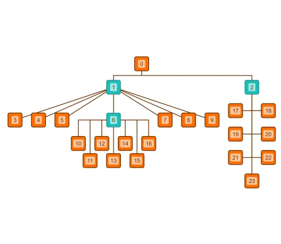 | [Tree Layout with Subtree Placers](layout-features/tree-node-placers/) | Shows how to use different subtree placers in tree layout.
 | [Orthogonal Layout](layout-features/orthogonal/) | Shows common configuration options for the orthogonal layout.
 | [Recursive Group Layout](layout-features/recursive-group-layout/) | Shows how to use different layouts for group nodes using the recursive group layout.
 | [Radial Group Layout](layout-features/radial-group/) | Shows how to configure the radial group layout to arrange grouped graphs.
 | [Compact Disk Groups](layout-features/compact-disk-groups/) | Shows how to configure the compact disk layout to arrange children of group nodes.
 | [Compact Tabular Layout](layout-features/compact-tabular-layout/) | Shows how to configure the tabular layout to create compact drawings
# [Loading](loading)

This folder and its subfolders contain demo applications which illustrate the different loading mechanisms of yFiles for HTML.

&nbsp;&nbsp;&nbsp;&nbsp;&nbsp;&nbsp;&nbsp;&nbsp;&nbsp;&nbsp;&nbsp;&nbsp;&nbsp;&nbsp;&nbsp;&nbsp;&nbsp;&nbsp;&nbsp;&nbsp;&nbsp;&nbsp;&nbsp;&nbsp;&nbsp;&nbsp;&nbsp;&nbsp;&nbsp;&nbsp; | Demo | Description
--- | --- | ---
 | [Node.js](loading/nodejs/) | Shows how to run a yFiles layout algorithm in a <a href='https://nodejs.org/' target='_blank'>Node.js&reg;</a> environment.
 | [Basic Demo](loading/basic-demo/) | A simple demo that you can use as a starting point for your own project.
 | [Rollup.js](loading/rollupjs/README.html) | Shows how to bundle the yFiles library in a <a href="https://rollupjs.org" target="_blank">rollup</a> project.
 | [Web Worker Webpack](loading/webworker-webpack/README.html) | Shows how to run a yFiles layout algorithm in a Web Worker task using Webpack.
 | [Web Worker](loading/webworker/) | Shows how to run a layout in a Web Worker task using module workers.
 | [webpack](loading/webpack/README.html) | Shows how to integrate the yFiles library in a <a href="https://webpack.js.org" target="_blank">webpack</a> project.
 | [Vite](loading/vite/README.html) | Shows how to integrate the yFiles library in a <a href="https://vitejs.dev/" target="_blank">Vite</a> project.
 | [Vite Lazy Load yFiles](loading/vite-lazy-yfiles/README.html) | Shows how to lazily load yFiles in a <a href="https://vitejs.dev/" target="_blank">Vite</a> project with dynamic imports.
 | [Web Dev Server](loading/web-dev-server/README.html) | Shows how to integrate the yFiles library in a <a href="https://modern-web.dev/docs/dev-server/overview/" target="_blank">Web Dev Server</a> project.
# [Showcase](showcase)

This folder and its subfolders contain demo applications which make use of the different features of yFiles for HTML.

&nbsp;&nbsp;&nbsp;&nbsp;&nbsp;&nbsp;&nbsp;&nbsp;&nbsp;&nbsp;&nbsp;&nbsp;&nbsp;&nbsp;&nbsp;&nbsp;&nbsp;&nbsp;&nbsp;&nbsp;&nbsp;&nbsp;&nbsp;&nbsp;&nbsp;&nbsp;&nbsp;&nbsp;&nbsp;&nbsp; | Demo | Description
--- | --- | ---
 | [Layout Styles](showcase/layoutstyles/) | Presents yFiles' exceptional layout algorithms, including hierarchical,       organic, orthogonal, tree, edge routing, and more.
 | [BPMN Editor](showcase/bpmn/) | An interactive business process diagram editor with BPMN node styles and a special layout algorithm.
 | [Organization Chart](showcase/orgchart/) | An interactive viewer for organization charts with adaptive styles and automatic layout.
 | [Process Mining](showcase/processmining/) | Shows how to create an animated visualization of a process flow.
 | [Company Ownership Chart](showcase/company-ownership/) | Interactively research the ownership of companies and their management relationships.
 | [Fraud Detection](showcase/frauddetection/) | Example of a fraud detection application for time-dependent data.
 | [Isometric Drawing](showcase/isometricdrawing/) | Displays graphs in 3D using an freely adjustable projection and WebGL rendering.
 | [Network Monitoring](showcase/networkmonitoring/) | Example of a monitoring tool for computer networks.
 | [Metaball Groups](showcase/metaballgroups/) | Shows how to render metaball-like background visualizations.
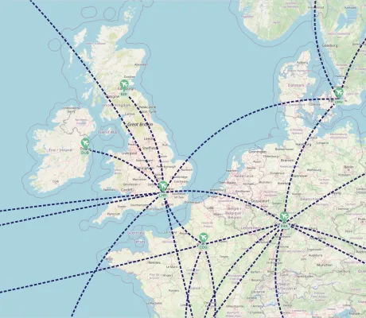 | [Map](showcase/map/) | Displays a graph on top of an interactive map.
 | [GraphWizard for Flowchart](showcase/graph-wizard-for-flowchart/) | Customizes defaults and input gestures to support fast creation of flowcharts.
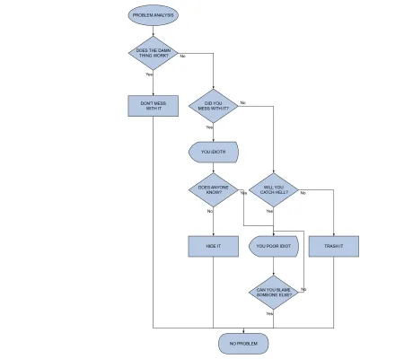 | [Flowchart Editor](showcase/flowchart/) | An editor for Flowchart diagrams that features interactive editing, flowchart node styles, and automatic layout.
 | [UML Editor](showcase/uml/) | An editor for UML diagrams with a tailored UML node style, automatic layout, and a quick way to create new edges with the mouse or touch.
 | [Decision Tree](showcase/decisiontree/) | An interactive Decision Tree component that lets you design and explore your own decision graphs.
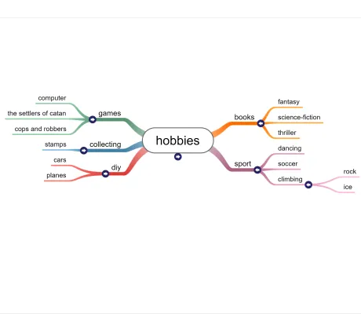 | [Mindmap Editor](showcase/mindmap/) | A Mindmap editor with a tailored node style, custom user interaction, and a specialized layout that automatically arranges new entries.
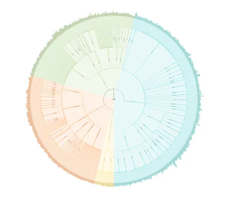 | [Tree of Life](showcase/tree-of-life/) | An interactive radial dendrogram visualization of the Tree of Life.
 | [Home Automation](showcase/home-automation/) | Demonstrates visual programming of a home automation network.
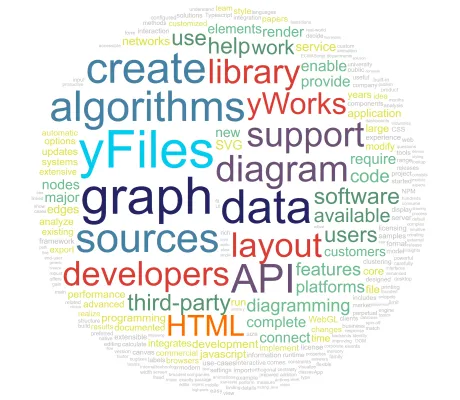 | [Tag Cloud](showcase/tag-cloud/) | Shows how to create a Tag Cloud.
 | [Logic Gates](showcase/logicgates/) | An editor for networks of logic gates, with tailored automatic layout.
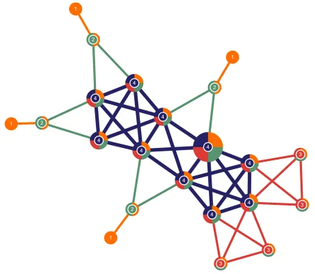 | [Graph Analysis](showcase/graphanalysis/) | Showcases yFiles' algorithms that help analyzing the structure of a graph, such as shortest paths, flows, centrality measures
 | [Large Graphs](showcase/large-graphs/) | Shows how to display large graphs with both good performance in WebGL and high quality in SVG.
 | [Large Graph Aggregation](showcase/largegraphaggregation/) | Shows how to use the smart node aggregation for drill-down exploration of a large graph.
 | [Neighborhood View](showcase/neighborhood/) | Shows the neighborhood of the currently selected node alongside the graph.
 | [Neighborhood Circles](showcase/neighborhood-circles/) | Shows the neighborhood of selected nodes arranged on concentric circles.
 | [Chord Diagram](showcase/chord-diagram/) | Shows a chord diagram that emphasizes the magnitude of connections between nodes.
 | [Non-ribbon Chord Diagram](showcase/chord-diagram-non-ribbon/) | Shows a non-ribbon chord diagram that emphasizes the traceability of the connections.
# [Style](style)

This folder and its subfolders contain demo applications which make use of the different features of the viewer component of yFiles for HTML.

&nbsp;&nbsp;&nbsp;&nbsp;&nbsp;&nbsp;&nbsp;&nbsp;&nbsp;&nbsp;&nbsp;&nbsp;&nbsp;&nbsp;&nbsp;&nbsp;&nbsp;&nbsp;&nbsp;&nbsp;&nbsp;&nbsp;&nbsp;&nbsp;&nbsp;&nbsp;&nbsp;&nbsp;&nbsp;&nbsp; | Demo | Description
--- | --- | ---
 | [CSS Item Style](style/css-item-style/) | Shows how to style and animate graph items with CSS.
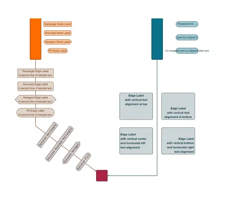 | [Label Style](style/label-style/) | Shows the features of the LabelStyle class.
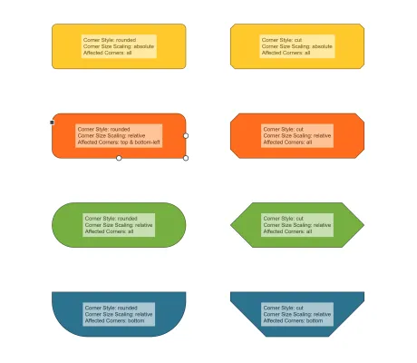 | [Rectangle Node Style](style/rectangle-node-style/) | Shows the different node shapes that can be implemented with the RectangleNodeStyle class.
 | [Shape Node Style](style/shape-node-style/) | Shows the features of the ShapeNodeStyle class.
 | [Shape Port Style](style/shape-port-style/) | Shows the features of the ShapePortStyle class.
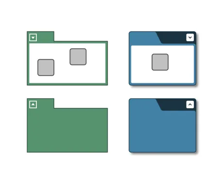 | [Group Node Style](style/group-node-style/) | Shows the group and folder node visualization options offered by the GroupNodeStyle class.
 | [Arrow](style/arrow/) | Shows all arrow types of the Arrow class.
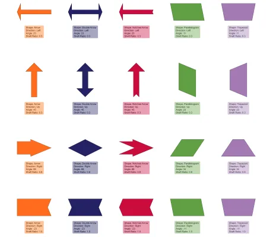 | [Arrow Node Style](style/arrow-node-style/) | Shows the features of the ArrowNodeStyle class.
 | [Arrow Edge Style](style/arrow-edge-style/) | Shows the features of the ArrowEdgeStyle class.
 | [WebGL Animations](style/webgl-animations/) | Shows howto use WebGL animations to highlight interesting parts of a graph.
 | [Custom Styles](style/customstyles/) | Shows how to create custom styles for nodes, edges, labels, ports, and edge arrows.
 | [Template Styles](style/templatestyles/) | Shows SVG template styles for nodes using a simple templating engine.
 | [Template Node Style](style/template-node-style/) | Presents a versatile and customizable template node style using a simple templating engine.
 | [React JSX Component Style](style/react-template-node-style/) | Presents a versatile and easily customizable template node style based on JSX and React.
 | [Vue Template Node Style](style/vue-template-node-style/) | Presents a versatile and easily customizable template node style based on Vue.
 | [Lit Template Node Style](style/lit-template-node-style/) | Presents a versatile and easily customizable template node style based on the Lit templating framework.
 | [WebGL Styles](style/webgl-styles/) | Shows the various graph item styles available in WebGL rendering.
 | [WebGL Selection Styles](style/webgl-selection-styles/) | Shows the possible styling configurations for selections in WebGL rendering.
 | [CSS Styling](style/cssstyling/) | Shows how to style indicators and other templates.
 | [Theme Variants](style/theme-variants/) | Shows various interaction visualization themes simultaneously.
 | [Isometric Bar Chart Node Style](style/isometric-bar-chart-style/) | Shows how a node style can be augmented with isometric bars.
 | [d3 Chart Nodes](style/d3chartnodes/) | Presents a node style that visualizes dynamic data with d3.js.
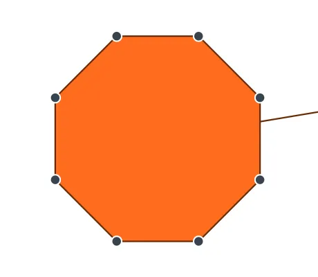 | [Editable Path Node Style](style/editablepathstyle/) | Shows a path-based node style whose control points can be moved by users.
 | [WebGL Image Node](style/webgl-image-node/) | Shows how to render image nodes with WebGL.
 | [Clickable Style Decorator](style/clickable-style-decorator/) | Illustrates an approach for handling clicks on specific areas of the style.
 | [Composite Node Style](style/composite-node-style/) | Shows how to combine node visualizations from several styles.
 | [Level of Detail Style](style/level-of-detail-style/) | Shows a node style that hides details when zooming out.
 | [Data Table](style/datatable/) | Shows a node style and a label style that display data in a tabular fashion.
 | [Bezier Edge Style](style/bezieredgestyle/) | Shows how to use the curved edge style consisting of Bezier splines.
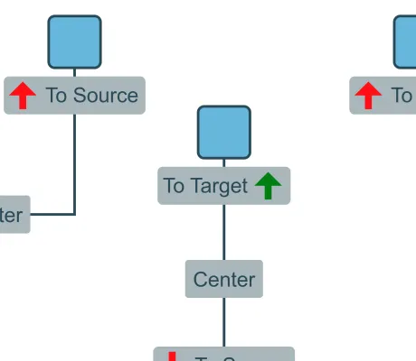 | [Directed Edge Label Style](style/directed-edge-label/) | Shows label styles displaying arrows that always point to the source or target port.
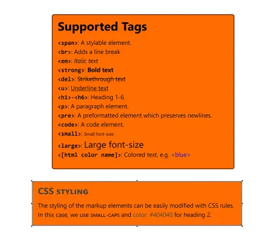 | [Markup Label](style/markup-labels/) | Markup label style lets you use html-like markup to structure and style the label text.
 | [Markdown Label](style/markdownlabel/) | Use markdown to format the label text.
 | [Rich Text Label](style/richtextlabel/) | Edit markup labels with a WYSIWYG text editor.
 | [HTML Controls](style/html-controls/) | Shows how a custom HTML-based node style can be used to create interactive nodes.
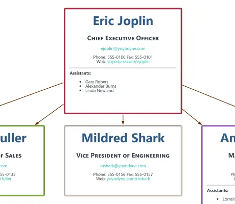 | [HTML Label Style](style/html-label-style/) | Shows how HTML can be used for label rendering with a custom label style.
 | [Zoom-invariant Label Style](style/invariant-label/) | Shows label styles that are independent of the zoom level.
 | [Simple Arrow Style](style/simple-arrow-style/) | Shows how to create a simple custom arrow for edges.
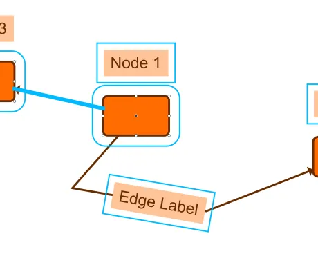 | [Selection Styling](style/selectionstyling/) | Shows customized selection painting of nodes, edges and labels by decorating these items with a corresponding      style.
 | [Style Decorators](style/styledecorators/) | Shows how to create styles for nodes, edges, and labels that wrap existing styles and add visual decorators.
 | [General Path Node Style](style/general-path-node-style/) | Shows how to create a variety of star, polygon, and other custom node styles with GeneralPathNodeStyle.
 | [Angular Component Node Style](style/angular-component-node-style/README.html) | Shows how to use an Angular component to visualize graph nodes.
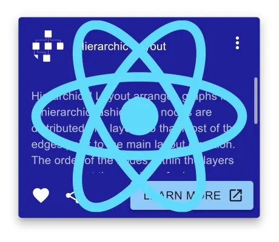 | [React Component Node Style](style/react-component-node-style/README.html) | Shows how to use a React component to visualize graph nodes.
 | [Vue Component Node Style](style/vue-component-node-style/README.html) | Shows how to use a Vue component to visualize graph nodes.
# [Testing](testing)

This collection of demos shows how to use testing frameworks with yFiles.

&nbsp;&nbsp;&nbsp;&nbsp;&nbsp;&nbsp;&nbsp;&nbsp;&nbsp;&nbsp;&nbsp;&nbsp;&nbsp;&nbsp;&nbsp;&nbsp;&nbsp;&nbsp;&nbsp;&nbsp;&nbsp;&nbsp;&nbsp;&nbsp;&nbsp;&nbsp;&nbsp;&nbsp;&nbsp;&nbsp; | Demo | Description
--- | --- | ---
 | [WebdriverIO](testing/wdio/README.html) | Shows how to test a yFiles for HTML app in multiple browsers using WebdriverIO.
 | [Cypress](testing/cypress/README.html) | Shows how to test a yFiles for HTML app using Cypress.
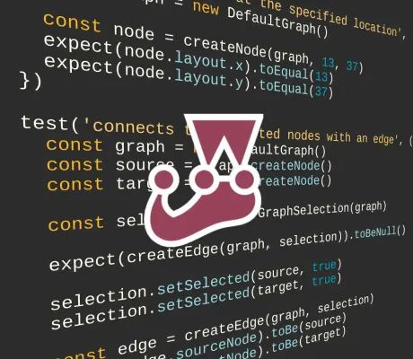 | [Jest](testing/jest/README.html) | Shows how to test a yFiles for HTML app using Jest.
 | [Jest Puppeteer](testing/jest-puppeteer/README.html) | Shows how to test a yFiles for HTML app using Jest with the Puppeteer environment.
 | [Vitest](testing/vitest/README.html) | Shows how to test a yFiles for HTML app using Vitest.
 | [Playwright](testing/playwright/README.html) | Shows how to test a yFiles for HTML app using Playwright.
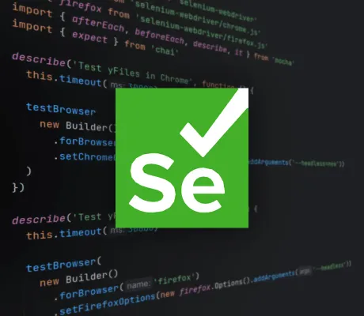 | [Selenium WebDriver](testing/selenium-webdriver/README.html) | Shows how to test a yFiles for HTML app using Selenium WebDriver.
# [Tutorial Basic Features](tutorial-basic-features)

This Basic Features Tutorial is a step-by-step introduction to the concepts and main features of the yFiles for HTML diagramming library. Topics include basic styling, user interaction, Undo/Redo, clipboard, group nodes and folding.

&nbsp;&nbsp;&nbsp;&nbsp;&nbsp;&nbsp;&nbsp;&nbsp;&nbsp;&nbsp;&nbsp;&nbsp;&nbsp;&nbsp;&nbsp;&nbsp;&nbsp;&nbsp;&nbsp;&nbsp;&nbsp;&nbsp;&nbsp;&nbsp;&nbsp;&nbsp;&nbsp;&nbsp;&nbsp;&nbsp; | Demo | Description
--- | --- | ---
 | [Tutorial: Basic Features](tutorial-yfiles-basic-features/01-graphcomponent/) | Learn about the most commonly used yFiles features.
 | [01 Creating the View](tutorial-yfiles-basic-features/01-graphcomponent/) | Introduces the GraphComponent class, the central UI element for working with graphs.
 | [02 Creating Graph Elements](tutorial-yfiles-basic-features/02-graph-element-creation/) | Shows how to create the basic graph elements.
 | [03 Managing Viewport](tutorial-yfiles-basic-features/03-managing-viewport/) | Shows how to work with the viewport.
 | [04 Setting Styles](tutorial-yfiles-basic-features/04-setting-styles/) | Shows how to configure the visual appearance of graph elements using styles.
 | [05 Label Placement](tutorial-yfiles-basic-features/05-label-placement/) | Shows how to control label placement with the help of so called label model parameters.
 | [06 Basic Interaction](tutorial-yfiles-basic-features/06-basic-interaction/) | Shows the default interaction gestures that are provided by class GraphEditorInputMode.
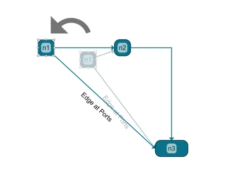 | [07 Undo Clipboard Support](tutorial-yfiles-basic-features/07-undo-clipboard-support/) | Shows how to use the undo and clipboard features.
 | [08 Grouping](tutorial-yfiles-basic-features/08-grouping/) | Shows how to configure support for grouped (or hierarchically organized) graphs.
 | [09 Data Binding](tutorial-yfiles-basic-features/09-data-binding/) | Shows how to bind data to graph elements.
 | [10 Layout](tutorial-yfiles-basic-features/10-layout/) | Shows how to use the layout algorithms in yFiles for HTML to automatically place the graph elements.
 | [11 Layout Data](tutorial-yfiles-basic-features/11-layout-data/) | Shows how to configure individual settings for each node for the automatic layout.
 | [12 Analysis Algorithms](tutorial-yfiles-basic-features/12-graph-analysis/) | Shows how to use the graph analysis algorithms.
# [Tutorial Style Implementation Edge](tutorial-style-implementation-edge)

This tutorial is a step-by-step guide to customizing the visual representation of edges.

&nbsp;&nbsp;&nbsp;&nbsp;&nbsp;&nbsp;&nbsp;&nbsp;&nbsp;&nbsp;&nbsp;&nbsp;&nbsp;&nbsp;&nbsp;&nbsp;&nbsp;&nbsp;&nbsp;&nbsp;&nbsp;&nbsp;&nbsp;&nbsp;&nbsp;&nbsp;&nbsp;&nbsp;&nbsp;&nbsp; | Demo | Description
--- | --- | ---
 | [Tutorial: Edge Style Implementation](tutorial-style-implementation-edge/01-create-a-polyline/) | Learn how to implement a custom edge style using SVG.
 | [01 Create a Polyline](tutorial-style-implementation-edge/01-create-a-polyline/) | Create a simple edge style using SVG
 | [02 Crop the Polyline](tutorial-style-implementation-edge/02-crop-the-polyline/) | Crop the edge path at the outline of its source and target nodes.
 | [03 Create Parallel Polylines](tutorial-style-implementation-edge/03-create-parallel-polylines/) | Create parallel polylines for edge visualization.
 | [04 Render Performance](tutorial-style-implementation-edge/04-render-performance/) | Optimize rendering performance of an SVG edge style
 | [05 Making the Style Configurable](tutorial-style-implementation-edge/05-making-the-style-configurable/) | Make a custom edge style configurable by adding properties
 | [06 Data from Tag](tutorial-style-implementation-edge/06-data-from-tag/) | Adjust how the edge style renders the edge using the edge business data
 | [07 Hit-Testing](tutorial-style-implementation-edge/07-hit-testing/) | Customize which area of a edge can be hovered and clicked
 | [08 Item Visibility](tutorial-style-implementation-edge/08-visibility/) | Adjust the visibility check to parts of the edge visualization that lie outside of the edge bounds
 | [09 Render Boundaries](tutorial-style-implementation-edge/09-bounds/) | Adjust the edge boundaries to parts of the edge visualization that lie outside of the edge path
 | [10 Bridge Support](tutorial-style-implementation-edge/10-bridge-support/) | Adjust the edge visualization to resolve the visual ambiguity induced by intersecting edge paths
 | [11 Adding Arrows](tutorial-style-implementation-edge/11-adding-arrows/) | Add arrows to indicate the edge’s direction
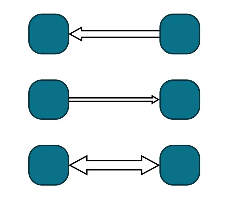 | [12 Custom Arrow](tutorial-style-implementation-edge/12-custom-arrow/) | Create a custom arrow that matches our edge style
# [Tutorial Graph Builder](tutorial-graph-builder)

This tutorial is a step-by-step guide to using the GraphBuilder classes.

&nbsp;&nbsp;&nbsp;&nbsp;&nbsp;&nbsp;&nbsp;&nbsp;&nbsp;&nbsp;&nbsp;&nbsp;&nbsp;&nbsp;&nbsp;&nbsp;&nbsp;&nbsp;&nbsp;&nbsp;&nbsp;&nbsp;&nbsp;&nbsp;&nbsp;&nbsp;&nbsp;&nbsp;&nbsp;&nbsp; | Demo | Description
--- | --- | ---
 | [Tutorial: Graph Builder](tutorial-graph-builder/01-create-graph/) | Learn how to convert business data into a graph using the GraphBuilder class.
 | [01 Create Graph](tutorial-graph-builder/01-create-graph/) | Introduces the GraphBuilder class which helps to transfer business data into a graph.
 | [02 Create Nodes Sources](tutorial-graph-builder/02-create-nodes-sources/) | Shows how to retrieve nodes from different data sources.
 | [03 Create Edges Sources](tutorial-graph-builder/03-create-edges-sources/) | Shows how to retrieve edges from different data sources.
 | [04 Group Nodes](tutorial-graph-builder/04-group-nodes/) | Shows how to create group nodes to visualize hierarchy information within the business data.
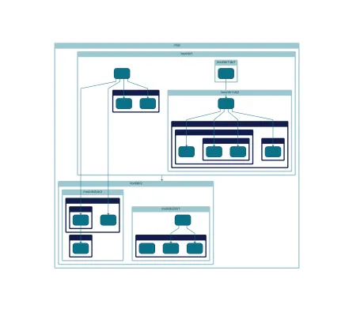 | [05 Implicit Grouping](tutorial-graph-builder/05-implicit-grouping/) | Shows how to create group nodes implicitly.
 | [06 Configure Styles](tutorial-graph-builder/06-configure-styles/) | Shows how to associate different node and edge styles with the business data.
 | [07 Create Labels Sources](tutorial-graph-builder/07-create-labels-sources/) | Shows how to retrieve labels for nodes and edges from the business data.
 | [08 Configure Labels](tutorial-graph-builder/08-configure-labels/) | Shows how to associate different label styles with the business data.
 | [09 Configure Tags](tutorial-graph-builder/09-configure-tags/) | Shows how to provide the business data in the elements' tags.
 | [10 Configure Layout](tutorial-graph-builder/10-configure-layout/) | Shows how to load positions for graph elements from the business data.
 | [11 Update Graph](tutorial-graph-builder/11-update-graph/) | Shows how to update the graph after incremental changes in the business data.
 | [12 Adjacency Graph Builder](tutorial-graph-builder/12-adjacency-graph-builder/) | Shows how to build a graph from data with implicit relationship information using AdjacencyGraphBuilder.
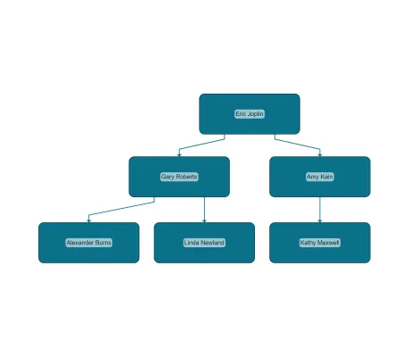 | [13 Tree Builder](tutorial-graph-builder/13-tree-builder/) | Shows how to build a graph from tree structured data using TreeBuilder.
# [Tutorial Style Implementation Label](tutorial-style-implementation-label)

This tutorial is a step-by-step guide to customizing the visual representation of labels.

&nbsp;&nbsp;&nbsp;&nbsp;&nbsp;&nbsp;&nbsp;&nbsp;&nbsp;&nbsp;&nbsp;&nbsp;&nbsp;&nbsp;&nbsp;&nbsp;&nbsp;&nbsp;&nbsp;&nbsp;&nbsp;&nbsp;&nbsp;&nbsp;&nbsp;&nbsp;&nbsp;&nbsp;&nbsp;&nbsp; | Demo | Description
--- | --- | ---
 | [Tutorial: Label Style Implementation](tutorial-style-implementation-label/01-render-label-text/) | Learn how to implement a custom label style using SVG.
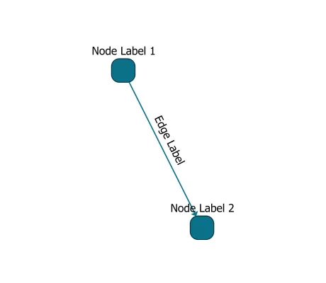 | [01 Rendering the Label Text](tutorial-style-implementation-label/01-render-label-text/) | Visualize a label using a basic text element
 | [02 Using Text Utilities](tutorial-style-implementation-label/02-using-text-utilities/) | Use convenience functionality to place the text
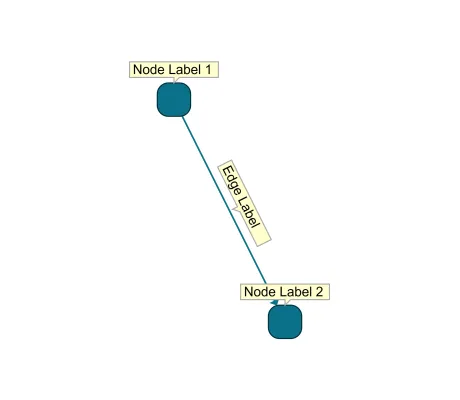 | [03 Adding a Background Shape](tutorial-style-implementation-label/03-add-background-shape/) | Add a customized background to the label text
 | [04 Preferred Label Size](tutorial-style-implementation-label/04-preferred-size/) | Let the label style set the desired label size
 | [05 Render Performance](tutorial-style-implementation-label/05-render-performance/) | Optimize the render performance of the label style
 | [06 Text Alignment](tutorial-style-implementation-label/06-text-alignment/) | Configure horizontal and vertical text alignment inside the label bounds
 | [07 Line Wrapping](tutorial-style-implementation-label/07-line-wrapping/) | Add automatic line wrapping to the label style
 | [08 Data From Tag](tutorial-style-implementation-label/08-data-from-tag/) | Use data from the label tag in the visualization
 | [09 Hit-Testing](tutorial-style-implementation-label/09-hit-testing/) | Configure which parts of the label visualization are clickable
 | [10 Visibility](tutorial-style-implementation-label/10-visibility/) | Adjust the visibility check to parts of the label visualization that lie outside of the label bounds
 | [11 Bounds](tutorial-style-implementation-label/11-bounds/) | Adjust the label boundaries to parts of the label visualization that lie outside of the label bounds
# [Tutorial Style Implementation Node](tutorial-style-implementation-node)

This tutorial is a step-by-step guide to customizing the visual representation of nodes.

&nbsp;&nbsp;&nbsp;&nbsp;&nbsp;&nbsp;&nbsp;&nbsp;&nbsp;&nbsp;&nbsp;&nbsp;&nbsp;&nbsp;&nbsp;&nbsp;&nbsp;&nbsp;&nbsp;&nbsp;&nbsp;&nbsp;&nbsp;&nbsp;&nbsp;&nbsp;&nbsp;&nbsp;&nbsp;&nbsp; | Demo | Description
--- | --- | ---
 | [Tutorial: Node Style Implementation](tutorial-style-implementation-node/01-create-a-rectangle/) | Learn how to implement a custom node style using SVG.
 | [01 Create A Rectangle](tutorial-style-implementation-node/01-create-a-rectangle/) | Create a simple node style using SVG
 | [02 Create A Custom Shape](tutorial-style-implementation-node/02-create-a-custom-shape/) | Create a simple node style with a custom shape using SVG
 | [03 Render Performance](tutorial-style-implementation-node/03-render-performance/) | Optimize rendering performance of an SVG node style
 | [04 Making the Style Configurable](tutorial-style-implementation-node/04-making-the-style-configurable/) | Make a custom node style configurable by adding properties
 | [05 Data from Tag](tutorial-style-implementation-node/05-data-from-tag/) | Adjust how the node style renders the node using the node business data
 | [06 Rendering Text](tutorial-style-implementation-node/06-render-text/) | Adjust the node style to render text defined by the node business data
 | [07 Hit-Testing](tutorial-style-implementation-node/07-hit-testing/) | Customize which area of a node can be hovered and clicked
 | [08 Edge Cropping](tutorial-style-implementation-node/08-edge-cropping/) | Customize where edges at the node are cropped
 | [09 Item Visibility](tutorial-style-implementation-node/09-visibility/) | Adjust the visibility check to parts of the node visualization that lie outside of the node bounds
 | [10 Render Boundaries](tutorial-style-implementation-node/10-bounds/) | Adjust the node boundaries to parts of the node visualization that lie outside of the node bounds
 | [11 Group Node Style](tutorial-style-implementation-node/11-group-node-style/) | Create a basic group node style
 | [12 Group Node Style Behavior](tutorial-style-implementation-node/12-group-node-style-behavior/) | Adjust the group node style minimum size and size calculation
# [Tutorial Style Implementation Port](tutorial-style-implementation-port)

This tutorial is a step-by-step guide to customizing the visual representation of ports.

&nbsp;&nbsp;&nbsp;&nbsp;&nbsp;&nbsp;&nbsp;&nbsp;&nbsp;&nbsp;&nbsp;&nbsp;&nbsp;&nbsp;&nbsp;&nbsp;&nbsp;&nbsp;&nbsp;&nbsp;&nbsp;&nbsp;&nbsp;&nbsp;&nbsp;&nbsp;&nbsp;&nbsp;&nbsp;&nbsp; | Demo | Description
--- | --- | ---
 | [Tutorial: Port Style Implementation](tutorial-style-implementation-port/01-render-port-shape/) | Learn how to implement a custom port style using SVG.
 | [01 Rendering the Port](tutorial-style-implementation-port/01-render-port-shape/) | Visualize a port as a basic circle shape
 | [02 Port Size](tutorial-style-implementation-port/02-port-size/) | Configuring the port size in the style
 | [03 Render Performance](tutorial-style-implementation-port/03-render-performance/) | Optimize rendering performance of an SVG port style
 | [04 Conditional Port Coloring](tutorial-style-implementation-port/04-conditional-coloring/) | Set the color of the port based on the number of connected edges
 | [05 Hit-Testing](tutorial-style-implementation-port/05-hit-testing/) | Customize which area of a port can be hovered and clicked
 | [06 Edge Cropping](tutorial-style-implementation-port/06-edge-cropping/) | Crop the edge at the port outline
# [View](view)

This folder and its subfolders contain demo applications which make use of the different features of the viewer component of yFiles for HTML.

&nbsp;&nbsp;&nbsp;&nbsp;&nbsp;&nbsp;&nbsp;&nbsp;&nbsp;&nbsp;&nbsp;&nbsp;&nbsp;&nbsp;&nbsp;&nbsp;&nbsp;&nbsp;&nbsp;&nbsp;&nbsp;&nbsp;&nbsp;&nbsp;&nbsp;&nbsp;&nbsp;&nbsp;&nbsp;&nbsp; | Demo | Description
--- | --- | ---
 | [Gantt Chart](view/ganttchart/) | An editor for Gantt charts.
 | [Large Collapsible Tree](view/large-tree/) | Shows a tree graph, where a large number of nodes can be added interactively.
 | [Collapsible Trees](view/collapse/) | Shows interactive collapsing and expanding of subtrees of a graph.
 | [Rendering Optimizations](view/rendering-optimizations/) | Illustrates optimizations of the rendering performance for large graphs.
 | [Contextual Toolbar](view/contextualtoolbar/) | Shows a contextual toolbar for the current selection that enables fast and easy style changes.
 | [WebGL Label Fading](view/webgl-label-fading/) | Shows how to achieve a simple level of detail effect by fading in/out labels at a certain zoom value using WebGL rendering.
 | [Graph Editor](view/grapheditor/) | Shows the graph editing features of the graph component.
 | [Graph Viewer](view/graphviewer/) | Displays sample graphs from various application domains.
 | [HTML Popup](view/htmlpopup/) | Shows HTML pop-up panels that displays additional information about a clicked node or edge.
 | [Structure View](view/structureview/) | A tree list component that shows the nesting of the groups and nodes.
 | [Rendering Order](view/renderingorder/) | Shows different rendering order settings.
 | [Z-Order](view/zorder/) | Shows how to adjust the z-order of graph elements and to keep this z-order consistent.
 | [Deep Zoom](view/deep-zoom/) | Seamlessly zoom into the contents of deeply nested group nodes, similar to "deep zoom" for images
 | [Arrange Objects](view/arrange-objects/) | Shows simple operations for aligning and distributing nodes.
 | [List Node](view/list-node/) | Shows a node which contains re-arrangeable rows.
 | [Overview Styling](view/overviewstyles/) | Shows several different rendering techniques and styles for the overview.
 | [Bridges](view/bridges/) | Shows the capabilities of the <code>BridgeManager</code> class for inserting bridges into edge paths.
 | [Edge To Edge](view/edgetoedge/) | Shows edge-to-edge connections.
 | [Image Export](view/imageexport/) | Shows how to export the whole diagram or a part of it to a PNG image.
 | [SVG Export](view/svgexport/) | Shows how to export the whole diagram or a part of it to an SVG image.
 | [PDF Export](view/pdfexport/) | Shows how to export the whole diagram or a part of it to a PDF.
 | [Printing](view/printing/) | Shows how to print the whole diagram or a part of it.
 | [File Operations](application-features/file-operations/) | Shows different ways to open and save a graph.
 | [Events Viewer](view/events/) | Shows the multitude of events provided by the classes <code>IGraph</code>, <code>GraphComponent</code>, and the <em>Input Modes</em>.
 | [WebGL Precompilation](view/webgl-precompilation/) | Shows how to precompile the WebGL styles you want to use
 | [Application Under Test](testing/application-under-test/) | A simple app that is used as the test candidate in some of the testing demos.
 | [Clipboard](view/clipboard/) | Shows different ways of using the class GraphClipboard for Copy & Paste operations.
 | [Deferred Cut Clipboard](view/clipboard-deferred-cut/) | Shows a clipboard which grays elements out upon cut and only removes them when they are finally pasted.
 | [GraphML](view/graphml/) | Provides a live view of the graph's GraphML representation.
