# yFiles for HTML Demo Applications

The [@PRODUCT@ @VERSION@](@PRODUCT_URL@) demos and tutorials are extensive sample applications that present the features of the @PRODUCT@ diagramming library.

The complete source code of all of these samples is part of the @PRODUCT@ package and available at [Github](https://github.com/yWorks/yfiles-for-html-demos)

To execute a specific sample, click on its card below. All of these demos are also hosted at the [yFiles for HTML Online Demos page](https://live.yworks.com/demos/).

# [Complete](complete)

This folder and its subfolders contain demo applications which make use of the different features of yFiles for HTML.

&nbsp;&nbsp;&nbsp;&nbsp;&nbsp;&nbsp;&nbsp;&nbsp;&nbsp;&nbsp;&nbsp;&nbsp;&nbsp;&nbsp;&nbsp;&nbsp;&nbsp;&nbsp;&nbsp;&nbsp;&nbsp;&nbsp;&nbsp;&nbsp;&nbsp;&nbsp;&nbsp;&nbsp;&nbsp;&nbsp; | Demo | Description
--- | --- | ---
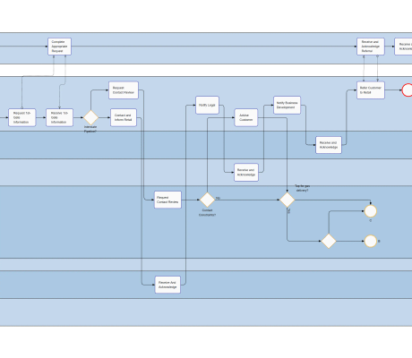 | [BPMN Editor](complete/bpmn) | An editor for Business Process diagrams that features interactive editing, BPMN node styles and a specialized BPMN layout algorithm.
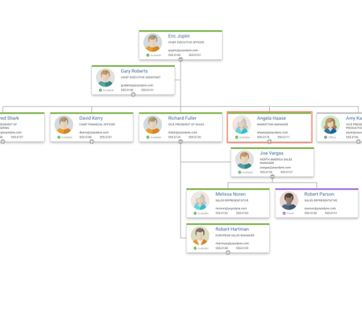 | [Organization Chart](complete/interactiveorgchart) | An interactive viewer for organization charts with automatic layout updates.
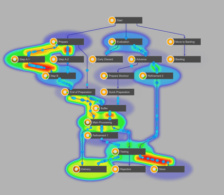 | [Process Mining](complete/processmining) | Shows how to create an animated visualization of a process flow.
 | [Fraud Detection](complete/frauddetection) | Example of a fraud detection application for time-dependent data.
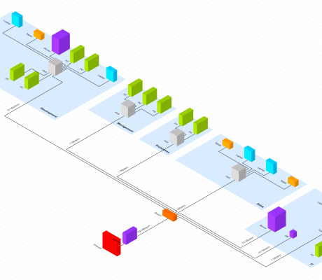 | [Isometric Drawing](complete/isometricdrawing) | Displays graphs in 3D using an arbitrary projection and WebGL rendering.
 | [Network Monitoring](complete/networkmonitoring) | Example of a monitoring tool for computer networks.
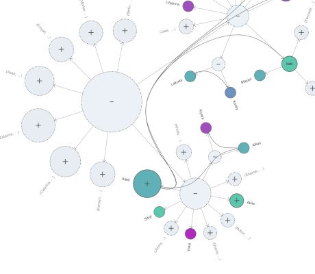 | [Large Graph Aggregation](complete/largegraphaggregation) | Shows how to use the smart node aggregation for drill-down exploration of a large graph.
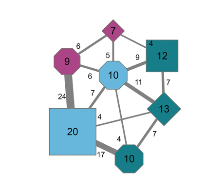 | [Interactive Aggregation](complete/interactiveaggregation) | Shows how to analyze a graph by interactively aggregating nodes with common properties.
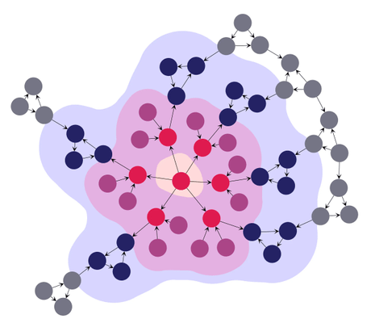 | [Metaball Groups](complete/metaballgroups) | Shows how to render metaball-like background visualizations.
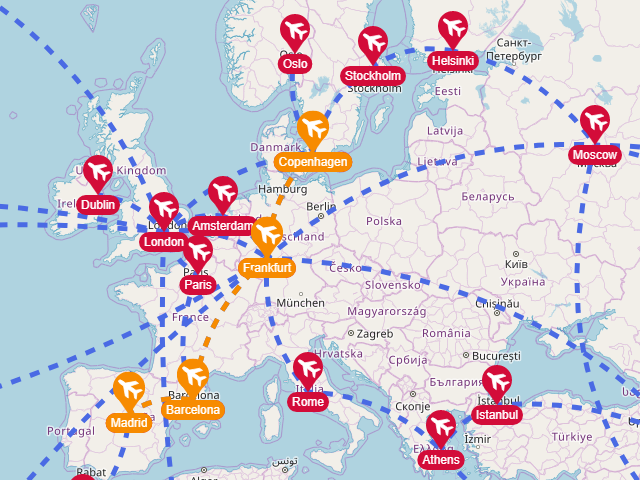 | [Interactive Map](complete/mapintegration) | Draws a graph on top of an interactive map.
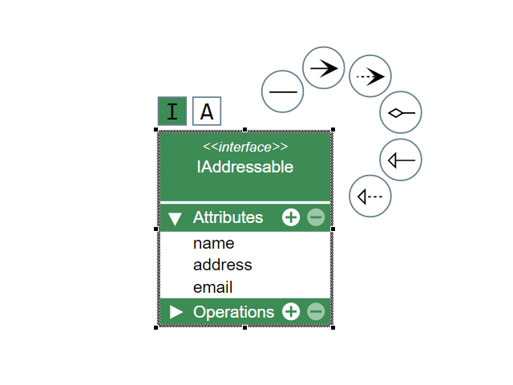 | [UML Editor](complete/uml) | An editor for UML diagrams with a tailored UML node style, automatic layout, and a quick way to create new edges with the mouse or touch.
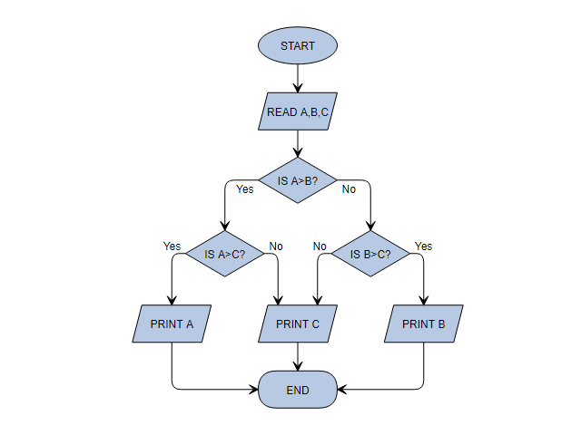 | [Flowchart Editor](complete/flowchart) | An editor for Flowchart diagrams that features interactive editing, flowchart node styles, and automatic layout.
 | [Decision Tree](complete/decisiontree) | An interactive Decision Tree component that lets you design and explore your own decision graphs.
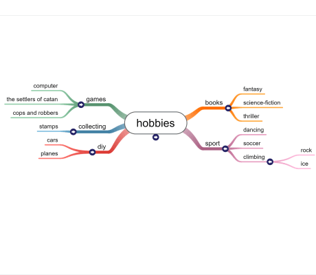 | [Mindmap Editor](complete/mindmap) | A Mindmap editor with a tailored node style, custom user interaction, and a specialized layoutthat automatically arranges new entries.
 | [Logic Gates](complete/logicgates) | An editor for networks of logic gates, with tailored automatic layout.
 | [Component Drag and Drop](complete/componentdraganddrop) | A demo that shows how to clear space for a dropped component in an existing layout.
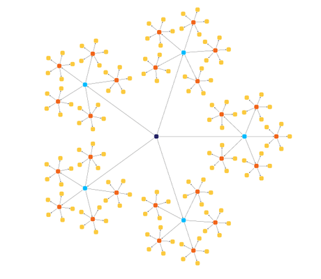 | [Large Collapsible Tree](complete/large-tree) | Shows a tree graph, where a large number of nodes can be added interactively.
 | [Collapsible Trees](complete/collapse) | Shows interactive collapsing and expanding of subtrees of a graph.
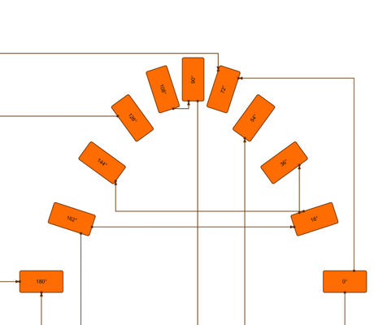 | [Rotatable Nodes](complete/rotatablenodes) | Shows nodes that can be rotated with the mouse or touch.
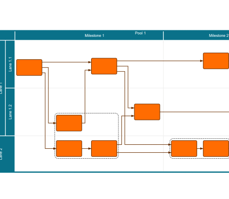 | [Table Editor](complete/tableeditor) | Shows the support for diagrams that are organized in a tabular way, for example in a grid or a swimlane layout.
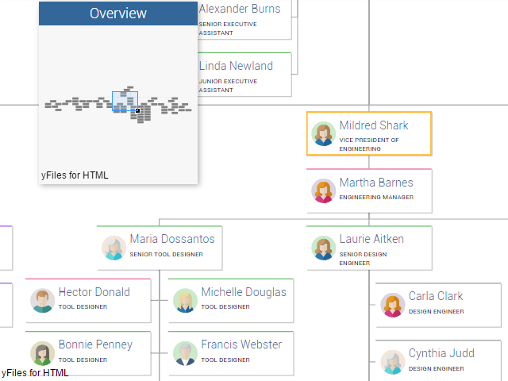 | [Organization Chart Viewer](complete/orgchartviewer) | A viewer for organization charts.
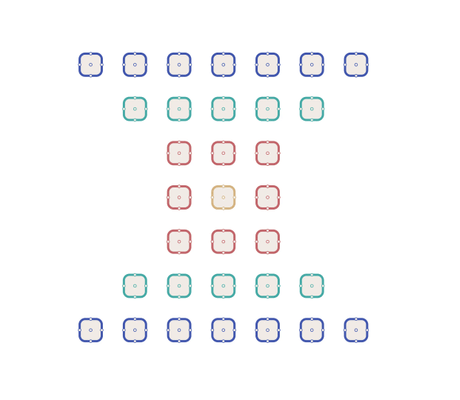 | [Custom Edge Creation](complete/customedgecreation) | Shows how to provide directional ports and demonstrates interactive routing during edge creation.
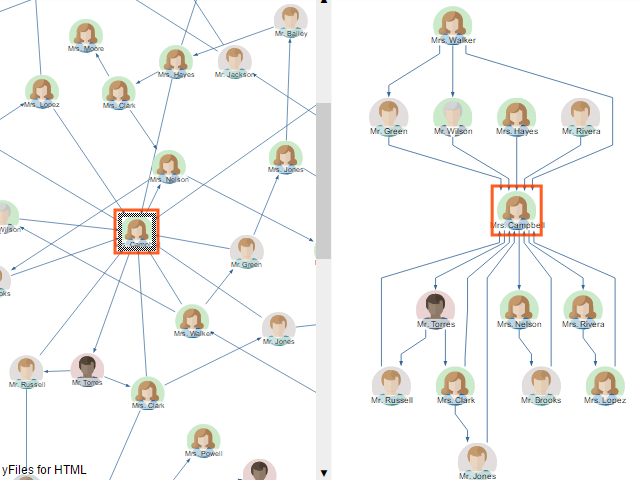 | [Neighborhood View](complete/neighborhood) | Shows the neighborhood of the currently selected node alongside the graph.
 | [Hierarchic Nesting](complete/hierarchicgrouping) | The hierarchic layout nicely expands and collapses sub-graphs organized in groups.
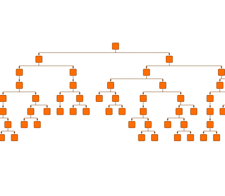 | [Interactive Graph Restructuring](complete/interactivegraphrestructuring) | Shows how to interactively relocate subtrees from one parent to another.
# [Layout](layout)

This folder and its subfolders contain demo applications which make use of the different layout algorithms of the layout component of yFiles for HTML.

&nbsp;&nbsp;&nbsp;&nbsp;&nbsp;&nbsp;&nbsp;&nbsp;&nbsp;&nbsp;&nbsp;&nbsp;&nbsp;&nbsp;&nbsp;&nbsp;&nbsp;&nbsp;&nbsp;&nbsp;&nbsp;&nbsp;&nbsp;&nbsp;&nbsp;&nbsp;&nbsp;&nbsp;&nbsp;&nbsp; | Demo | Description
--- | --- | ---
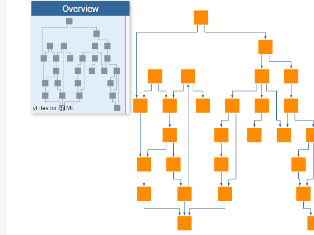 | [Layout Styles](layout/layoutstyles) | Showcases the most used layout algorithms of yFiles, including hierarchic, organic, orthogonal, tree, circular, balloon, and several edge routing styles.
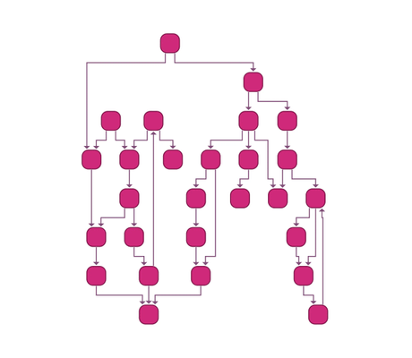 | [Layout Styles: Hierarchic](layout/layoutstyles?layout=hierarchic&sample=hierarchic) | Suitable for any kind of directed diagram, like flow charts, BPMN diagrams and more
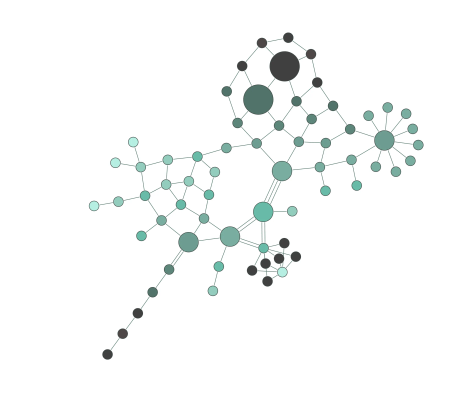 | [Layout Styles: Organic](layout/layoutstyles?layout=organic&sample=organic) | Suitable for many types of undirected graphs and complex networks, like social networks, WWW visualizations or knowledge representation.
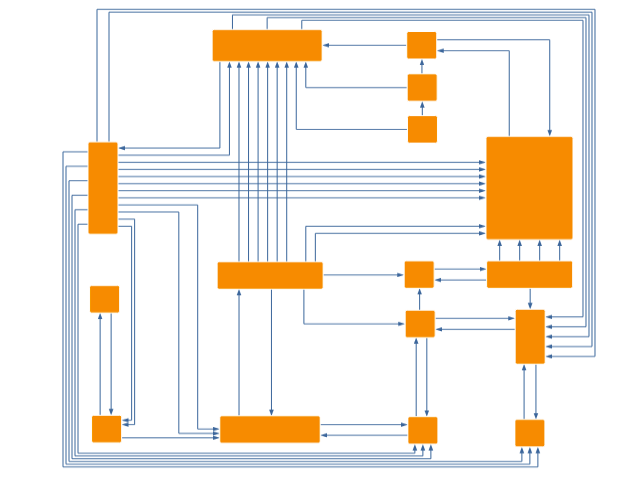 | [Layout Styles: Edge Router](layout/layoutstyles?layout=edge-router&sample=edge-router) | For routing edges in an orthogonal, octilinear or curved style.
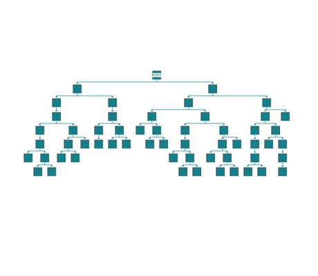 | [Layout Styles: Tree](layout/layoutstyles?layout=tree&sample=tree) | Suitable to visualize tree structures like organization charts or for dataflow analysis.
 | [Layout Styles: Balloon](layout/layoutstyles?layout=balloon&sample=balloon) | Suitable to visualize tree-like structures in a radial fashion.
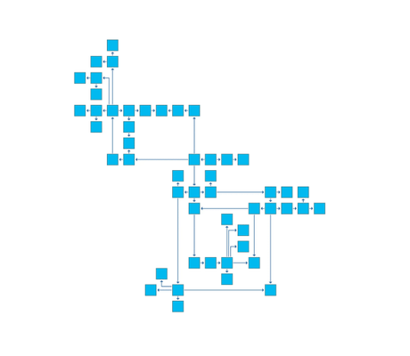 | [Layout Styles: Orthogonal](layout/layoutstyles?layout=orthogonal&sample=orthogonal) | Suitable for diagrams with orthogonal edges such as UML, database schemas, system management and more.
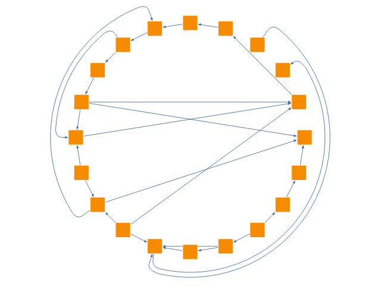 | [Layout Styles: Circular](layout/layoutstyles?layout=circular&sample=circular) | Suitable for applications in social networking, for WWW visualization and network management
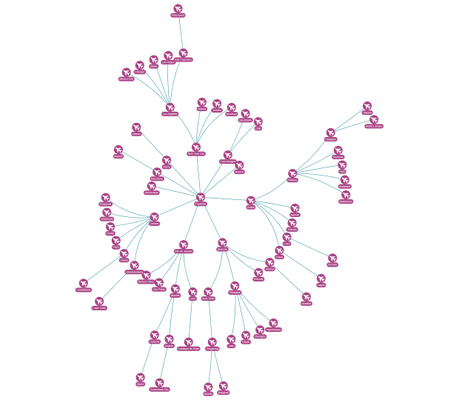 | [Layout Styles: Radial](layout/layoutstyles?layout=radial&sample=radial) | Suitable to visualize directed diagrams with a certain flow.
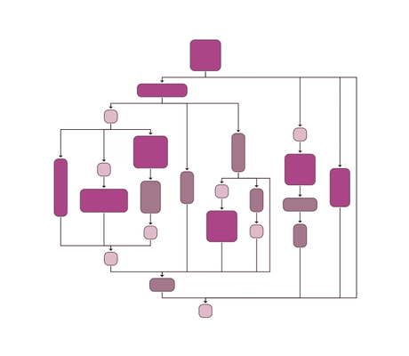 | [Layout Styles: Series-Parallel](layout/layoutstyles?layout=series-parallel&sample=series-parallel) | Suitable for diagrams with a main direction, like flow charts.
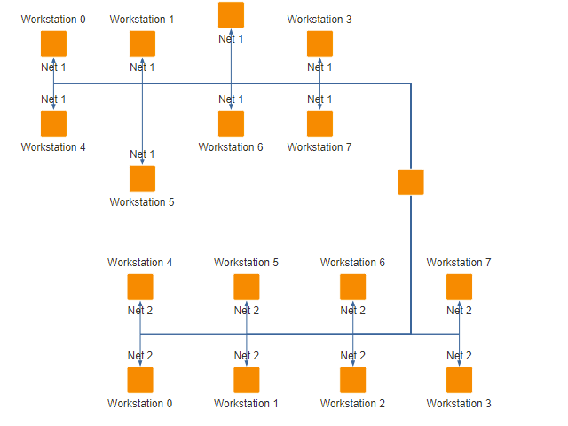 | [Layout Styles: Bus Router](layout/layoutstyles?layout=bus-router) | For routing edges in an orthogonal bus-style.
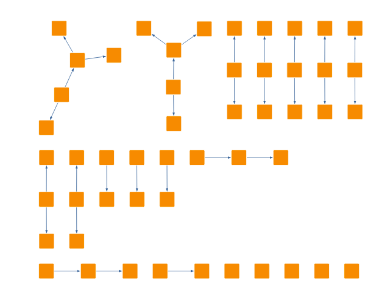 | [Layout Styles: Components](layout/layoutstyles?layout=components&sample=components) | For arranging any kind of disconnected diagram components.
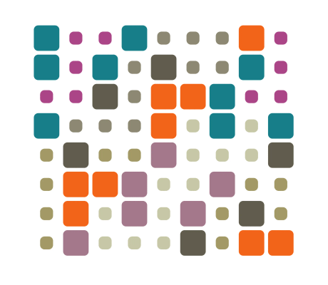 | [Layout Styles: Tabular](layout/layoutstyles?layout=tabular&sample=tabular) | Suitable to arrange elements in rows and columns.
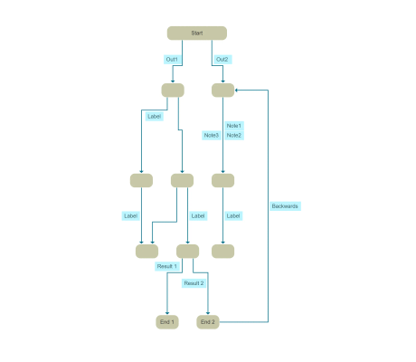 | [Layout Styles: Labeling](layout/layoutstyles?layout=labeling) | Places node and edge labels.
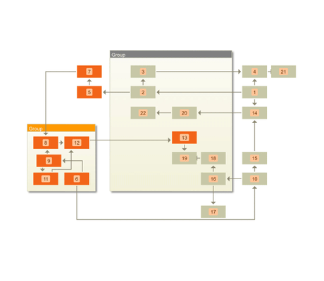 | [Layout Styles: Partial](layout/layoutstyles?layout=partial) | Suitable for incremental scenarios where new elements should be added to an existing diagram layout.
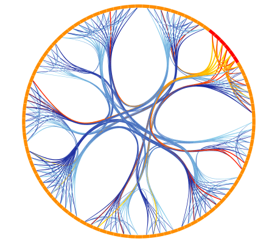 | [Edge Bundling](layout/edgebundling) | Shows how edge bundling can be applied for reducing visual cluttering in dense graphs.
 | [Sankey Diagram](layout/sankey) | A diagram used for visualizing flow information in which the thickness of the edges is proportional to the flow quantity.
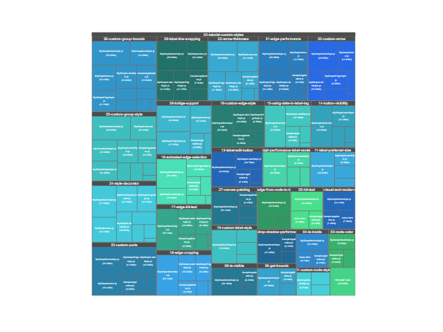 | [Tree Map](layout/treemap) | Shows disk usage of a directory tree with the Tree Map layout.
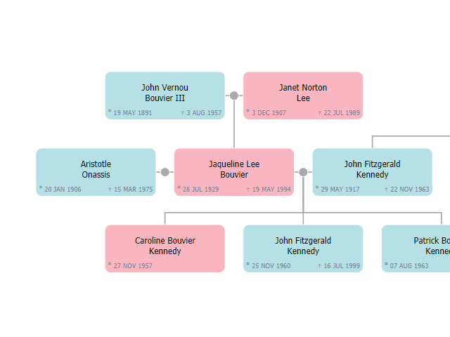 | [Family Tree](layout/familytree) | Shows how to visualize genealogical graphs (family trees).
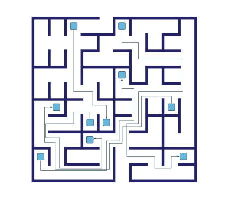 | [Maze Routing](layout/mazerouting) | Shows how the automatic edge routing finds routes through a maze.
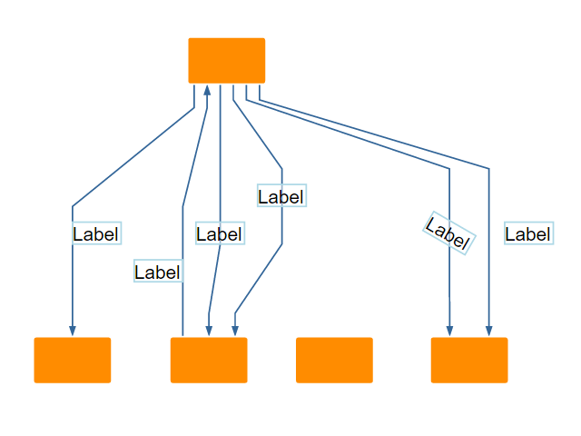 | [Edge Label Placement](layout/edgelabelplacement) | Shows how to place edge labels at the preferred location with a labeling algorithm.
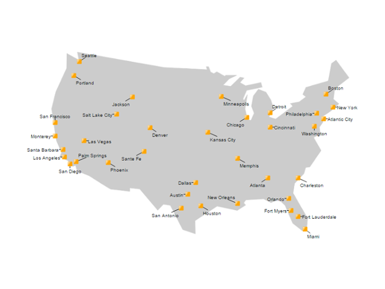 | [Node Label Placement](layout/nodelabelplacement) | Shows how to place node labels at the preferred location with a labeling algorithm.
 | [Node Types](layout/nodetypes) | Shows how different layout algorithms handle nodes with types.
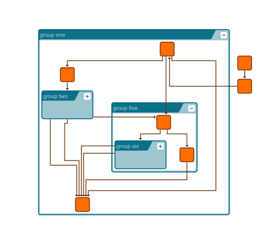 | [Folding With Layout](layout/foldingwithlayout) | Shows how an automatic layout makes space for opening groups and reclaims the space of closing groups.
 | [Incremental Hierarchic Layout](layout/incrementalhierarchic) | The incremental mode of the hierarchic layout style can fit new nodes and edges into the existing drawing.
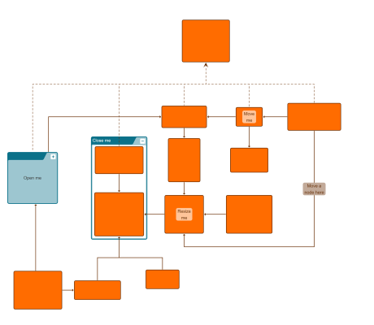 | [Interactive Edge Routing](layout/interactiveedgerouting) | After each edit the edge paths are re-routed if necessary.
 | [Edge Grouping](layout/edgegrouping) | The hierarchic layout can group the paths or ports of edges.
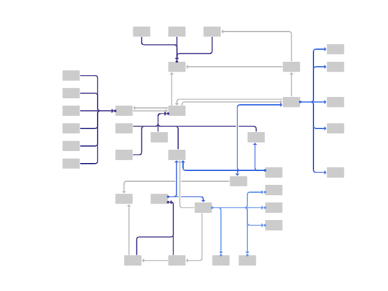 | [EdgeRouter Grouping](layout/edgeroutergrouping) | The EdgeRouter can group the paths or ports of edges.
 | [Organic Substructures](layout/organicsubstructures) | Shows organic layout, and its substructures and node types features.
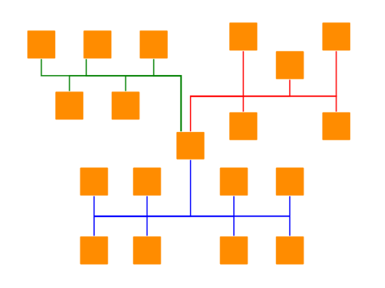 | [Bus Routing](layout/busrouting) | Shows how to group edges in bus structures.
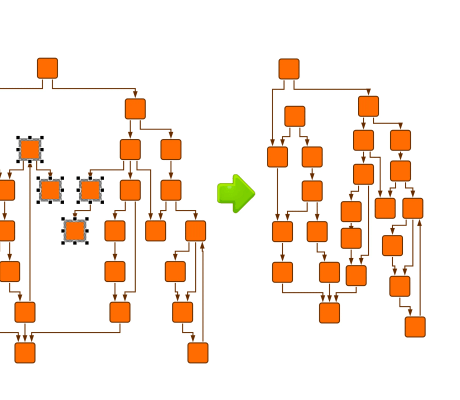 | [Fill Area Layout](layout/fillarealayout) | Shows how to fill free space after deleting nodes.
 | [Clear Marquee Area](layout/clearmarqueearea) | Shows how to automatically keep a marquee area clear of graph elements.
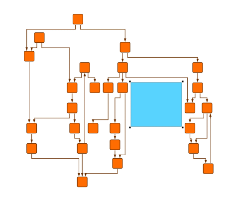 | [Clear Rectangle Area](layout/clearrectanglearea) | Shows how to automatically keep a user-defined rectangular area clear of graph elements.
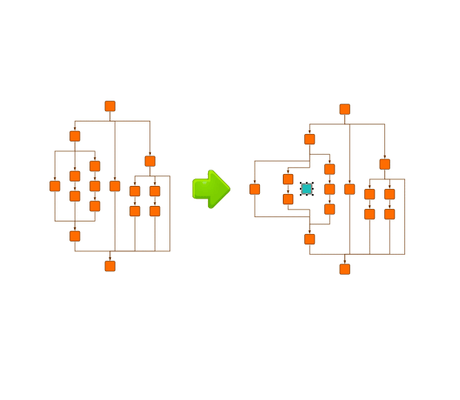 | [Node Overlap Avoiding](layout/nodeoverlapavoiding) | Shows how an automatic layout can remove node overlaps while a user interactively edits a graph.
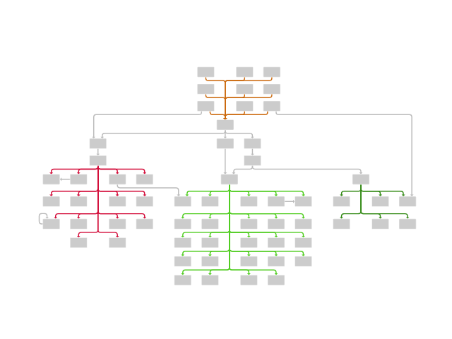 | [Hierarchic Bus Structures](layout/busstructures) | Bus structures in the hierarchic layout result in more compact arrangements.
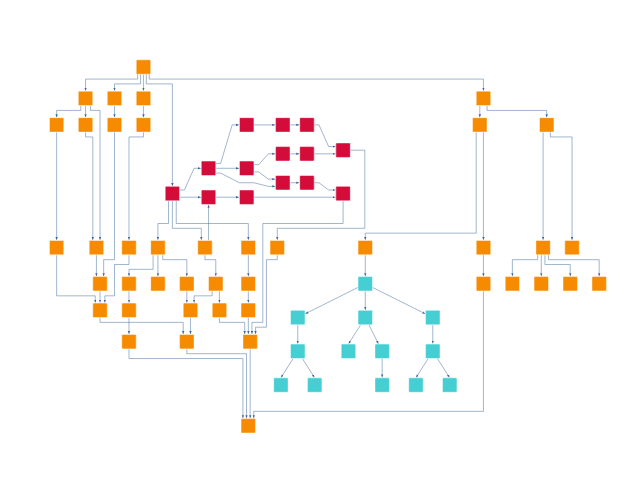 | [Hierarchic Subcomponents](layout/subcomponents) | The hierarchic layout can arrange subcomponents with different layout styles.
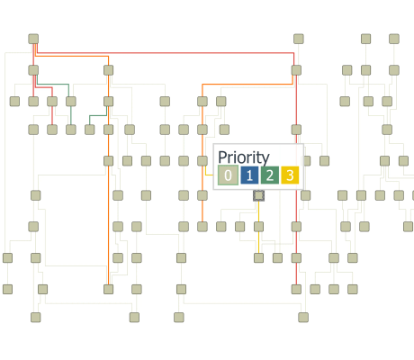 | [Critical Paths](layout/criticalpaths) | The hierarchic and tree layout styles can emphasize critical (important) paths by aligning their nodes.
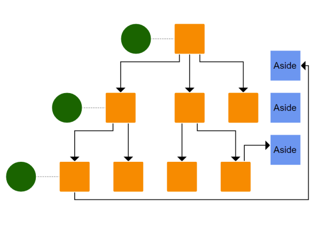 | [Custom Layout Stage](layout/custom-layout-stage) | Custom layout stages can be used to solve unique layout problems that are not adequately covered by existing layout algorithms.
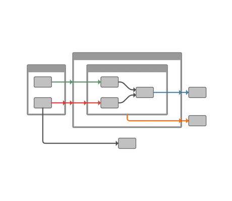 | [Split Edges](layout/splitedges) | Shows how to align edges at group nodes using RecursiveGroupLayout with HierarchicLayout.
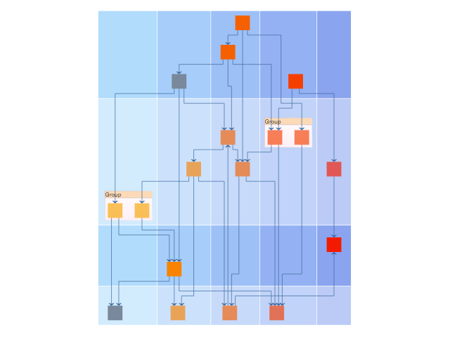 | [Partition Grid](layout/partitiongrid) | Demonstrates the usage of a partition grid for hierarchic and organic layouts.
 | [Simple Partition Grid](layout/simplepartitiongrid) | Shows how to create a simple partition grid.
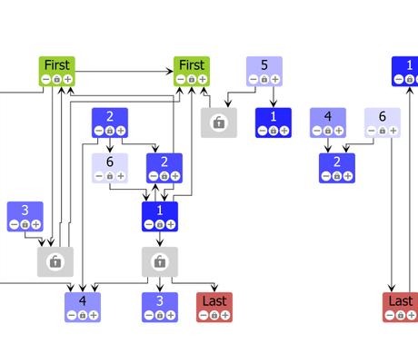 | [Layer Constraints](layout/layerconstraints) | Shows how to use layer constraints to prescribe the node layering in hierarchic layouts.
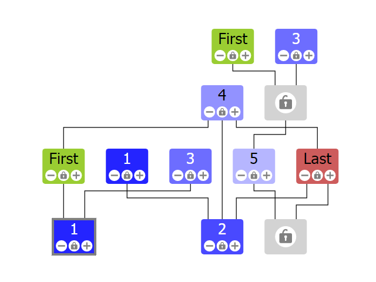 | [Sequence Constraints](layout/sequenceconstraints) | Shows how to use sequence constraints to prescribe the node sequencing in hierarchic layouts.
No Preview | [Interactive Organic Layout](layout/interactiveorganic) | Shows the 'interactive organic' layout algorithm.
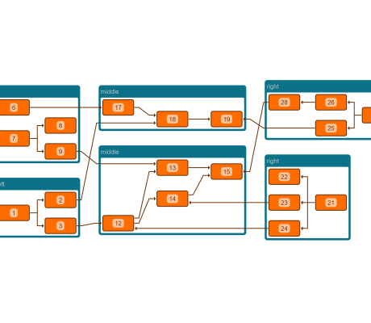 | [Recursive Group Layout](layout/recursivegroup) | Shows how to use different layout styles for the contents of groups and the overall graph.
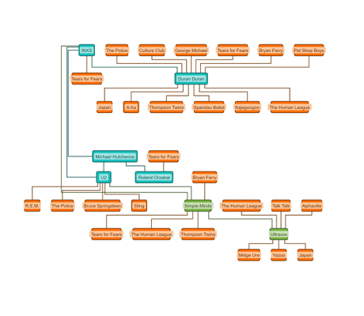 | [Multi-Page Layout](layout/multipage) | Shows how to divide a large model graph into several smaller page graphs, for example to print to multiple pages.
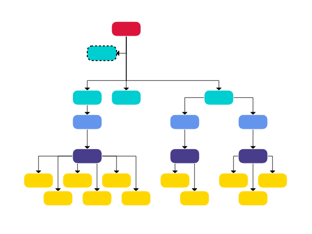 | [Tree Layout](layout/tree) | Shows how to use different node placer in TreeLayout.
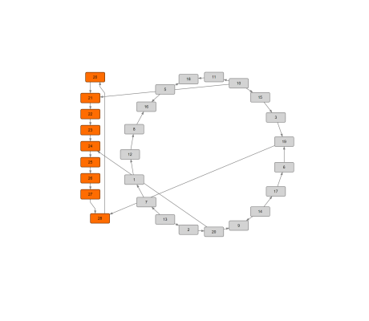 | [Partial Layout](layout/partial) | Shows how to integrate new graph elements into an existing graph layout.
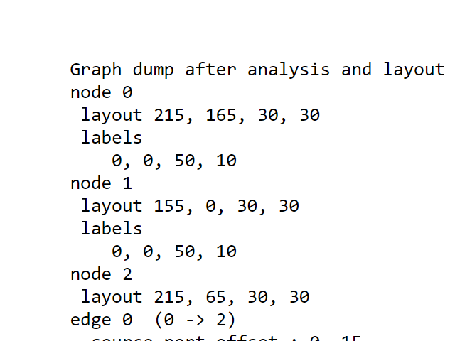 | [Layout Without View](layout/without-view) | Shows how to use the graph analysis and layout algorithms without a view and without the IGraph API
# [View](view)

This folder and its subfolders contain demo applications which make use of the different features of the viewer component of yFiles for HTML.

&nbsp;&nbsp;&nbsp;&nbsp;&nbsp;&nbsp;&nbsp;&nbsp;&nbsp;&nbsp;&nbsp;&nbsp;&nbsp;&nbsp;&nbsp;&nbsp;&nbsp;&nbsp;&nbsp;&nbsp;&nbsp;&nbsp;&nbsp;&nbsp;&nbsp;&nbsp;&nbsp;&nbsp;&nbsp;&nbsp; | Demo | Description
--- | --- | ---
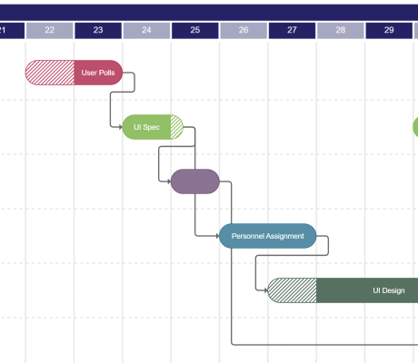 | [Gantt Chart](view/ganttchart) | An editor for Gantt charts.
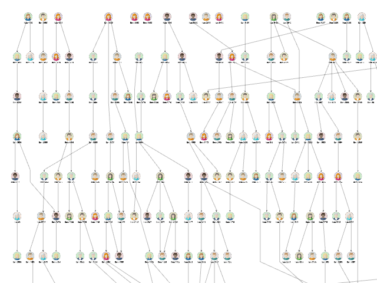 | [Large Graphs](view/large-graphs) | Shows how to display large graphs with both good performance in WebGL2 and high quality in SVG.
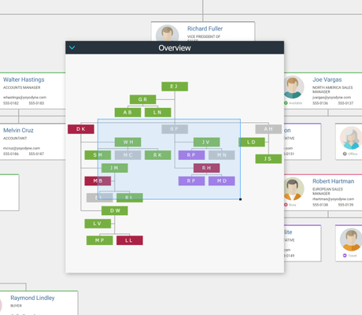 | [Overview Styling](view/overviewstyles) | Shows several different rendering techniques and styles for the overview.
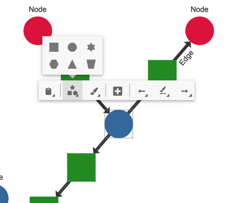 | [Contextual Toolbar](view/contextualtoolbar) | Shows a contextual toolbar for the current selection that enables fast and easy style changes.
 | [Graph Editor](view/grapheditor) | Shows the graph editing features of the graph component.
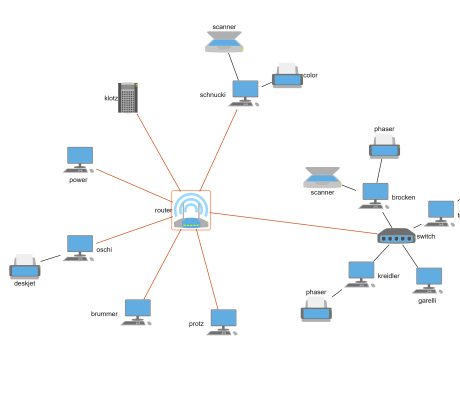 | [Graph Viewer](view/graphviewer) | Displays sample graphs from various application domains.
 | [Rendering Optimizations](view/rendering-optimizations) | Illustrates optimizations of the rendering performance for large graphs.
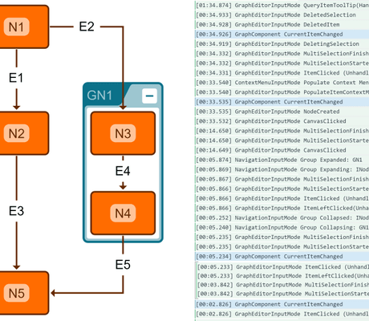 | [Events Viewer](view/events) | Shows the multitude of events provided by the classes <code>IGraph</code>, <code>GraphComponent</code>, and the <em>Input Modes</em>.
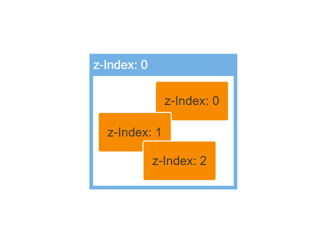 | [Z-Order](view/zorder) | Shows how to adjust the z-order of graph elements and to keep this z-order consistent.
 | [Image Export](view/imageexport) | Shows how to export the whole diagram or a part of it to a PNG image.
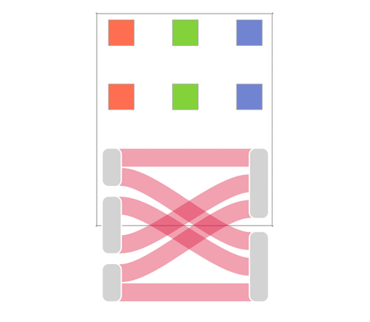 | [SVG Export](view/svgexport) | Shows how to export the whole diagram or a part of it to an SVG image.
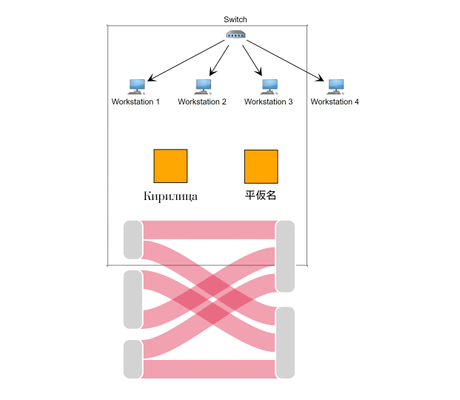 | [PDF Export](view/pdfexport) | Shows how to export the whole diagram or a part of it to a PDF.
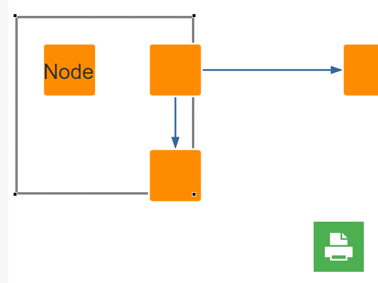 | [Printing](view/printing) | Shows how to print the whole diagram or a part of it.
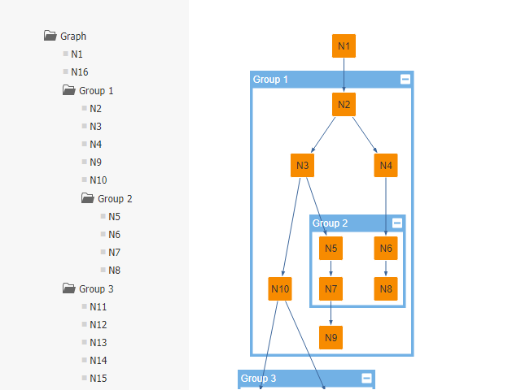 | [Structure View](view/structureview) | A tree list component that shows the nesting of the groups and nodes.
 | [HTML Popup](view/htmlpopup) | Shows HTML pop-up panels that displays additional information about a clicked node or edge.
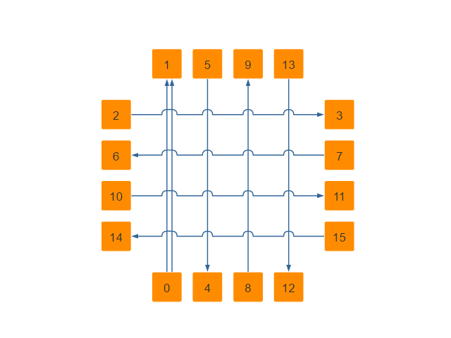 | [Bridges](view/bridges) | Shows the capabilities of the <code>BridgeManager</code> class for inserting bridges into edge paths.
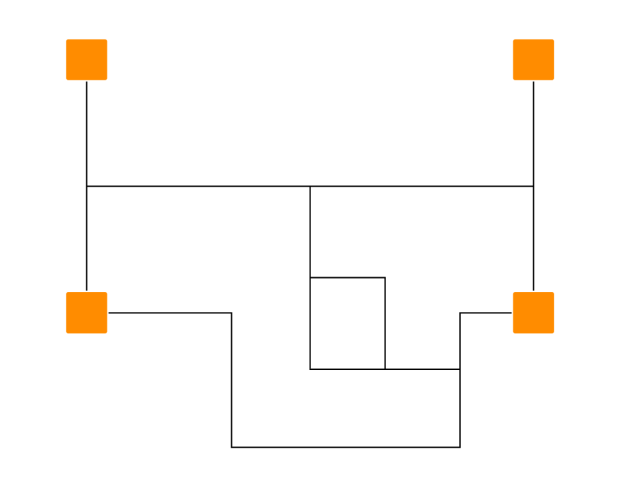 | [Edge To Edge](view/edgetoedge) | Shows edge-to-edge connections.
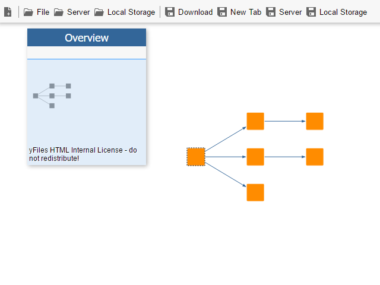 | [File Operations](view/fileoperations) | shows various ways to open and save a graph as GraphML.
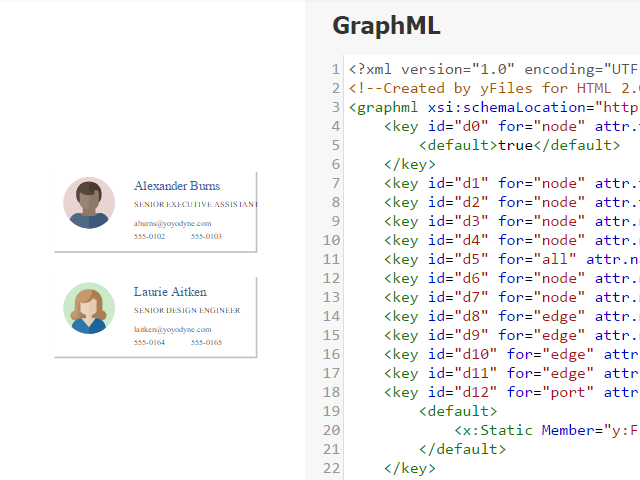 | [GraphML](view/graphml) | Provides a live view of the graph's GraphML representation.
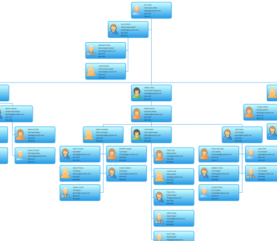 | [GraphML Compatibility](view/graphmlcompatibility) | Shows how to enable read compatibility for GraphML files from older versions.
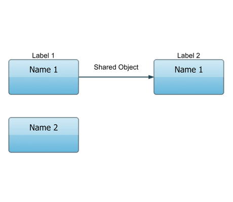 | [Clipboard](view/clipboard) | Shows different ways of using the class GraphClipboard for Copy & Paste operations.
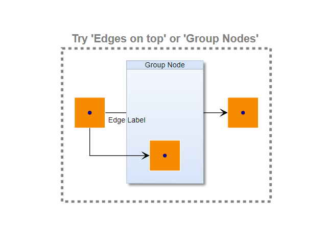 | [Rendering Order](view/renderingorder) | Shows different rendering order settings.
# [Analysis](analysis)

This folder and its subfolders contain demo applications which make use of the different features of the viewer component of yFiles for HTML.

&nbsp;&nbsp;&nbsp;&nbsp;&nbsp;&nbsp;&nbsp;&nbsp;&nbsp;&nbsp;&nbsp;&nbsp;&nbsp;&nbsp;&nbsp;&nbsp;&nbsp;&nbsp;&nbsp;&nbsp;&nbsp;&nbsp;&nbsp;&nbsp;&nbsp;&nbsp;&nbsp;&nbsp;&nbsp;&nbsp; | Demo | Description
--- | --- | ---
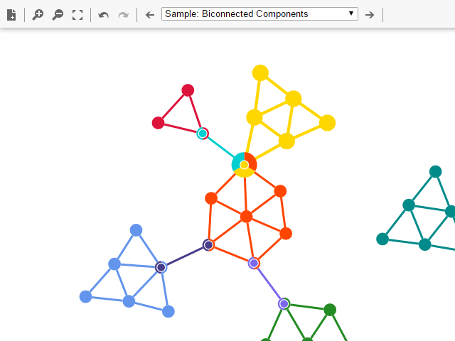 | [Graph Analysis](analysis/graphanalysis) | Showcases a selection of graph algorithms such as shortest paths, flows, centrality measures, etc. that help analysing the structure of a graph.
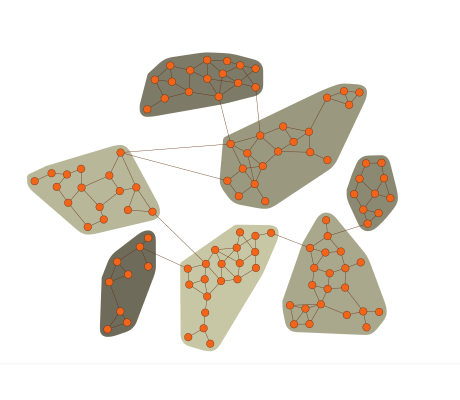 | [Clustering Algorithms](analysis/clustering) | Showcases a selection of clustering algorithms such as edge betweenness, k-means, hierarchical and biconnected components clustering.
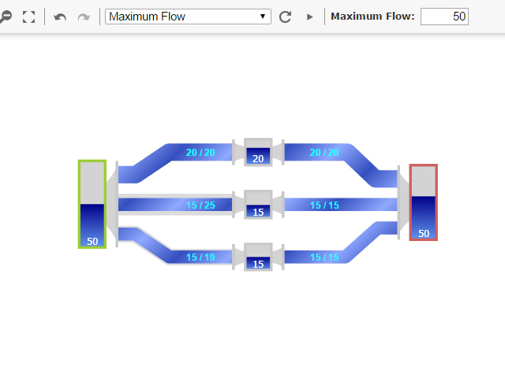 | [Network Flows](analysis/networkflows) | Presents three network flow graph analysis algorithms that are applied on a network of water pipes.
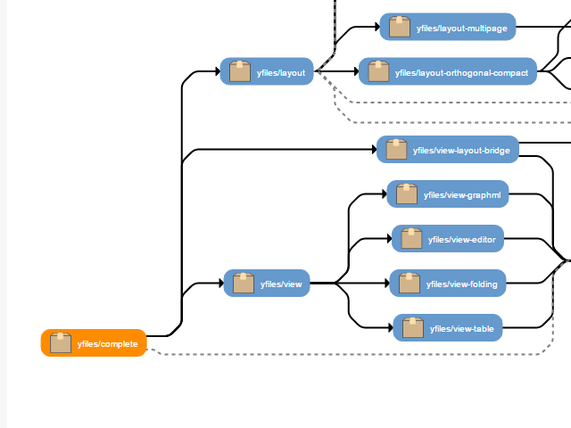 | [Transitivity](analysis/transitivity) | Shows how transitivity graph analysis algorithms can be applied to solve reachability problems.
# [Integration](integration)

This folder and its subfolders contain demo applications which illustrate the integration of yFiles for HTML with different web frameworks.

&nbsp;&nbsp;&nbsp;&nbsp;&nbsp;&nbsp;&nbsp;&nbsp;&nbsp;&nbsp;&nbsp;&nbsp;&nbsp;&nbsp;&nbsp;&nbsp;&nbsp;&nbsp;&nbsp;&nbsp;&nbsp;&nbsp;&nbsp;&nbsp;&nbsp;&nbsp;&nbsp;&nbsp;&nbsp;&nbsp; | Demo | Description
--- | --- | ---
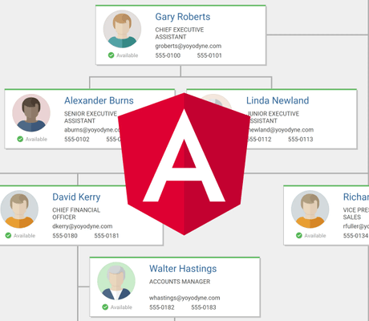 | [Angular CLI](toolkit/angular/README.html) | Shows how to use yFiles for HTML in an Angular app (Angular 2 and newer) using Angular CLI.
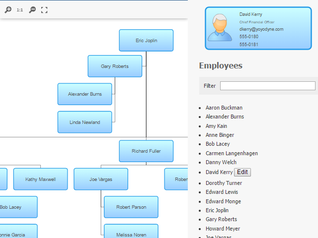 | [AngularJS 1](toolkit/angular1) | Shows how to use yFiles for HTML in an AngularJS 1 app.
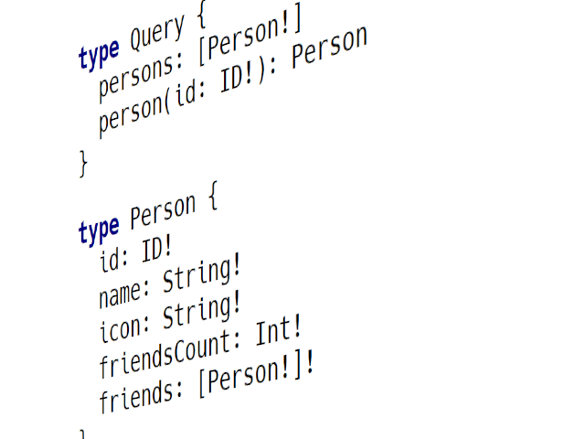 | [GraphQL](toolkit/graphql) | Shows how to load data from a GraphQL service and display it with yFiles for HTML.
 | [Neo4j](toolkit/neo4j) | Shows how to load data from a Neo4j database and display it with yFiles for HTML.
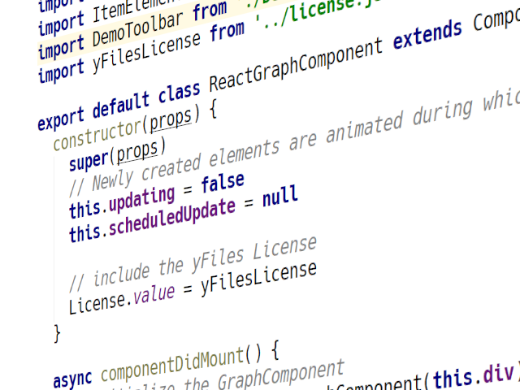 | [React](toolkit/react/README.html) | Shows how to use yFiles for HTML with the React library.
 | [React With TypeScript](toolkit/react-typescript/README.html) | Shows how to integrate yFiles in a basic React application with TypeScript based on Create React App.
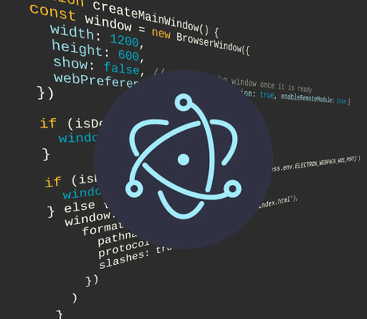 | [Electron](toolkit/electron/README.html) | Shows how to create a desktop app with Electron and yFiles for HTML.
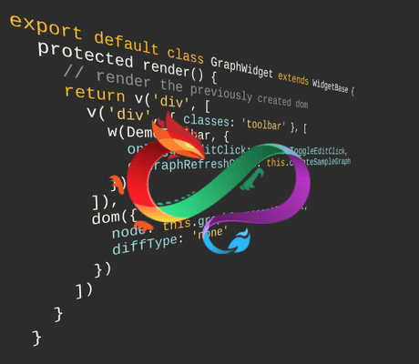 | [Dojo](toolkit/dojo/README.html) | Shows the integration of yFiles for HTML in a basic Dojo app based on Dojo's cli-create-app.
 | [Vue.js](toolkit/vuejs) | Shows how to use yFiles for HTML with Vue.js.
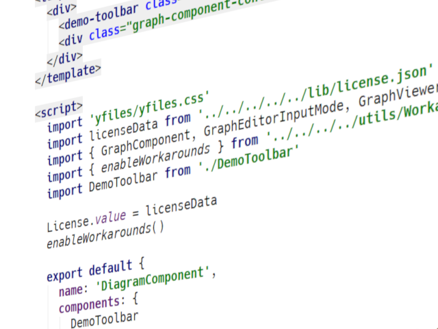 | [Vue-CLI](toolkit/vue-cli/README.html) | Shows how to integrate yFiles for HTML in a basic Vue-CLI setup.
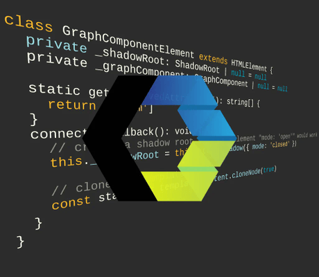 | [Web Components](toolkit/webcomponents) | Shows how to use yFiles for HTML with Web Components v1.
# [Style](style)

This folder and its subfolders contain demo applications which make use of the different features of the viewer component of yFiles for HTML.

&nbsp;&nbsp;&nbsp;&nbsp;&nbsp;&nbsp;&nbsp;&nbsp;&nbsp;&nbsp;&nbsp;&nbsp;&nbsp;&nbsp;&nbsp;&nbsp;&nbsp;&nbsp;&nbsp;&nbsp;&nbsp;&nbsp;&nbsp;&nbsp;&nbsp;&nbsp;&nbsp;&nbsp;&nbsp;&nbsp; | Demo | Description
--- | --- | ---
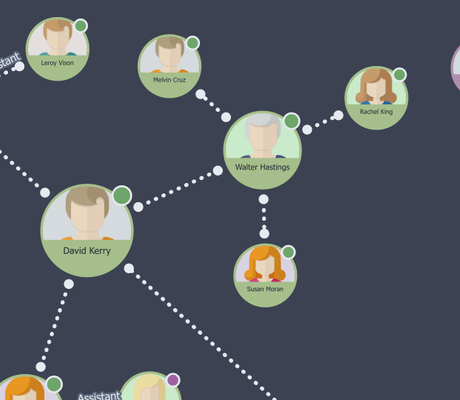 | [Template Styles](style/templatestyles) | Shows SVG template styles for nodes, labels and ports.
 | [WebGL2 Styles](style/webgl-styles) | Shows the various graph element styles available in WebGL2 rendering.
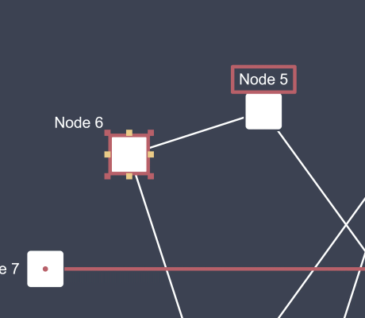 | [CSS Styling](style/cssstyling) | Shows how to style indicators and other templates.
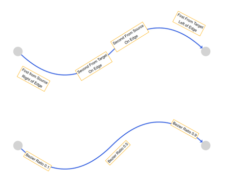 | [Bezier Edge Style](style/bezieredgestyle) | Shows how to use the curved edge style consisting of Bezier splines.
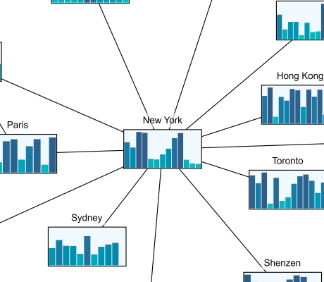 | [d3 Chart Nodes](style/d3chartnodes) | Presents a node style that visualizes dynamic data with d3.js.
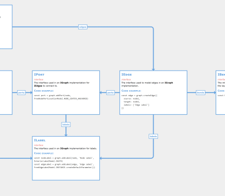 | [Markdown Label](style/markdownlabel) | Use markdown to format the label text.
 | [Rich Text Label](style/richtextlabel) | Edit markup labels with a WYSIWYG text editor.
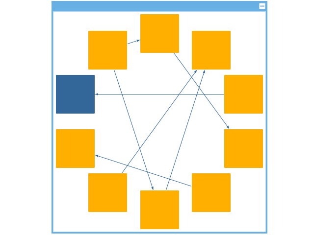 | [CSS3 Animations and Transitions](style/css3animationsandtransitions) | Shows how CSS3 transformations and animations can be applied to graph items.
 | [WebGL2 Animations](style/webgl-animations) | Shows howto use WebGL2 animations to highlight interesting parts of a graph.
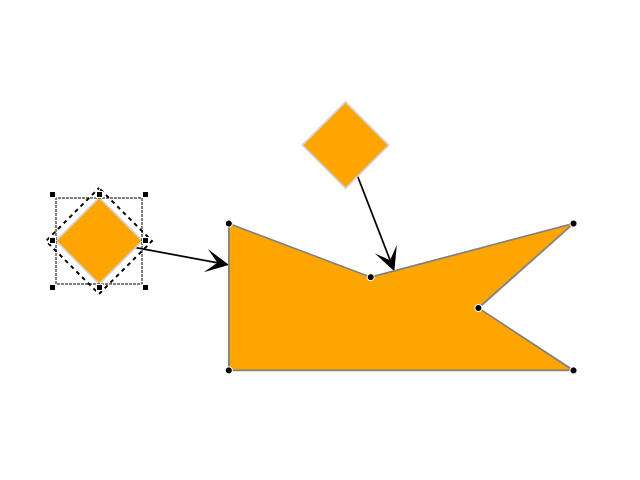 | [Editable Path Node Style](style/editablepathstyle) | Shows a path-based node style whose control points can be moved by users.
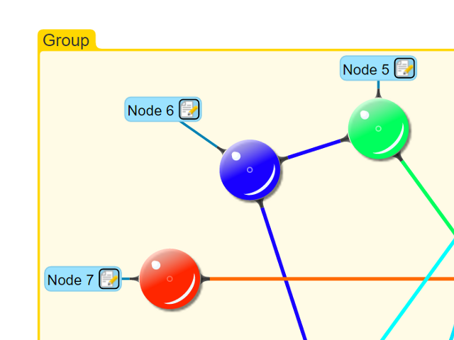 | [Custom Styles](style/customstyles) | Shows how to create custom styles for nodes, edges, labels, ports, and edge arrows.
 | [Vue.js Template Node Style](style/vuejstemplatenodestyle) | Presents a very versatile and easily customizable template node style.
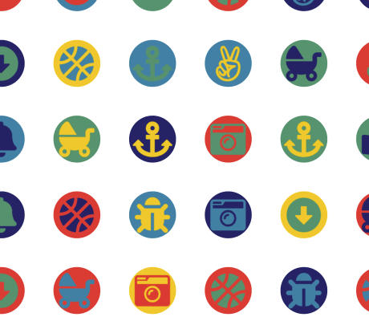 | [WebGL2 Icon Node](style/webgl-icon-node) | Shows how to render icon nodes with WebGL2.
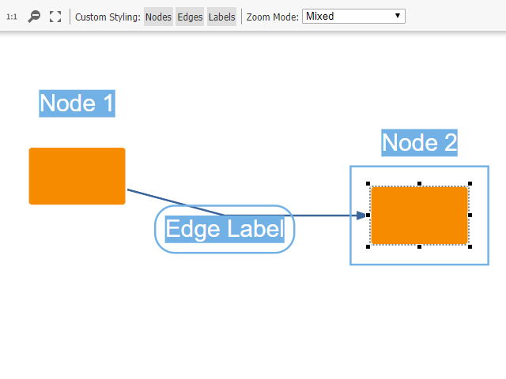 | [Selection Styling](style/selectionstyling) | Shows customized selection painting of nodes, edges and labels by decorating these items with a corresponding      style.
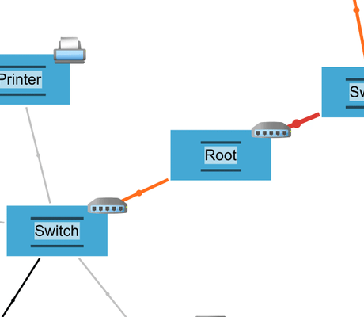 | [Style Decorators](style/styledecorators) | Shows how to create styles for nodes, edges, and labels that wrap existing styles and add visual decorators.
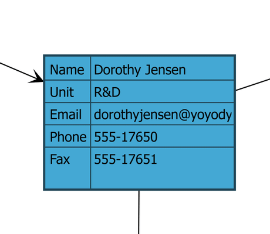 | [Data Table](style/datatable) | Shows a node style and a label style that display data in a tabular fashion.
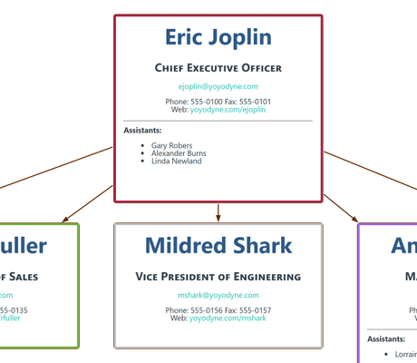 | [HTML Label](style/htmllabel) | Shows how HTML can be used in label text with a custom label style.
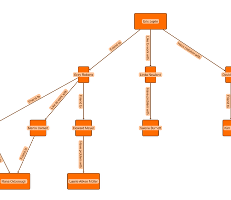 | [Zoom-invariant Label Style](style/invariant-label) | Shows label styles that are independent of the zoom level.
# [Input](input)

This folder and its subfolders contain demo applications which demonstrate how to use and customize the graph editing features provided by yFiles for HTML.

&nbsp;&nbsp;&nbsp;&nbsp;&nbsp;&nbsp;&nbsp;&nbsp;&nbsp;&nbsp;&nbsp;&nbsp;&nbsp;&nbsp;&nbsp;&nbsp;&nbsp;&nbsp;&nbsp;&nbsp;&nbsp;&nbsp;&nbsp;&nbsp;&nbsp;&nbsp;&nbsp;&nbsp;&nbsp;&nbsp; | Demo | Description
--- | --- | ---
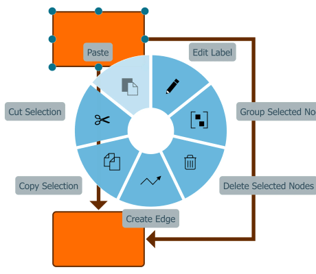 | [Touch Interaction](input/touchcustomization) | Shows how a graph editor application can be optimized for touch devices.
 | [Node Selection Resizing](input/nodeselectionresizing) | Shows how to reshape a selection of nodes as one unit.
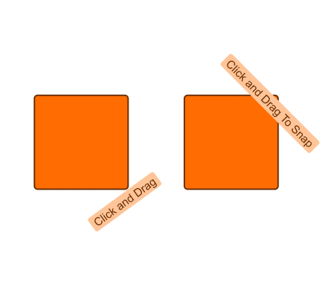 | [Custom Label Model](input/customlabelmodel) | Shows how to implement and use a custom label model.
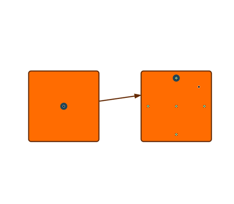 | [Custom Port Location Model](input/customportmodel) | Shows how to implement and use a custom port location model.
No Preview | [Custom Snapping](input/customsnapping) | Shows how the snapping feature can be customized.
 | [Context Menu](input/contextmenu) | Shows how to add a context menu to the nodes of a graph and to the canvas background.
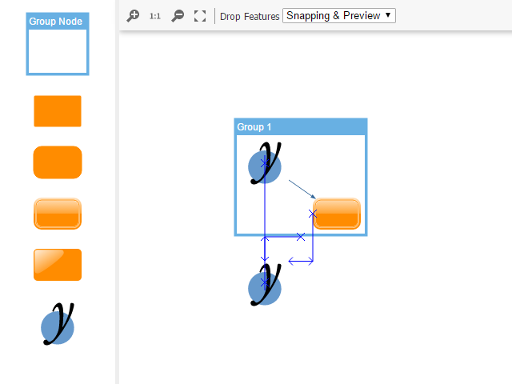 | [Drag and Drop](input/draganddrop) | Shows drag and drop of nodes, groups and labels.
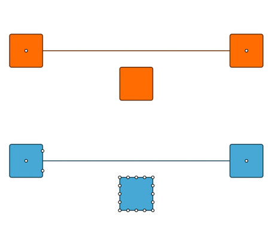 | [Edge Reconnection](input/edgereconnection) | Shows how the reconnection of edge ports can be customized and restricted.
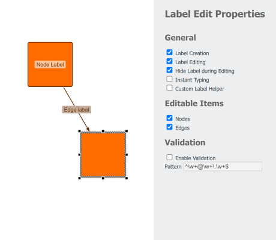 | [Label Editing](input/labelediting) | Shows customizations of the interactive label editing.
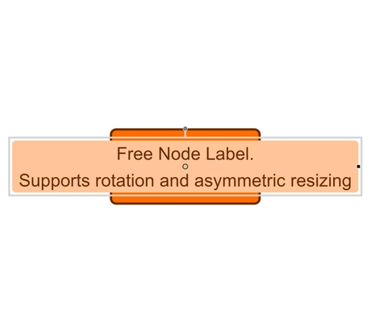 | [Label Handle Provider](input/labelhandleprovider) | Shows how to implement custom handles that allow interactive resizing and rotation of labels.
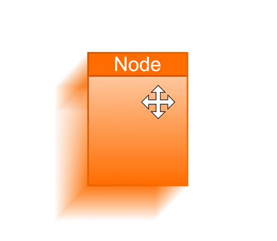 | [Move Unselected Nodes](input/moveunselectednodes) | Shows a special input mode that allows you to move nodes without selecting them first.
No Preview | [Orthogonal Edges](input/orthogonaledges) | Shows the customization of orthogonal edge editing.
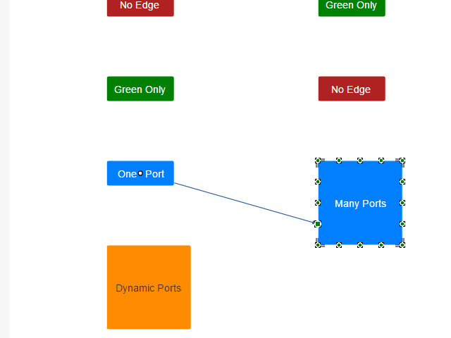 | [Port Candidate Provider](input/portcandidateprovider) | Shows how edge creation can be customized.
No Preview | [Position Handler](input/positionhandler) | Shows how to customize and restrict the movement behavior of nodes.
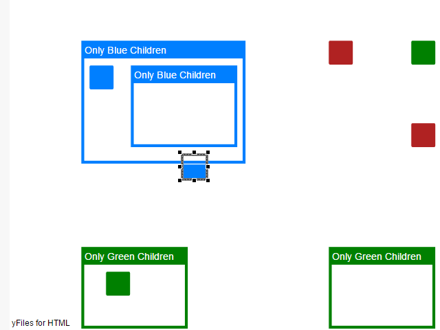 | [Reparent Handler](input/reparenthandler) | Shows how reparenting of nodes can be customized.
No Preview | [Reshape Handle Provider Configuration](input/reshapehandleconfiguration) | Shows how resizing of nodes can be customized.
No Preview | [Reshape Handle Provider](input/reshapehandleprovider) | Shows how to add resize handles to ports.
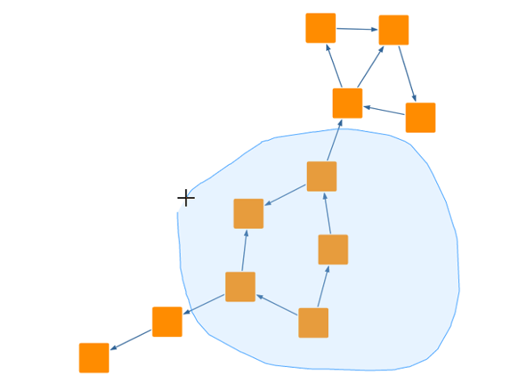 | [Lasso Selection](input/lassoselection) | Shows how to configure a lasso tool for freeform selection.
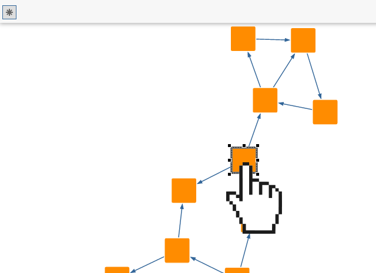 | [Single Selection](input/singleselection) | Shows how to configure GraphEditorInputMode for single selection mode.
No Preview | [Size Constraint Provider](input/sizeconstraintprovider) | Shows how resizing of nodes can be restricted.
# [Databinding](databinding)

This folder and its subfolders contain demo applications which make use of the different features of the viewer component of yFiles for HTML.

&nbsp;&nbsp;&nbsp;&nbsp;&nbsp;&nbsp;&nbsp;&nbsp;&nbsp;&nbsp;&nbsp;&nbsp;&nbsp;&nbsp;&nbsp;&nbsp;&nbsp;&nbsp;&nbsp;&nbsp;&nbsp;&nbsp;&nbsp;&nbsp;&nbsp;&nbsp;&nbsp;&nbsp;&nbsp;&nbsp; | Demo | Description
--- | --- | ---
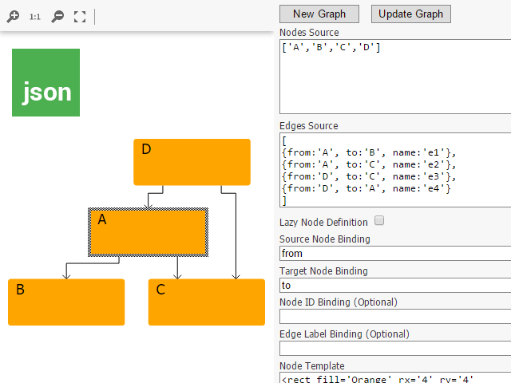 | [Graph Builder](databinding/graphbuilder) | Interactively builds and modifies a graph from JSON business data using class <code>GraphBuilder</code>.
 | [Tree Builder](databinding/treebuilder) | Interactively builds and modifies a graph from JSON business data using class <code>TreeBuilder</code>.
 | [Adjacency Graph Builder](databinding/adjacencygraphbuilder) | Interactively builds and modifies a graph from JSON business data using class <code>AdjacencyGraphBuilder</code>.
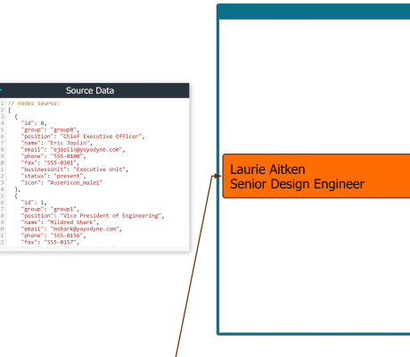 | [Simple Graph Builder](databinding/simplegraphbuilder) | Automatically builds a graph from JSON business data using <code>GraphBuilder</code>, <code>AdjacencyGraphBuilder</code> or <code>TreeBuilder</code>.
# [Loading](loading)

This folder and its subfolders contain demo applications which illustrate the different loading mechanisms of yFiles for HTML.

&nbsp;&nbsp;&nbsp;&nbsp;&nbsp;&nbsp;&nbsp;&nbsp;&nbsp;&nbsp;&nbsp;&nbsp;&nbsp;&nbsp;&nbsp;&nbsp;&nbsp;&nbsp;&nbsp;&nbsp;&nbsp;&nbsp;&nbsp;&nbsp;&nbsp;&nbsp;&nbsp;&nbsp;&nbsp;&nbsp; | Demo | Description
--- | --- | ---
 | [Node.js](loading/nodejs) | Shows how to run a yFiles layout algorithm in a <a href='https://nodejs.org/' target='_blank'>Node.js&reg;</a> environment.
 | [AMD Loading](loading/amdloading) | Loads the yFiles library modules with the AMD loading standard (require.js).
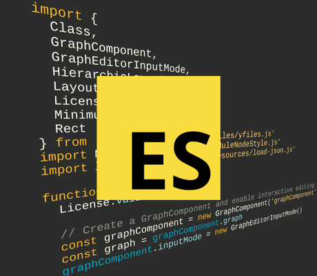 | [ES Module Loading](loading/esmodules) | Loads the yFiles module resources using ES module imports.
 | [Browserify](loading/browserify/README.html) | Shows how to bundle the yFiles library in a <a href="http://browserify.org" target="_blank">Browserify</a> project.
 | [Rollup.js](loading/rollupjs/README.html) | Shows how to bundle the yFiles library in a <a href="https://rollupjs.org" target="_blank">rollup</a> project.
 | [Script Loading](loading/scriptloading) | Loads the yFiles modules using plain old &lt;script&gt; tags.
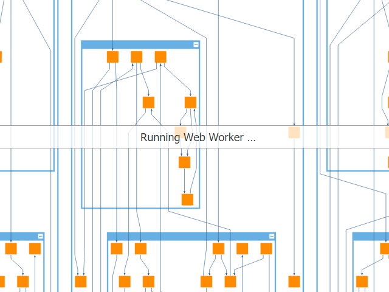 | [Web Worker Webpack](loading/webworker-webpack/README.html) | Shows how to run a yFiles layout algorithm in a Web Worker task using Webpack.
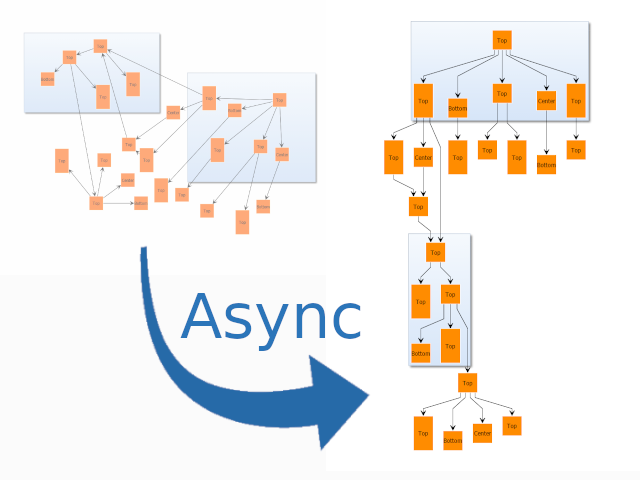 | [Web Worker Modules](loading/webworker-modules) | Shows how to run a layout in a Web Worker task using module workers.
 | [Web Worker UMD](loading/webworker-umd) | Shows how to run a yFiles layout algorithm in a Web Worker task using AMD modules.
 | [webpack](loading/webpack/README.html) | Shows how to integrate the yFiles library in a <a href="https://webpack.js.org" target="_blank">webpack</a> project using ES modules.
 | [Webpack Lazy Load yFiles](loading/webpack-lazy-yfiles/README.html) | Shows how to lazily load yFiles in a <a href="https://webpack.js.org/" target="_blank">webpack</a> project with dynamic imports.
 | [Webpack Lazy Load Layout](loading/webpack-lazy-layout/README.html) | Shows how to lazily load selected yFiles modules in a <a href="https://webpack.js.org" target="_blank">webpack</a> project with dynamic imports.
# [Tutorial Getting Started](01-tutorial-getting-started)

This Getting Started Tutorial is a step-by-step introduction to the concepts and main features of the yFiles for HTML diagramming library. Topics include basic styling, user interaction, Undo/Redo, clipboard, group nodes and folding.

&nbsp;&nbsp;&nbsp;&nbsp;&nbsp;&nbsp;&nbsp;&nbsp;&nbsp;&nbsp;&nbsp;&nbsp;&nbsp;&nbsp;&nbsp;&nbsp;&nbsp;&nbsp;&nbsp;&nbsp;&nbsp;&nbsp;&nbsp;&nbsp;&nbsp;&nbsp;&nbsp;&nbsp;&nbsp;&nbsp; | Demo | Description
--- | --- | ---
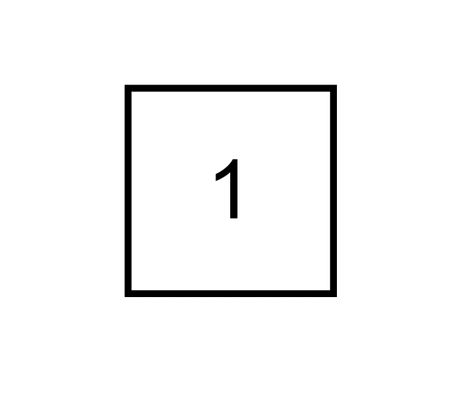 | [01 Creating the View](01-tutorial-getting-started/01-graphcomponent) | Introduces the GraphComponent class, the central UI element for working with graphs.
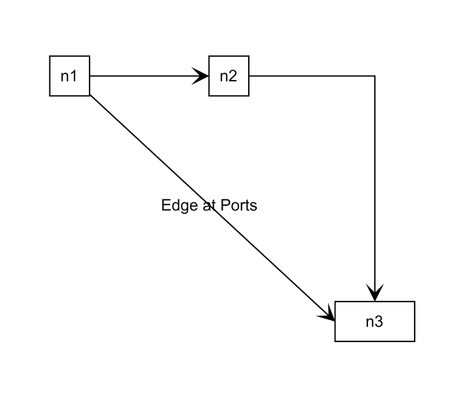 | [02 Creating Graph Elements](01-tutorial-getting-started/02-graph-element-creation) | Shows how to create the basic graph elements.
 | [03 Managing Viewport](01-tutorial-getting-started/03-managing-viewport) | Shows how to work with the viewport.
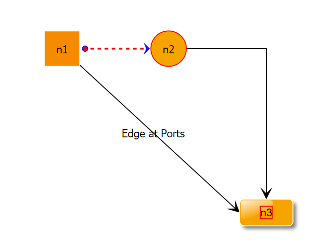 | [04 Setting Styles](01-tutorial-getting-started/04-setting-styles) | Shows how to configure the visual appearance of graph elements using styles.
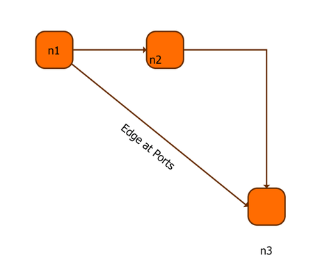 | [05 Label Placement](01-tutorial-getting-started/05-label-placement) | Shows how to control label placement with the help of so called label model parameters.
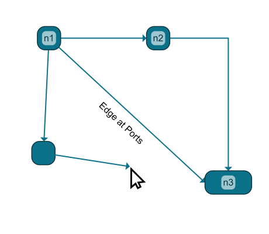 | [06 Basic Interaction](01-tutorial-getting-started/06-basic-interaction) | Shows the default interaction gestures that are provided by class GraphEditorInputMode.
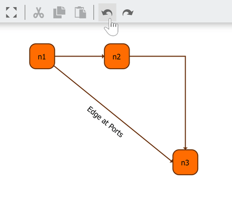 | [07 Undo Clipboard Support](01-tutorial-getting-started/07-undo-clipboard-support) | Shows how to use the undo and clipboard features.
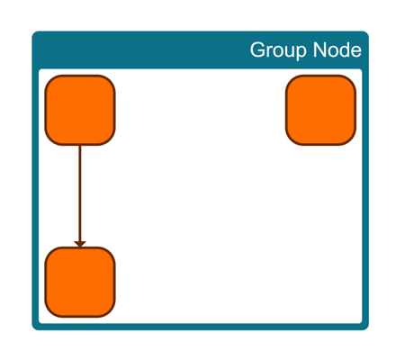 | [08 Grouping](01-tutorial-getting-started/08-grouping) | Shows how to configure support for grouped (or hierarchically organized) graphs.
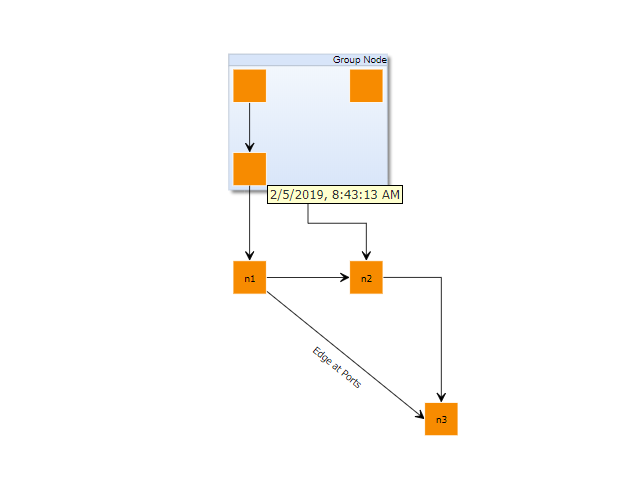 | [09 Data Binding](01-tutorial-getting-started/09-data-binding) | Shows how to bind data to graph elements.
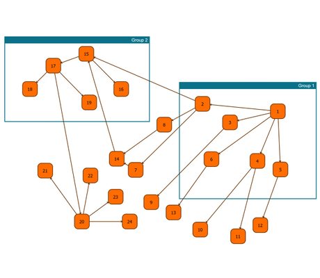 | [10 Layout](01-tutorial-getting-started/10-layout) | Shows how to use the layout algorithms in yFiles for HTML to automatically place the graph elements.
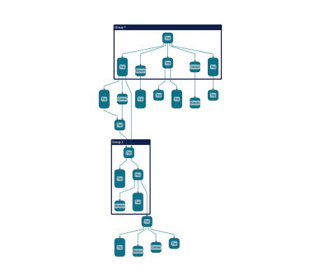 | [11 Layout Data](01-tutorial-getting-started/11-layout-data) | Shows how to configure individual settings for each node for the automatic layout.
 | [12 Analysis Algorithms](01-tutorial-getting-started/12-graph-analysis) | Shows how to use the graph analysis algorithms.
# [Tutorial Custom Styles](02-tutorial-custom-styles)

This tutorial is a step-by-step guide to customizing the visual representation of graph elements.

&nbsp;&nbsp;&nbsp;&nbsp;&nbsp;&nbsp;&nbsp;&nbsp;&nbsp;&nbsp;&nbsp;&nbsp;&nbsp;&nbsp;&nbsp;&nbsp;&nbsp;&nbsp;&nbsp;&nbsp;&nbsp;&nbsp;&nbsp;&nbsp;&nbsp;&nbsp;&nbsp;&nbsp;&nbsp;&nbsp; | Demo | Description
--- | --- | ---
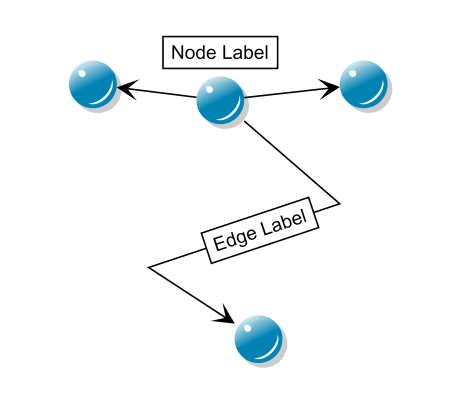 | [01 Custom Node Style](02-tutorial-custom-styles/01-custom-node-style) | Shows how to create a custom node style.
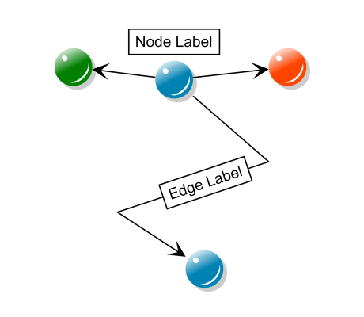 | [02 Node Color](02-tutorial-custom-styles/02-node-color) | Shows how to change the style of the nodes based on their tag.
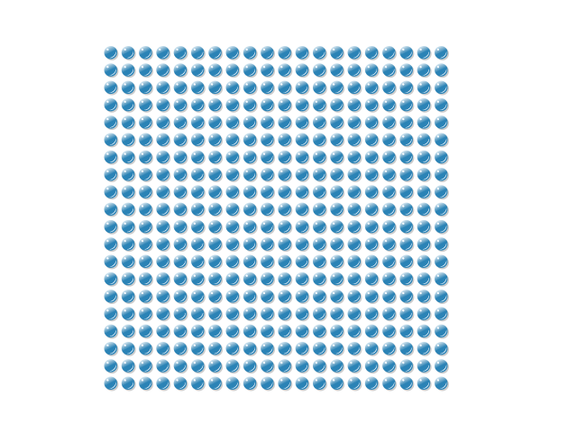 | [03 Update Visual And Render Data Cache](02-tutorial-custom-styles/03-update-visual-and-render-data-cache) | Shows how to implement high-performance rendering of nodes.
 | [04 Is Inside](02-tutorial-custom-styles/04-is-inside) | Shows how to override isInside() and getOutline() of NodeStyleBase.
 | [05 Hit Test](02-tutorial-custom-styles/05-hit-test) | Shows how to override isHit() and isInBox() of NodeStyleBase.
 | [06 Get Bounds](02-tutorial-custom-styles/06-get-bounds) | Shows how to override getBounds() of NodeStyleBase.
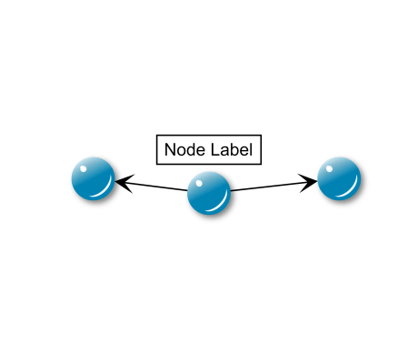 | [07 Drop Shadow Performance](02-tutorial-custom-styles/07-drop-shadow-performance) | This step replaces the simple drop shadow in the last steps with a more visually appealing, blurred one.
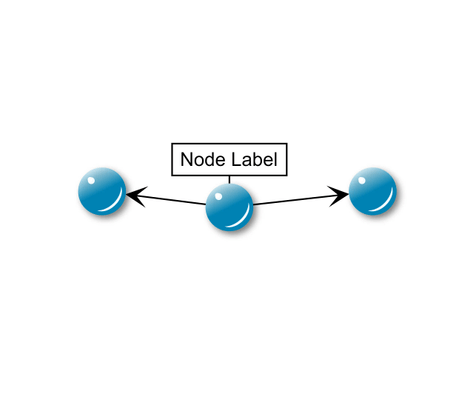 | [08 Edge From Node To Label](02-tutorial-custom-styles/08-edge-from-node-to-label) | Shows how to visually connect a label to its owner node with a line.
 | [09 Is Visible](02-tutorial-custom-styles/09-is-visible) | Shows how to override the method isVisible() of NodeStyleBase.
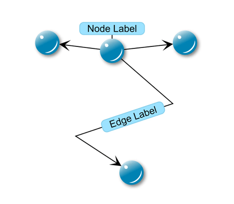 | [10 Custom Label Style](02-tutorial-custom-styles/10-custom-label-style) | Shows how a custom label style.
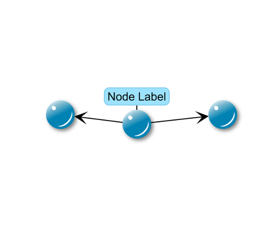 | [11 Label Preferred Size](02-tutorial-custom-styles/11-label-preferred-size) | Shows how to set the size of the label based on the size of its text by overriding the LabelStyleBase#getPreferredSize() method.
 | [12 High Performance Label Rendering](02-tutorial-custom-styles/12-high-performance-label-rendering) | Shows how to implement high-performance rendering for labels.
 | [13 Label Edit Button](02-tutorial-custom-styles/13-label-edit-button) | Shows how to display a button on a label that starts the label editor.
 | [14 Button Visibility](02-tutorial-custom-styles/14-button-visibility) | Shows how to hide the 'Label Edit' button based on the zoom level.
 | [15 Using Data In Label Tag](02-tutorial-custom-styles/15-using-data-in-label-tag) | Shows how to use data from a business object, which is stored in the label's tag, for rendering.
 | [16 Custom Edge Style](02-tutorial-custom-styles/16-custom-edge-style) | Shows how to create a custom edge style which allows to specify the edge thickness by setting a property on the style.
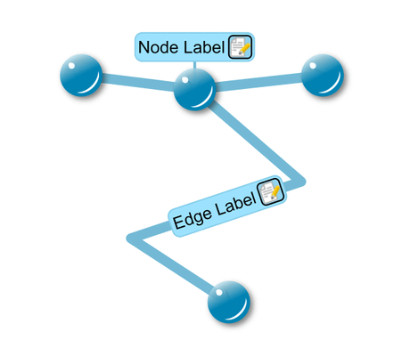 | [17 Edge Hit Test](02-tutorial-custom-styles/17-edge-hit-test) | Shows how to take the thickness of the edge into account when checking if the edge was clicked.
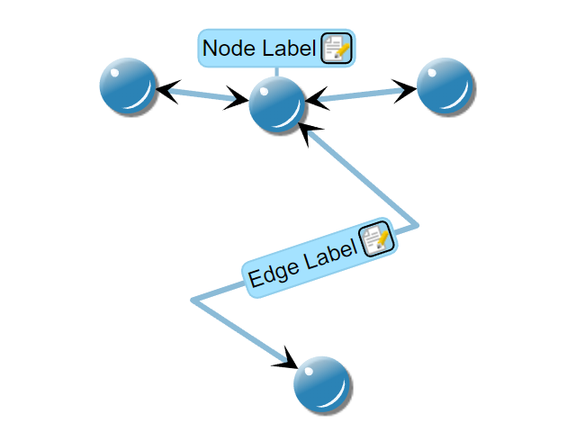 | [18 Edge Cropping](02-tutorial-custom-styles/18-edge-cropping) | Shows how to crop an edge at the node's bounds.
 | [19 Animated Edge Selection](02-tutorial-custom-styles/19-animated-edge-selection) | Shows how to change the style of an edge if the edge is selected.
 | [20 Custom Arrow](02-tutorial-custom-styles/20-custom-arrow) | Shows a custom arrow.
 | [21 Edge Performance](02-tutorial-custom-styles/21-edge-performance) | Shows how to optimize rendering performance for edges and arrows.
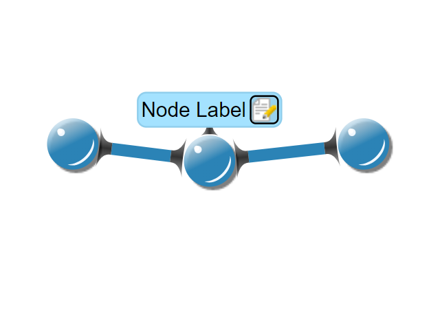 | [22 Arrow Thickness](02-tutorial-custom-styles/22-arrow-thickness) | Shows how to render the arrow based on a property of its edge.
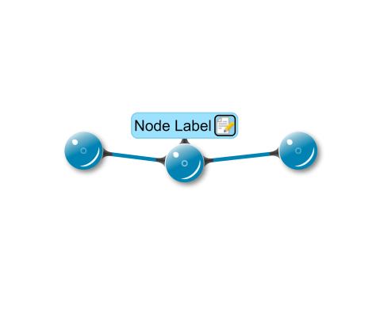 | [23 Custom Ports](02-tutorial-custom-styles/23-custom-ports) | Shows a custom port style.
 | [24 Style Decorator](02-tutorial-custom-styles/24-style-decorator) | Shows how to enhance an existing node style by adding visual decorators.
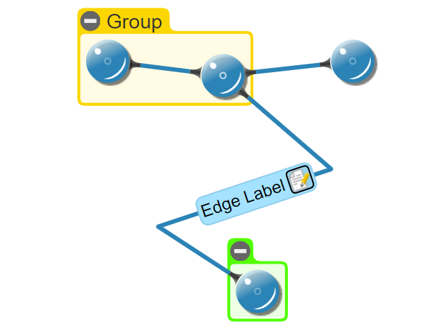 | [25 Custom Group Style](02-tutorial-custom-styles/25-custom-group-style) | Shows how to implement a special node style for group nodes.
 | [26 Custom Group Bounds](02-tutorial-custom-styles/26-custom-group-bounds) | Shows how to customize the way that the group insets are calculated by implementing an ILayoutGroupBoundsCalculator.
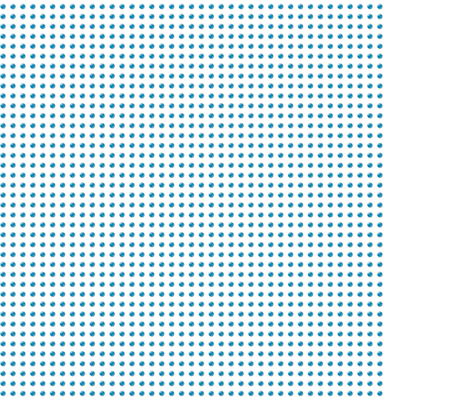 | [27 Canvas Painting](02-tutorial-custom-styles/27-canvas-painting) | Shows how to implement a zoom-dependent high-performance rendering using HTML5 Canvas painting for nodes.
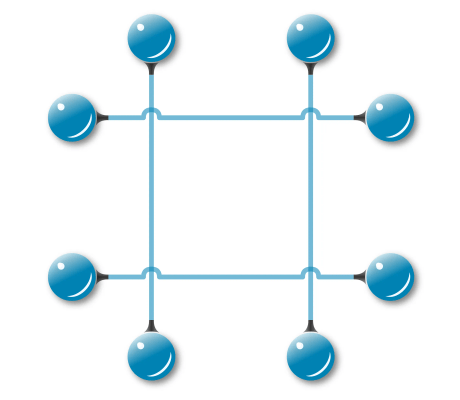 | [28 Bridge Support](02-tutorial-custom-styles/28-bridge-support) | Shows how to enable bridges for a custom edge style.
 | [29 Label Line Wrapping](02-tutorial-custom-styles/29-label-line-wrapping) | Shows how to enhance a custom label style to support different line wrapping (trimming) styles as well as text clipping at the label bounds.
# [Tutorial Application Features](03-tutorial-application-features)

This tutorial is an introduction to the features of the yFiles for HTML diagramming library for building an application. It covers a broad range of topics including building graphs from JSON data, drag and drop, tooltips, snapping (guide lines), etc.

&nbsp;&nbsp;&nbsp;&nbsp;&nbsp;&nbsp;&nbsp;&nbsp;&nbsp;&nbsp;&nbsp;&nbsp;&nbsp;&nbsp;&nbsp;&nbsp;&nbsp;&nbsp;&nbsp;&nbsp;&nbsp;&nbsp;&nbsp;&nbsp;&nbsp;&nbsp;&nbsp;&nbsp;&nbsp;&nbsp; | Demo | Description
--- | --- | ---
 | [Application Features Base](03-tutorial-application-features/application-features-base) | This demo is the base for the feature-specific demos of this tutorial.
 | [Background Image](03-tutorial-application-features/background-image) | Shows how to add a background visualizations to a graph component.
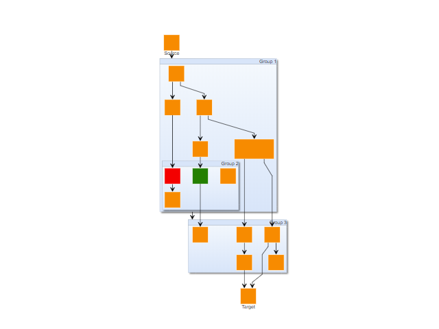 | [Building Graphs From Data](03-tutorial-application-features/building-graph-from-data) | Shows how to build a graph from data in JSON format.
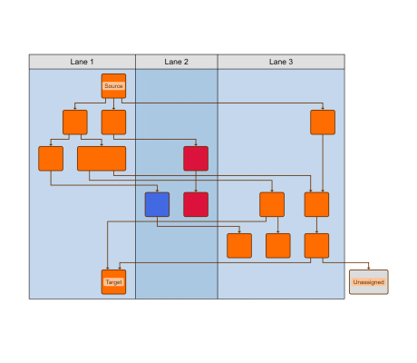 | [Building Swimlanes From Data](03-tutorial-application-features/building-swimlanes-from-data) | Shows how to build a graph with swimlanes from data in JSON format.
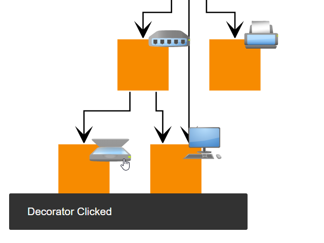 | [Clickable Style Decorator](03-tutorial-application-features/clickable-style-decorator) | Illustrates an approach for handling clicks on specific areas of the style.
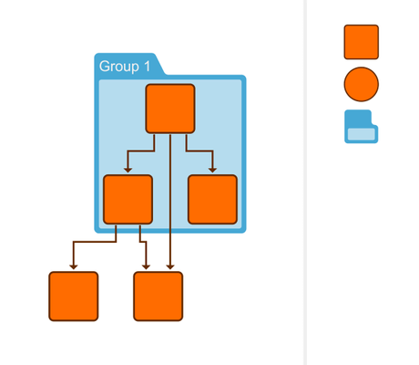 | [Drag And Drop](03-tutorial-application-features/drag-and-drop) | Shows how to enable dragging nodes from a panel and drop them into the graph component.
 | [External Links](03-tutorial-application-features/external-links) | Shows how to add labels that act like external links and open in a new window.
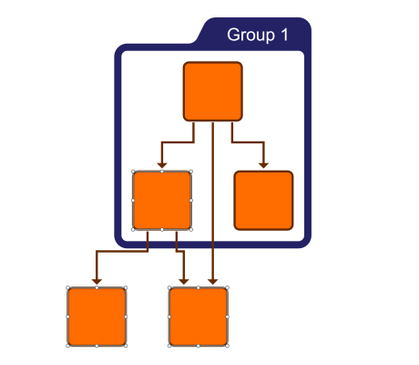 | [Filtering](03-tutorial-application-features/filtering) | Shows how to configure graph filtering.
 | [Filtering With Folding](03-tutorial-application-features/filtering-with-folding) | Shows how to configure filtering and folding in the same application.
 | [Folding](03-tutorial-application-features/folding) | Shows how to enable collapsing and expanding of group nodes.
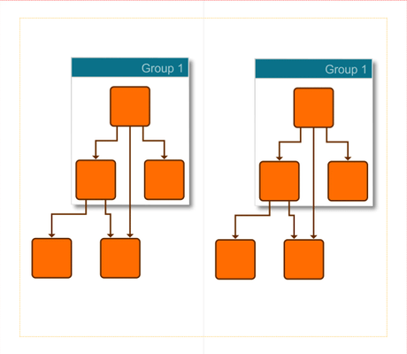 | [Graph Copy](03-tutorial-application-features/graph-copy) | Shows how to copy a graph or parts of a graph.
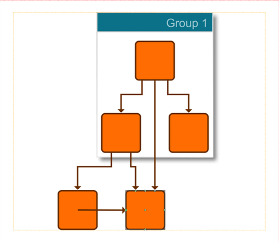 | [Graph Decorator](03-tutorial-application-features/graph-decorator) | Shows how to decorate graph items to change their behavior or visualization.
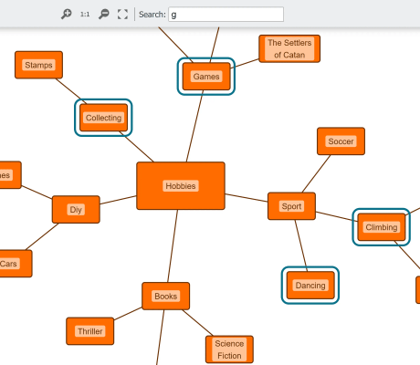 | [Graph Search](03-tutorial-application-features/graph-search) | Shows how to search for specific nodes in a graph.
 | [Grid Snapping](03-tutorial-application-features/grid-snapping) | Shows how to enable grid snapping during interactive changes.
 | [Save and Load GraphML](03-tutorial-application-features/input-output) | Shows how to use GraphML input and output.
 | [Custom Data in GraphML](03-tutorial-application-features/custom-graphml) | Shows how to read and write additional data from and to GraphML.
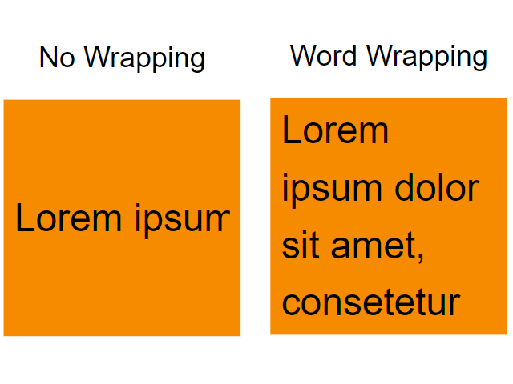 | [Label Text Wrapping](03-tutorial-application-features/label-text-wrapping) | Shows how to enable label text wrapping and trimming.
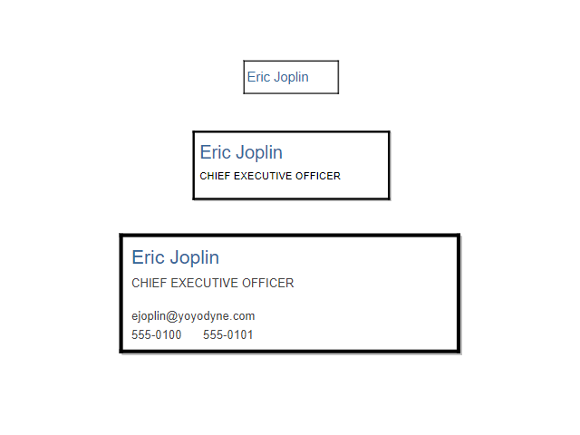 | [Level of Detail Style](03-tutorial-application-features/level-of-detail-style) | Shows a node style that hides details when zooming out.
 | [Markup Labels](03-tutorial-application-features/markup-labels) | Markup label style lets you use html-like markup to structure and style the label text.
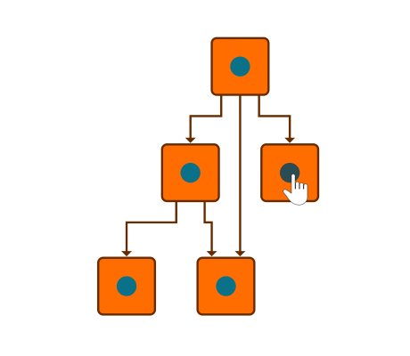 | [Native Listeners](03-tutorial-application-features/native-listeners) | Illustrates how to register native event listeners to a SVG elements of a style.
 | [Orthogonal Edges](03-tutorial-application-features/orthogonal-edges) | Shows how to enable interactive orthogonal edge editing.
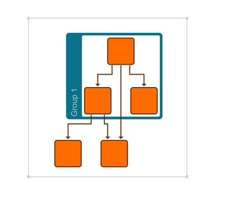 | [Rectangular Indicator](03-tutorial-application-features/rectangular-indicator) | Shows how to add an interactive rectangular indicator to the graph component.
 | [Smart Click Navigation](03-tutorial-application-features/smart-click-navigation) | Shows the how to scroll and zoom to the area of interest by single edge-clicks.
 | [Snapping](03-tutorial-application-features/snapping) | Shows how to enable snapping (guide lines) for interactive changes.
 | [Tooltips](03-tutorial-application-features/tooltips) | Shows how to enable tooltips for graph items.
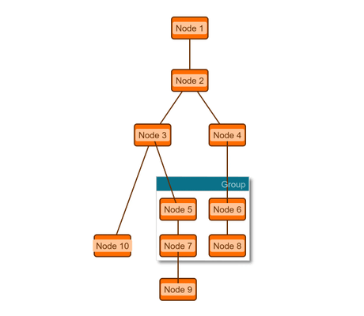 | [Accessibility](03-tutorial-application-features/accessibility) | Shows how to use the aria-live region to update screen readers.
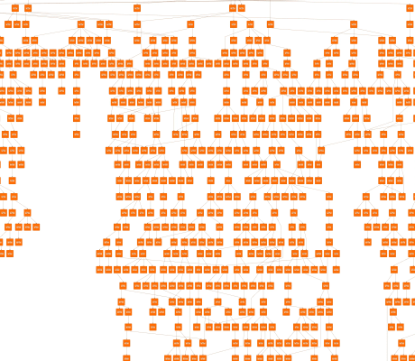 | [WebGL2 Rendering](03-tutorial-application-features/webgl-rendering) | Shows how to enable the WebGL2 rendering mode.
