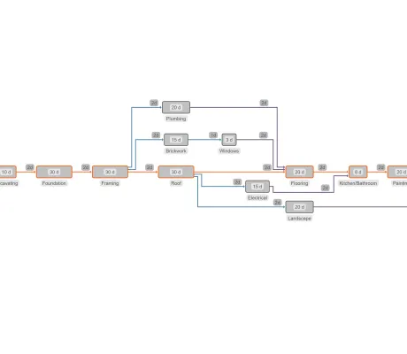

<!--
 //////////////////////////////////////////////////////////////////////////////
 // @license
 // This file is part of yFiles for HTML.
 // Use is subject to license terms.
 //
 // Copyright (c) by yWorks GmbH, Vor dem Kreuzberg 28,
 // 72070 Tuebingen, Germany. All rights reserved.
 //
 //////////////////////////////////////////////////////////////////////////////
-->
# Critical Path Analysis (CPA) Demo

[You can also run this demo online](https://www.yworks.com/demos/analysis/criticalpathanalysis/).

This demo shows how to perform critical path analysis (CPA) in project management with yFiles. Formally, this means identifying the tasks of a project that must be completed on time so that the whole project can be completed on time.

This example demonstrates the process of building a house. Each node represents a task that has to be completed and is associated with a time duration written on its label. The width of each node is also proportional to the required task duration.

An edge connecting two tasks means that the task of its source node has to be completed before the task of its target node and is associated with a transition time duration (see the corresponding edge label) which represents the time needed to proceed from the source task to the target task.

The orange edges are the edges that belong to the critical path. The dark-blue edges connect tasks that should be completed on time otherwise, the whole project will be delayed, while the purple ones have slack greater than zero, which means that they can be delayed without affecting the completion time of the project.

For the critical path calculation, we apply the [RankAssignmentAlgorithm](https://docs.yworks.com/yfileshtml/#/api/RankAssignmentAlgorithm) and we assign to each node a number that represents its rank and to each edge a number that represents its slack. Afterwards, we calculate the shortest path between the first/last ranked nodes while taking into consideration the slack values of each edge, i.e. the paths with higher slack are longer. At the end, we apply a [HierarchicalLayout](https://docs.yworks.com/yfileshtml/#/api/HierarchicalLayout) such that nodes are placed in layers based on their ranking, while the edges that belong to the critical path gain priority so that the corresponding nodes incident to them are horizontally-aligned.
