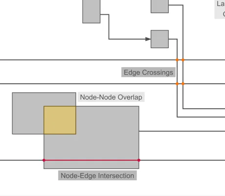

<!--
 //////////////////////////////////////////////////////////////////////////////
 // @license
 // This file is part of yFiles for HTML.
 // Use is subject to license terms.
 //
 // Copyright (c) by yWorks GmbH, Vor dem Kreuzberg 28,
 // 72070 Tuebingen, Germany. All rights reserved.
 //
 //////////////////////////////////////////////////////////////////////////////
-->
# Intersection Detection Demo

[You can also run this demo online](https://www.yworks.com/demos/analysis/intersection-detection/).

This demo showcases how to find and highlight intersections and overlaps between graph items.

The [Intersections](https://docs.yworks.com/yfileshtml/#/api/Intersections) algorithm calculates all geometric intersections between nodes, edges, and labels in a diagram. Checking whether items overlap can be helpful in various scenarios. For example, you could check if a newly inserted or moved graph item intersects other items. Or, more generally, if there are overlaps, a layout algorithm could be applied to re-arrange the graph and resolve the overlaps.

The result of the algorithm is provided as a list of [Intersection](https://docs.yworks.com/yfileshtml/#/api/Intersection) objects, where each one represents the intersection between exactly two elements and additionally provides the exact points describing the shape of the intersection. The shapes of the intersections are visualized in this demo using different colors for different kind of intersections (see right-hand panel).

### Things to Try

- **Observe the intersections** in the provided initial sample graph. They are highlighted using different colors, while the actual graph items are painted in gray.
- **Move a graph item** to see how the result of the intersection algorithm changes. The result is re-computed on the fly when modifying the graph.
- **Explore the settings** of the intersection algorithm in the right-hand sidebar.
