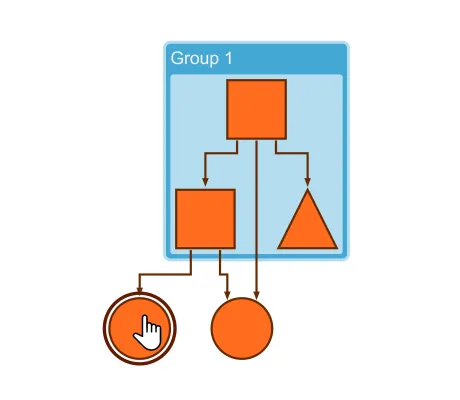

<!--
 //////////////////////////////////////////////////////////////////////////////
 // @license
 // This file is part of yFiles for HTML.
 // Use is subject to license terms.
 //
 // Copyright (c) 2026 by yWorks GmbH, Vor dem Kreuzberg 28,
 // 72070 Tuebingen, Germany. All rights reserved.
 //
 //////////////////////////////////////////////////////////////////////////////
-->
# Complex Highlight Decorator - Application Features

[You can also run this demo online](https://www.yfiles.com/demos/application-features/complex-highlight-decorator/).

Shows how to highlight a node when the mouse hovers over it. The shape of the highlight effect differs depending on the data stored in the node's tag.

## Things to Try

- Hover over a node to see a highlight effect.
- Hover over nodes of different shapes to see the shape of the highlight effect change as well.
