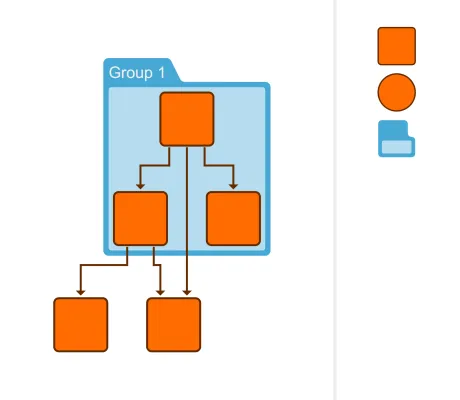

<!--
 //////////////////////////////////////////////////////////////////////////////
 // @license
 // This file is part of yFiles for HTML.
 // Use is subject to license terms.
 //
 // Copyright (c) by yWorks GmbH, Vor dem Kreuzberg 28,
 // 72070 Tuebingen, Germany. All rights reserved.
 //
 //////////////////////////////////////////////////////////////////////////////
-->
# Simple Drag and Drop - Application Features

[You can also run this demo online](https://www.yworks.com/demos/application-features/drag-and-drop/).

This demo shows how to use [NodeDropInputMode](https://docs.yworks.com/yfileshtml/#/api/NodeDropInputMode) for dragging nodes from a separate panel to drop them into the graph component.

- Drag nodes and group nodes into the graph.
- Drop nodes and group nodes on other group nodes to add them as their children.

See the sources for details.

## Related Demos

- [Drag and Drop Demo](../../input/draganddrop/)
- [Graph Drag and Drop Demo](../../input/graph-drag-and-drop/)
- [Custom Drag and Drop Demo](../../input/custom-drag-and-drop/)
- [Drag From Component Demo](../../input/drag-from-component/)
