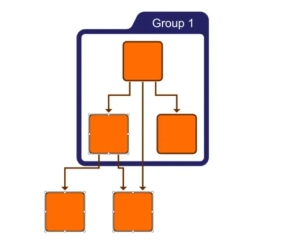

<!--
 //////////////////////////////////////////////////////////////////////////////
 // @license
 // This file is part of yFiles for HTML.
 // Use is subject to license terms.
 //
 // Copyright (c) 2026 by yWorks GmbH, Vor dem Kreuzberg 28,
 // 72070 Tuebingen, Germany. All rights reserved.
 //
 //////////////////////////////////////////////////////////////////////////////
-->
# Filtering

[You can also run this demo online](https://www.yfiles.com/demos/application-features/filtering/).

This demo shows how to dynamically **hide and show graph items** (nodes and edges) without modifying the underlying graph data structure. It uses the [FilteredGraphWrapper](https://docs.yworks.com/yfileshtml/api/FilteredGraphWrapper) to provide a temporary, filtered view of your graph.

## Things to Try

- **Select Items**: Click on individual nodes or edges, or draw a selection rectangle to select multiple items.
- **Filter Selection**: Press the `Filter Items` button in the toolbar to hide selected items from the graph.
- **Reset Filter**: Click the `Reset Filter` button to bring all previously hidden items back into view.

## Demos

- [Filtering With Folding Demo](../../application-features/filtering-with-folding/)
- [Flow Filtering Demo](../../application-features/flow-filtering/)

## Documentation

- [Filtering](https://docs.yworks.com/yfileshtml/dguide/filtering)
- [FilteredGraphWrapper](https://docs.yworks.com/yfileshtml/api/FilteredGraphWrapper) class
