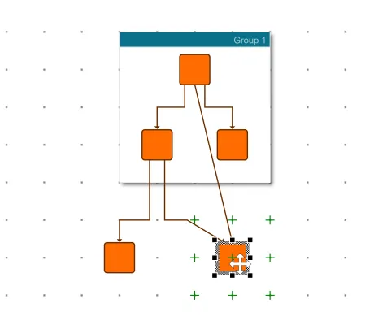

<!--
 //////////////////////////////////////////////////////////////////////////////
 // @license
 // This file is part of yFiles for HTML.
 // Use is subject to license terms.
 //
 // Copyright (c) by yWorks GmbH, Vor dem Kreuzberg 28,
 // 72070 Tuebingen, Germany. All rights reserved.
 //
 //////////////////////////////////////////////////////////////////////////////
-->
# Grid Snapping - Application Features

[You can also run this demo online](https://www.yfiles.com/demos/application-features/grid-snapping/).

This demo shows the [grid snapping](https://docs.yworks.com/yfileshtml/#/dguide/interaction-grid_snapping) feature which enables snapping graph items to grid points. Grid snapping not only works for moving or resizing nodes, but also for creating edges and adding and moving bends.

### Things to Try

- Toggle the grid's visibility with the 'Show Grid' icon in the toolbar. The snapping feature itself is unaffected by the visibility.
- Specify how items snap to the grid with the 'Grid Snapping' options on the right. The grid visualization is not affected by this snap type.
- Select and move a node or bend to make it snap to the grid.
- Select and resize a node to make it snap to the grid.
- Change the grid visualization.
- Choose a different color for the grid.
- Change the thickness of the grid.
- Test the different render modes for the grid.

See the sources for details.
