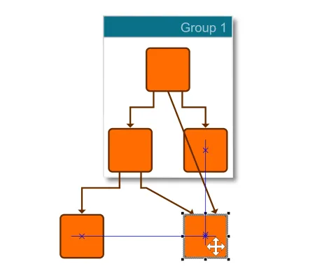

<!--
 //////////////////////////////////////////////////////////////////////////////
 // @license
 // This file is part of yFiles for HTML.
 // Use is subject to license terms.
 //
 // Copyright (c) by yWorks GmbH, Vor dem Kreuzberg 28,
 // 72070 Tuebingen, Germany. All rights reserved.
 //
 //////////////////////////////////////////////////////////////////////////////
-->
# Snapping - Application Features

[You can also run this demo online](https://www.yfiles.com/demos/application-features/snapping/).

This demo shows how to enable [snapping](https://docs.yworks.com/yfileshtml/#/dguide/interaction-snapping) (guide lines) for graph elements. This is provided through class [GraphSnapContext](https://docs.yworks.com/yfileshtml/#/api/GraphSnapContext).

Snapping helps you to arrange graph items interactively without running an automatic layout by providing useful lines and position hints that elements snap to.

In addition to this, labels with certain label models can snap to particular positions relative to their owner, for example to the corners of a node or along the edge path.

See the sources for details.
