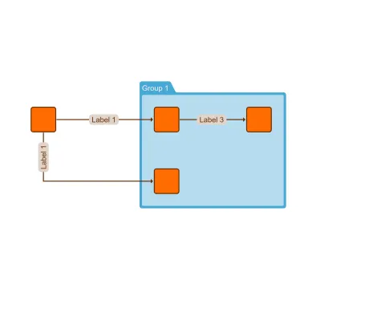

<!--
 //////////////////////////////////////////////////////////////////////////////
 // @license
 // This file is part of yFiles for HTML.
 // Use is subject to license terms.
 //
 // Copyright (c) by yWorks GmbH, Vor dem Kreuzberg 28,
 // 72070 Tuebingen, Germany. All rights reserved.
 //
 //////////////////////////////////////////////////////////////////////////////
-->
# Subdivide Edges - Application Features

[You can also run this demo online](https://www.yworks.com/demos/application-features/subdivide-edges/).

This demo shows how to use a custom [NodeDropInputMode](https://docs.yworks.com/yfileshtml/#/api/NodeDropInputMode) for dragging nodes from a separate panel onto an edge.

More precisely, when a node is dropped onto an edge, a new node is created and the edge is split in two edges such that:

- The source of the first edge is the original source of the split edge and the target is the newly created node.
- The source of second edge is the newly created node and the target is the original target of the split edge.

## Things to try

- Drag a node onto an edge and see how the edge is being split.

See the sources for details.

## Related Demos

- [Drag and Drop Demo](../../input/draganddrop/)
- application-features-drag-and-drop
- [Graph Drag and Drop Demo](../../input/graph-drag-and-drop/)
- [Custom Drag and Drop Demo](../../input/custom-drag-and-drop/)
- [Drag From Component Demo](../../input/drag-from-component/)
