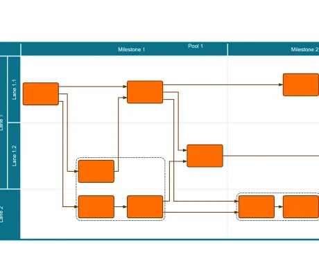

<!--
 //////////////////////////////////////////////////////////////////////////////
 // @license
 // This file is part of yFiles for HTML.
 // Use is subject to license terms.
 //
 // Copyright (c) by yWorks GmbH, Vor dem Kreuzberg 28,
 // 72070 Tuebingen, Germany. All rights reserved.
 //
 //////////////////////////////////////////////////////////////////////////////
-->
# Table Editor Demo

[You can also run this demo online](https://www.yfiles.com/demos/application-features/tableeditor/).

The Table Editor demo shows the support for diagrams that are organized in a tabular way, for example in a grid or a swimlane layout. Besides model items and styles for [Table](https://docs.yworks.com/yfileshtml/#/api/Table), yFiles provides dedicated editing features to add, remove, resize, and reparent rows, columns, and the table contents.

## Basic Gestures

- Select a row or column by clicking on its header. Multiple rows or columns can be selected by keeping Ctrl pressed. Note that selecting a graph element will clear the table selection and vice versa.
- Press F2 to edit the label of a selected stripe. Enter an empty text to remove the label.
- Press the right mouse button on a stripe header to activate a context menu.
- A node is assigned to the row and column its center coordinates lie in. Therefore it can be assigned to another row or column simply by dragging it to a new position.

## Modifying the Table

- Add a new row or column by dragging the corresponding item from the list and dropping it onto a table.
- Delete selected items using the Delete key. Children will be reparented to the deleted stripe's parent. The parent and/or the siblings are resized to disturb the overall table layout as little as possible.
- Move a stripe by dragging its header to a different position in the table. The highlight indicates whether the stripe is added as a new child or as a sibling of the drop target. Moving a stripe will move all its children as well as its contents.

## Resizing Stripes

- Drag a stripe border to resize the stripe. By default, the neighbor stripes and their contents are moved.
- Except for the topmost/leftmost borders, resizing always extends the stripe to the bottom/to the right.
- Press Shift at the beginning of the gesture to redistribute the sizes of the two attached stripes.
- By default, stripe borders cannot be dragged over content nodes. Press Ctrl at the beginning of the resize gesture to resize the stripes freely.
- Resizing the table node will resize the outermost stripe(s) accordingly.

## Automatic Layout

- Calculate a new hierarchical layout for the tables and their contents by pressing the layout button.
