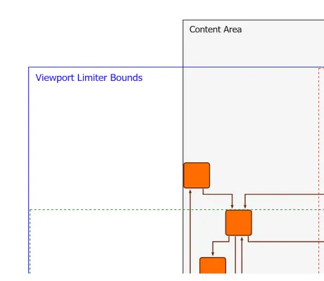

<!--
 //////////////////////////////////////////////////////////////////////////////
 // @license
 // This file is part of yFiles for HTML.
 // Use is subject to license terms.
 //
 // Copyright (c) 2026 by yWorks GmbH, Vor dem Kreuzberg 28,
 // 72070 Tuebingen, Germany. All rights reserved.
 //
 //////////////////////////////////////////////////////////////////////////////
-->
# Viewport Limiter - Application Features

[You can also run this demo online](https://www.yfiles.com/demos/application-features/viewportlimiter/).

The [ViewportLimiter](https://docs.yworks.com/yfileshtml/api/ViewportLimiter) limits the interactive movement of the viewport. This helps to navigate the canvas without losing the content.

The effective viewport limiter area, or [bounds](https://docs.yworks.com/yfileshtml/api/ViewportLimiter#bounds), are calculated from the [viewportContentMargins](https://docs.yworks.com/yfileshtml/api/ViewportLimiter#viewportContentMargins) and the [minimumViewportContentRatio](https://docs.yworks.com/yfileshtml/api/ViewportLimiter#minimumViewportContentRatio) properties.

## Things to Try

- Pan the graph with a pointer or touch device. Try to move the graph out of the viewport. Observe how the Viewport Limiter prevents moving the graph completely outside.
- Change the limiting policy and the settings in the property panel on the right-hand side. Move the graph again to see how the different settings affect the viewport limiting.

## Policy Description

#### Strict Bounds Containment

If enabled, the viewport only shows elements inside the bounds of the ViewportLimiter. No area outside the bounds should ever be visible.

If disabled, it is possible to see parts outside the bounds, but the limiter tries to minimize the amount of possible space outside.

See the sources for details.
