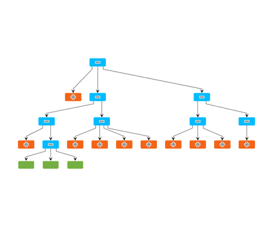

# Collapsible Tree Demo

[You can also run this demo online](https://live.yworks.com/demos/complete/collapse/index.html).

The Collapsible Tree demo shows interactive collapsing and expanding of subtrees of a graph. Using the dedicated helper classes for filtering-out parts of a graph and the tree layout algorithm, implementing such an interactive application is easy.

The main classes used in this demo are [FilteredGraphWrapper](https://docs.yworks.com/yfileshtml/#/api/FilteredGraphWrapper) and [TreeLayout](https://docs.yworks.com/yfileshtml/#/api/TreeLayout).

## Things to Try

- Click a node with a +/- button to expand or collapse its subtree. Note that there are also leaf nodes which cannot be expanded further.
- Select an automatic layout style from the drop down in the toolbar. Choosing a new style, or expanding and collapsing nodes, triggers a refresh of the layout.
- Use the zoom and "Fit Content" buttons in the toolbar to focus on local areas or to view the complete graph.
