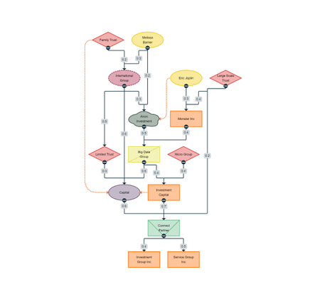

# Company Ownership Chart Demo

[You can also run this demo online](https://live.yworks.com/demos/complete/company-ownership/index.html).

# Company Ownership Chart Demo

This demo implements an interactive viewer for exploring company ownership. The diagram illustrates both the ownership (shareholders, investors, etc) and the management relationships among business entities.

Nodes can be shown in two different ways: Either as different shapes and colors per type, or as a table-like overview of the relevant properties.

The edges demonstrate either hierarchy/ownership (dark-gray edges) or a simple relationship (orange edges).

## Things to Try

- Click on the port to hide and show the descendants of a node. **Hide Children** by clicking on  and **Show Children** by clicking on . A node is considered to be visible if at least one of its parents defined by a hierarchy edge (i.e., the black-colored edges) is visible.
- **Switch style** between shapes and tables.
- **Click** on  to load the initial graph.
- **Right-click** on a company or a relationship in the chart and show the corresponding data in the Properties View.
- **Left-click** on an edge or an edge label zooms to the current clicked location.
- **Hover** over a company node to highlight its adjacent relationships. **Hover** over a relationship to highlight its associated label.
